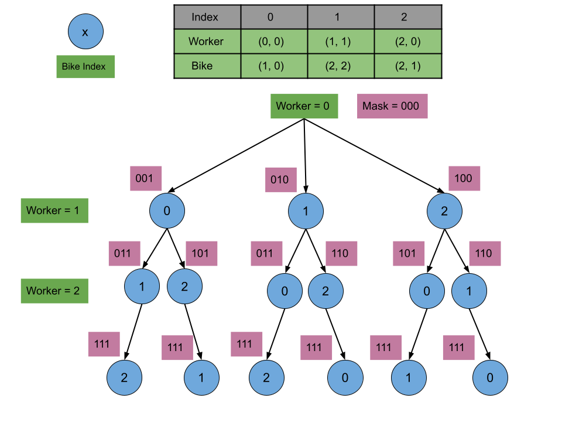

# 1066. Campus Bikes II — Detailed Notes

This document converts the provided explanation into a detailed Markdown note.

---

# Problem Recap

We are given:

- `N` workers
- `M` bikes
- `N <= M`

Each worker and each bike is a point on a 2D grid.

We must assign:

- exactly one unique bike to each worker
- each bike to at most one worker

The objective is to minimize the total **Manhattan distance**:

```text
|x1 - x2| + |y1 - y2|
```

between each worker and the bike assigned to that worker.

The problem asks for the **minimum possible total distance**.

---

# Why This Problem Is Tricky

This is an assignment problem.

For each worker, we need to choose one bike, but every choice affects future choices because the chosen bike becomes unavailable.

That means:

- decisions are sequential
- decisions are dependent on previous assignments

This structure strongly suggests:

- backtracking
- dynamic programming
- state compression
- shortest-path style search over assignment states

Because the number of bikes is at most `10`, bitmask-based solutions are very practical.

---

# Approach 1: Greedy Backtracking

## Intuition

The most direct idea is:

> Try every possible assignment of bikes to workers and keep the minimum total distance.

Suppose there are `M` bikes and `N` workers.

The first worker has `M` choices.

The second worker has `M - 1` remaining choices.

The third worker has `M - 2`, and so on.

So the total number of assignments is:

```text
M * (M - 1) * (M - 2) * ... * (M - N + 1)
```

which equals:

```text
M! / (M - N)!
```

This is the number of permutations of `N` bikes chosen from `M` total bikes.

That is already manageable for very small input sizes, but still large enough that we want pruning.

---

## Greedy Pruning Idea

Suppose while exploring one partial assignment, the current accumulated distance is:

```text
currDistanceSum
```

and the best full solution found so far is:

```text
smallestDistanceSum
```

If at any point:

```text
currDistanceSum >= smallestDistanceSum
```

then there is no need to continue deeper.

Why?

Because every future assignment adds a non-negative Manhattan distance, so the final total can only increase.

Therefore this branch can never improve the current best solution.

This is a standard and very effective backtracking pruning rule.

---

## Algorithm

1. Start assigning bikes from worker `0`
2. For the current worker:
   - iterate through all bikes
   - if a bike is not yet used, assign it
3. Add the Manhattan distance for that assignment
4. Recurse to assign the next worker
5. After recursion, unassign the bike to backtrack
6. If all workers are assigned:
   - update the global minimum answer
7. Before exploring a branch, prune if the current distance is already not better than the best known answer

---

## Java Implementation

```java
class Solution {
    // Maximum number of bikes is 10
    boolean visited[] = new boolean[10];
    int smallestDistanceSum = Integer.MAX_VALUE;

    // Manhattan distance
    private int findDistance(int[] worker, int[] bike) {
        return Math.abs(worker[0] - bike[0]) + Math.abs(worker[1] - bike[1]);
    }

    private void minimumDistanceSum(int[][] workers, int workerIndex, int[][] bikes, int currDistanceSum) {
        if (workerIndex >= workers.length) {
            smallestDistanceSum = Math.min(smallestDistanceSum, currDistanceSum);
            return;
        }

        // Prune branches that cannot improve the result
        if (currDistanceSum >= smallestDistanceSum) {
            return;
        }

        for (int bikeIndex = 0; bikeIndex < bikes.length; bikeIndex++) {
            if (!visited[bikeIndex]) {
                visited[bikeIndex] = true;
                minimumDistanceSum(
                    workers,
                    workerIndex + 1,
                    bikes,
                    currDistanceSum + findDistance(workers[workerIndex], bikes[bikeIndex])
                );
                visited[bikeIndex] = false;
            }
        }
    }

    public int assignBikes(int[][] workers, int[][] bikes) {
        minimumDistanceSum(workers, 0, bikes, 0);
        return smallestDistanceSum;
    }
}
```

---

## Complexity Analysis

Let:

- `N` = number of workers
- `M` = number of bikes

### Time Complexity

In the worst case, we explore all possible worker-bike assignment permutations:

```text
M! / (M - N)!
```

So the time complexity is:

```text
O(M! / (M - N)!)
```

Pruning often helps in practice, but the worst-case bound remains the same.

### Space Complexity

We use:

- `visited` array of size `M`
- recursion stack depth up to `N`

So:

```text
O(N + M)
```

---

## Summary

This approach is intuitive and easy to write, but it still explores too many assignments when the search space grows.

It is mainly useful as a foundation for the optimized DP approaches.

---

# Approach 2: Top-Down Dynamic Programming + Bitmasking



## Intuition

The backtracking approach repeats the same subproblems.

For example, suppose we have already assigned some set of bikes. The future cost depends only on:

- which bikes are already used
- which worker comes next

If the same used-bike pattern is reached again through a different order of choices, the remaining minimum cost is the same.

That means there are overlapping subproblems.

So we can memoize them.

---

## Why Bitmasking Works

Since `M <= 10`, we can represent the assigned bikes using a bitmask.

For example, if there are 10 bikes, then a 10-bit integer can represent their status:

- bit `0` = bike `0`
- bit `1` = bike `1`
- ...
- bit `9` = bike `9`

Interpretation:

- `0` bit → bike is available
- `1` bit → bike is already assigned

So instead of using a boolean array, we store the entire assignment state in a single integer `mask`.

---

## Important Observation

The recursive state appears to have two variables:

- `workerIndex`
- `mask`

But in fact, `workerIndex` can be derived from `mask`.

Why?

Because the number of assigned bikes equals the number of assigned workers.

So:

```text
workerIndex = number of set bits in mask
```

That means `mask` alone fully determines the state.

This is very powerful because it reduces the memoization dimension to just one array indexed by `mask`.

---

## Transition

From a state `mask`:

1. Determine `workerIndex` from the number of set bits
2. Try assigning each available bike `bikeIndex`
3. The total cost is:

```text
distance(workerIndex, bikeIndex) + solve(nextMask)
```

where:

```text
nextMask = mask | (1 << bikeIndex)
```

Take the minimum over all available bikes.

---

## Base Case

If:

```text
workerIndex >= workers.length
```

then all workers have been assigned a bike, so the remaining cost is:

```text
0
```

---

## Java Implementation

```java
class Solution {
    // Maximum mask value = 2^(number of bikes), number of bikes <= 10
    int memo[] = new int[1024];

    private int findDistance(int[] worker, int[] bike) {
        return Math.abs(worker[0] - bike[0]) + Math.abs(worker[1] - bike[1]);
    }

    private int minimumDistanceSum(int[][] workers, int[][] bikes, int workerIndex, int mask) {
        if (workerIndex >= workers.length) {
            return 0;
        }

        if (memo[mask] != -1)
            return memo[mask];

        int smallestDistanceSum = Integer.MAX_VALUE;
        for (int bikeIndex = 0; bikeIndex < bikes.length; bikeIndex++) {
            if ((mask & (1 << bikeIndex)) == 0) {
                smallestDistanceSum = Math.min(
                    smallestDistanceSum,
                    findDistance(workers[workerIndex], bikes[bikeIndex]) +
                    minimumDistanceSum(
                        workers,
                        bikes,
                        workerIndex + 1,
                        mask | (1 << bikeIndex)
                    )
                );
            }
        }

        return memo[mask] = smallestDistanceSum;
    }

    public int assignBikes(int[][] workers, int[][] bikes) {
        Arrays.fill(memo, -1);
        return minimumDistanceSum(workers, bikes, 0, 0);
    }
}
```

---

## Complexity Analysis

### Time Complexity

There are:

```text
2^M
```

possible masks.

For each mask, we may try all `M` bikes.

So total complexity is:

```text
O(M * 2^M)
```

### Space Complexity

We use:

- memo array of size `2^M`
- recursion stack up to depth `N`

So:

```text
O(2^M + N)
```

Usually this is written as:

```text
O(2^M)
```

since that dominates for small `M`.

---

## Summary

This is one of the standard optimal solutions for the problem.

It is much faster than brute force because every bike-assignment state is solved once.

---

# Approach 3: Bottom-Up Dynamic Programming + Bitmasking

## Intuition

The top-down DP still uses recursion.

We can avoid recursion stack overhead by computing the same states iteratively.

The key idea stays the same:

- `mask` represents which bikes are already assigned
- the number of set bits in `mask` tells us which worker is next

Now instead of recursively exploring transitions, we iterate over all masks and update future masks.

---

## DP Meaning

Let:

```text
memo[mask]
```

represent:

> the minimum total distance needed to realize the assignment pattern `mask`

That means all bikes whose bits are `1` in `mask` have already been assigned to the first `k` workers, where `k` is the number of set bits.

---

## Transition

For a given `mask`:

1. Compute:

```text
nextWorkerIndex = number of set bits in mask
```

2. For each available bike `bikeIndex`:
   - create:

```text
newMask = mask | (1 << bikeIndex)
```

- update:

```text
memo[newMask] = min(
    memo[newMask],
    memo[mask] + distance(workers[nextWorkerIndex], bikes[bikeIndex])
)
```

This pushes the DP forward by assigning one more bike.

---

## Base State

If no bikes are assigned yet:

```text
mask = 0
```

Then the distance sum is:

```text
0
```

So initialize:

```text
memo[0] = 0
```

All other states start as infinity.

---

## Java Implementation

```java
class Solution {
    int memo[] = new int[1024];

    private int countNumOfOnes(int mask) {
        int count = 0;
        while (mask != 0) {
            mask &= (mask - 1);
            count++;
        }
        return count;
    }

    private int findDistance(int[] worker, int[] bike) {
        return Math.abs(worker[0] - bike[0]) + Math.abs(worker[1] - bike[1]);
    }

    private int minimumDistanceSum(int[][] workers, int[][] bikes) {
        int numOfBikes = bikes.length;
        int numOfWorkers = workers.length;
        int smallestDistanceSum = Integer.MAX_VALUE;

        memo[0] = 0;

        for (int mask = 0; mask < (1 << numOfBikes); mask++) {
            int nextWorkerIndex = countNumOfOnes(mask);

            if (nextWorkerIndex >= numOfWorkers) {
                smallestDistanceSum = Math.min(smallestDistanceSum, memo[mask]);
                continue;
            }

            for (int bikeIndex = 0; bikeIndex < numOfBikes; bikeIndex++) {
                if ((mask & (1 << bikeIndex)) == 0) {
                    int newMask = (1 << bikeIndex) | mask;

                    memo[newMask] = Math.min(
                        memo[newMask],
                        memo[mask] + findDistance(workers[nextWorkerIndex], bikes[bikeIndex])
                    );
                }
            }
        }

        return smallestDistanceSum;
    }

    public int assignBikes(int[][] workers, int[][] bikes) {
        Arrays.fill(memo, Integer.MAX_VALUE);
        return minimumDistanceSum(workers, bikes);
    }
}
```

---

## Complexity Analysis

### Time Complexity

There are:

```text
2^M
```

masks.

For each mask:

- we may loop through all `M` bikes
- counting set bits with Kernighan’s algorithm takes on average `O(M)`

So the total becomes:

```text
O(M * 2^M)
```

More explicitly, it is often written as:

```text
O(2^M * (M + M/2))
```

which simplifies to:

```text
O(M * 2^M)
```

### Space Complexity

We store the DP array of size:

```text
2^M
```

So:

```text
O(2^M)
```

---

## Summary

This is the iterative counterpart of the top-down bitmask DP.

It avoids recursion and is often slightly faster in practice.

---

# Approach 4: Priority Queue (Similar to Dijkstra’s Algorithm)

## Intuition

In the bottom-up DP approach, we iterate over all masks in numeric order.

But numeric order is not related to the best current total distance.

A more goal-directed strategy is:

> Explore assignment states in order of smallest known distance sum.

This is exactly the idea behind Dijkstra’s algorithm.

Each state is a `mask`.

Each transition assigns one more bike to the next worker.

Each edge cost is the Manhattan distance of that assignment.

So the state graph is:

- nodes = masks
- edges = assign one available bike
- edge weights = assignment distances

We want the shortest path from:

```text
mask = 0
```

to any mask that has assigned bikes to all workers.

---

## Priority Queue State

Each entry in the priority queue stores:

```text
{distanceSum, mask}
```

The priority queue always extracts the state with the smallest current total distance.

---

## Why the First Complete State Is Optimal

Because we always pop states in increasing order of total distance, the first state that has enough assigned bikes to cover all workers must have the minimum possible total distance.

This is the same correctness principle as Dijkstra’s shortest-path algorithm.

---

## Need for a Visited Set

A given mask can be reached through different assignment orders.

For example:

```text
0001 -> 0011
0010 -> 0011
```

So the same mask may be inserted into the priority queue multiple times.

To avoid processing it repeatedly, we keep a `visited` set of masks already finalized.

---

## Java Implementation

```java
class Solution {
    private int findDistance(int[] worker, int[] bike) {
        return Math.abs(worker[0] - bike[0]) + Math.abs(worker[1] - bike[1]);
    }

    private int countNumOfOnes(int mask) {
        int count = 0;
        while (mask != 0) {
            mask &= (mask - 1);
            count++;
        }
        return count;
    }

    public int assignBikes(int[][] workers, int[][] bikes) {
        int numOfBikes = bikes.length, numOfWorkers = workers.length;

        PriorityQueue<int[]> priorityQueue =
            new PriorityQueue<>((a, b) -> a[0] - b[0]);
        Set<Integer> visited = new HashSet<>();

        priorityQueue.add(new int[]{0, 0});

        while (!priorityQueue.isEmpty()) {
            int currentDistanceSum = priorityQueue.peek()[0];
            int currentMask = priorityQueue.peek()[1];
            priorityQueue.remove();

            if (visited.contains(currentMask))
                continue;

            visited.add(currentMask);

            int workerIndex = countNumOfOnes(currentMask);

            if (workerIndex == numOfWorkers) {
                return currentDistanceSum;
            }

            for (int bikeIndex = 0; bikeIndex < numOfBikes; bikeIndex++) {
                if ((currentMask & (1 << bikeIndex)) == 0) {
                    int nextStateDistanceSum =
                        currentDistanceSum +
                        findDistance(workers[workerIndex], bikes[bikeIndex]);

                    int nextStateMask = currentMask | (1 << bikeIndex);
                    priorityQueue.add(new int[]{nextStateDistanceSum, nextStateMask});
                }
            }
        }

        return -1;
    }
}
```

---

## Complexity Analysis

Let:

- `P(M, N) = M! / (M - N)!`
- `C(M, N) = M! / ((M - N)! * N!)`

### Time Complexity

The priority queue can contain multiple copies of the same mask.

The number of assignment sequences of `N` bikes from `M` is:

```text
P(M, N)
```

Each removal or insertion into the priority queue costs logarithmic time in the queue size.

So the total time is:

```text
O(P(M, N) * log(P(M, N)) + M * log(P(M, N)) * 2^M)
```

This comes from:

- many queue entries from different assignment orders
- processing each unique mask by expanding over `M` possible bikes

### Space Complexity

The priority queue may store up to:

```text
O(P(M, N))
```

states.

The visited set stores up to:

```text
O(2^M)
```

unique masks.

So total space is:

```text
O(P(M, N) + 2^M)
```

---

## Summary

This is a shortest-path perspective on the bitmask state graph.

It can sometimes reach the answer quickly because it explores promising low-cost states first.

However, the theoretical complexity is more involved than the DP approaches because the priority queue may hold many repeated masks.

---

# Comparing the Approaches

| Approach                       | Main Idea                                |                           Time Complexity |  Space Complexity |
| ------------------------------ | ---------------------------------------- | ----------------------------------------: | ----------------: |
| Greedy Backtracking            | Try all assignments with pruning         |                        `O(M! / (M - N)!)` |        `O(N + M)` |
| Top-Down DP + Bitmask          | Memoized recursion over assignment masks |                              `O(M * 2^M)` |      `O(2^M + N)` |
| Bottom-Up DP + Bitmask         | Iterative DP over assignment masks       |                              `O(M * 2^M)` |          `O(2^M)` |
| Priority Queue / Dijkstra-like | Explore masks by current best distance   | `O(P(M,N) log P(M,N) + M log P(M,N) 2^M)` | `O(P(M,N) + 2^M)` |

---

# Which Approach Is Best?

For this problem, because:

```text
M <= 10
```

the bitmask DP solutions are usually the best choice.

In particular:

- **Top-down DP + bitmask** is very intuitive
- **Bottom-up DP + bitmask** is often the cleanest iterative version

The brute-force solution is helpful conceptually, but the DP approaches are the standard optimal methods.

The priority queue method is interesting because it interprets the problem as shortest path over masks, but it is less standard than the DP solution.

---

# Key Takeaways

## 1. This is an assignment problem with small constraints

The limited number of bikes makes exponential-in-`M` solutions feasible.

## 2. Bitmasking compresses assignment state beautifully

A single integer can represent which bikes are already used.

## 3. Worker index is implicit in the mask

The number of assigned bikes equals the number of assigned workers.

So the state can be memoized just by `mask`.

## 4. DP drastically reduces repeated work

Instead of exploring the same future assignments again and again, each bike-usage pattern is solved once.

## 5. The problem can also be viewed as shortest path in state space

That is what motivates the Dijkstra-like priority queue solution.

---

# Final Insight

The real breakthrough in this problem is recognizing that once the set of used bikes is known, the remaining problem is completely determined.

That converts an assignment search problem into a compact bitmask dynamic programming problem.

Because `M <= 10`, the state space:

```text
2^M
```

is small enough to explore efficiently, which makes bitmask DP the natural and powerful solution for Campus Bikes II.
