# Paint House Problem — Multiple Approaches

This document explains several approaches to solving the **Paint House** problem, gradually improving from brute force to optimal dynamic programming solutions.

The input example used throughout the explanations is:

[[17, 2, 17],
 [8, 4, 10],
 [6, 3, 19],
 [4, 8, 12]]

Each row represents a house, and each column represents the cost of painting that house:

- Red (0)
- Green (1)
- Blue (2)

Constraint:
No two adjacent houses can have the same color.

---

# Approach 1: Brute Force

## Intuition

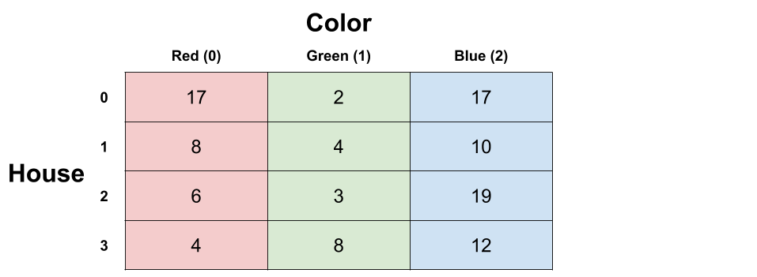

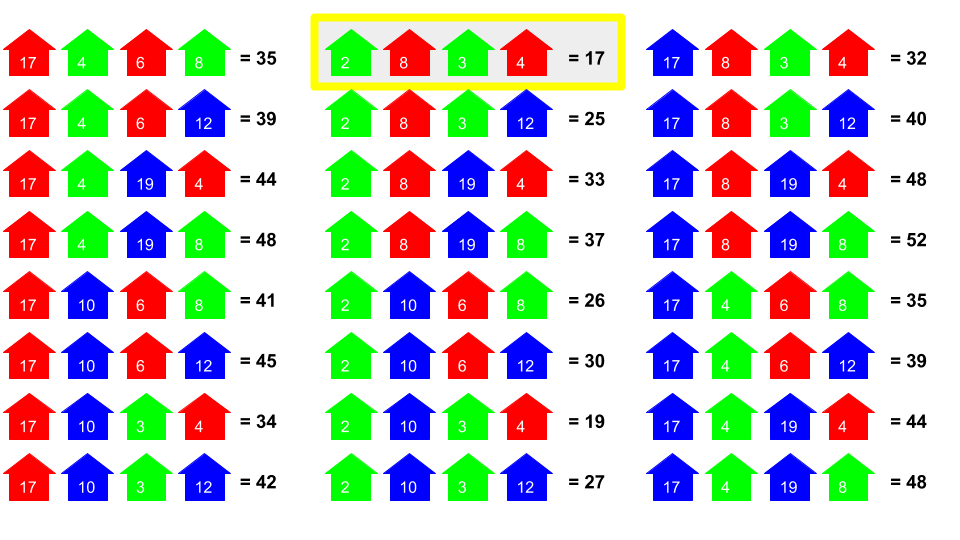

Generate every possible permutation of house colors and compute the cost.

Steps:

1. Generate all sequences of colors of length `n`.
2. Remove sequences where two adjacent colors are the same.
3. Compute total cost for each valid sequence.
4. Return the minimum.

Example optimal sequence:

Green → Red → Green → Red

Cost:

2 + 8 + 3 + 4 = 17

---

## Complexity

Time:

O(3^n)

Space:

O(n \* 3^n) if all permutations stored
O(n) if generated one by one

---

# Approach 2: Recursive Tree

## Intuition


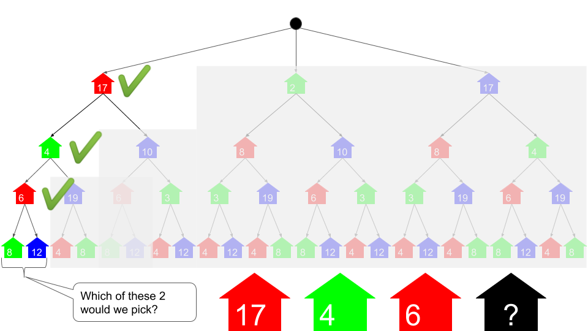

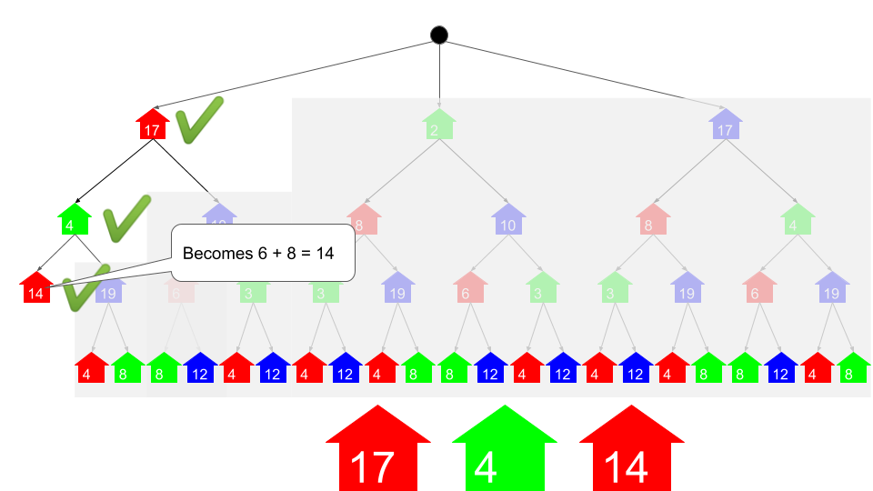

Think of the problem as a decision tree.

Each level represents a house.

Each node represents choosing a color.

Example:

House 0
├ Red
├ Green
└ Blue

From each node we choose a valid color for the next house.

Recursive idea:

paint(house, color) =
cost[house][color] +
minimum cost of painting remaining houses.

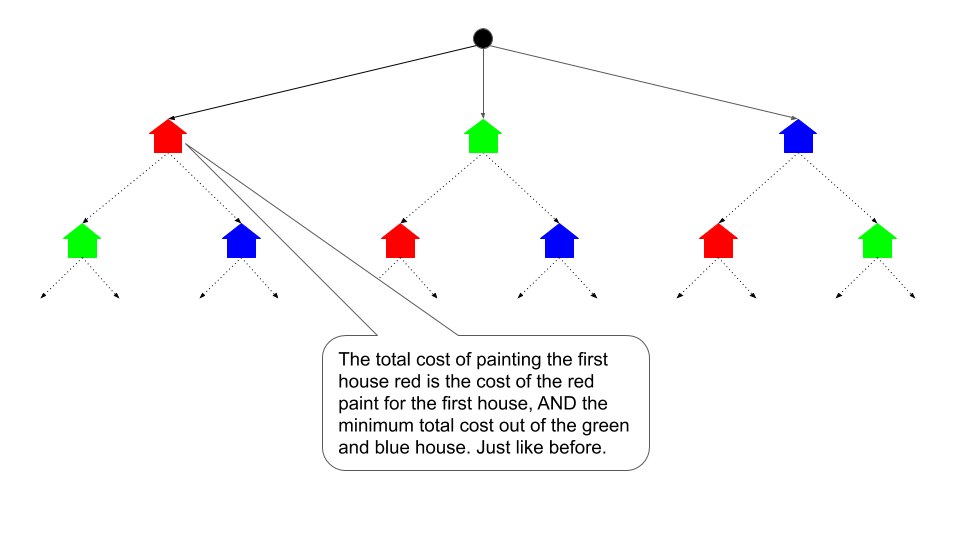

---

## Java Implementation

```java
class Solution {

    private int[][] costs;

    public int minCost(int[][] costs) {
        if (costs.length == 0) return 0;
        this.costs = costs;

        return Math.min(
            paintCost(0,0),
            Math.min(paintCost(0,1), paintCost(0,2))
        );
    }

    private int paintCost(int house, int color) {

        int cost = costs[house][color];

        if (house == costs.length - 1)
            return cost;

        if (color == 0)
            cost += Math.min(paintCost(house+1,1), paintCost(house+1,2));

        else if (color == 1)
            cost += Math.min(paintCost(house+1,0), paintCost(house+1,2));

        else
            cost += Math.min(paintCost(house+1,0), paintCost(house+1,1));

        return cost;
    }
}
```

Complexity:

Time: O(2^n)
Space: O(n)

---

# Approach 3: Memoization

## Intuition


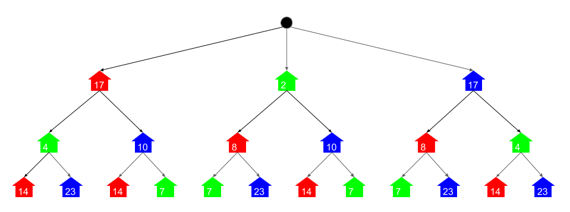

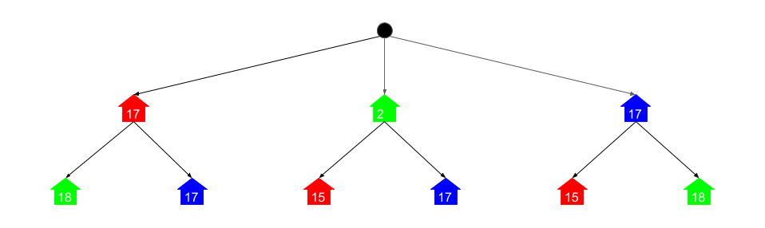

Recursive solution recalculates many subproblems.

Example repeated computation:

paint(2, red)

Memoization stores computed results.

Key idea:

memo[(house, color)] = minimum cost.

---

## Java Implementation

```java
class Solution {

    private int[][] costs;
    private Map<String,Integer> memo;

    public int minCost(int[][] costs) {

        if(costs.length==0) return 0;

        this.costs = costs;
        memo = new HashMap<>();

        return Math.min(
            paintCost(0,0),
            Math.min(paintCost(0,1), paintCost(0,2))
        );
    }

    private int paintCost(int house,int color){

        String key = house + "-" + color;

        if(memo.containsKey(key))
            return memo.get(key);

        int cost = costs[house][color];

        if(house != costs.length-1){

            if(color==0)
                cost += Math.min(paintCost(house+1,1), paintCost(house+1,2));

            else if(color==1)
                cost += Math.min(paintCost(house+1,0), paintCost(house+1,2));

            else
                cost += Math.min(paintCost(house+1,0), paintCost(house+1,1));
        }

        memo.put(key,cost);

        return cost;
    }
}
```

Complexity:

Time: O(n)
Space: O(n)

---

# Approach 4: Dynamic Programming (Bottom-Up)

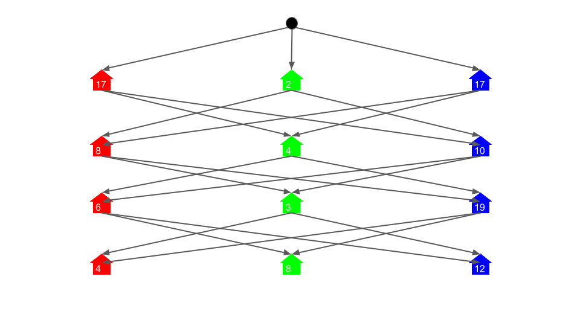

## Intuition

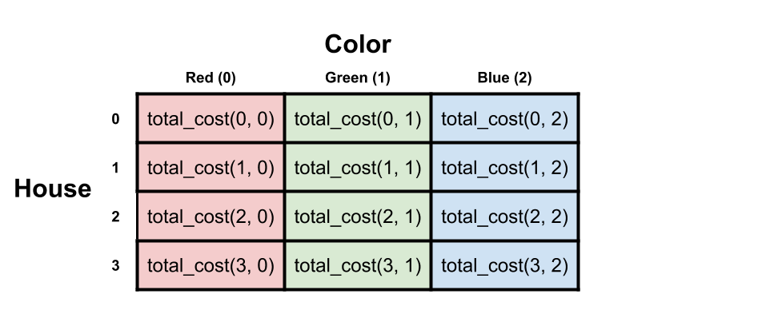

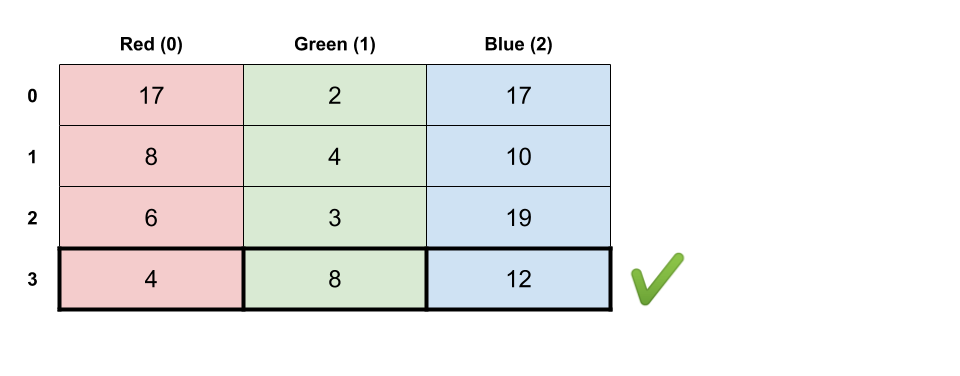

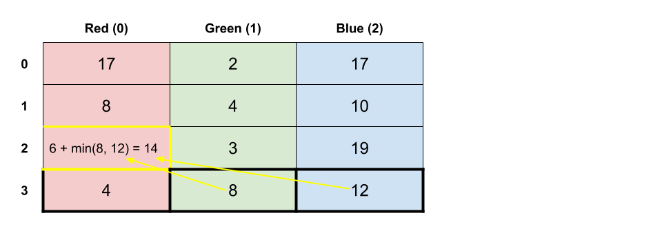

Instead of recursion we compute results iteratively.

Formula:

cost[i][red] += min(cost[i+1][green], cost[i+1][blue])
cost[i][green] += min(cost[i+1][red], cost[i+1][blue])
cost[i][blue] += min(cost[i+1][red], cost[i+1][green])

---

## Java Implementation

```java
class Solution {

    public int minCost(int[][] costs) {

        if(costs.length==0) return 0;

        for(int i=costs.length-2;i>=0;i--){

            costs[i][0] += Math.min(costs[i+1][1], costs[i+1][2]);
            costs[i][1] += Math.min(costs[i+1][0], costs[i+1][2]);
            costs[i][2] += Math.min(costs[i+1][0], costs[i+1][1]);
        }

        return Math.min(
            costs[0][0],
            Math.min(costs[0][1], costs[0][2])
        );
    }
}
```

Complexity:

Time: O(n)
Space: O(1)

---

# Approach 5: DP with Optimized Space

## Intuition

We only need the previous row when computing the current row.

Thus we store only two rows.

---

## Java Implementation

```java
class Solution {

    public int minCost(int[][] costs) {

        if(costs.length==0) return 0;

        int[] prev = costs[costs.length-1];

        for(int i=costs.length-2;i>=0;i--){

            int[] curr = costs[i].clone();

            curr[0] += Math.min(prev[1], prev[2]);
            curr[1] += Math.min(prev[0], prev[2]);
            curr[2] += Math.min(prev[0], prev[1]);

            prev = curr;
        }

        return Math.min(prev[0], Math.min(prev[1], prev[2]));
    }
}
```

Complexity:

Time: O(n)
Space: O(1)

---

# Why This Problem Uses Dynamic Programming

Two DP properties exist:

### Optimal Substructure

Best solution for house `i` depends on optimal solution for house `i+1`.

### Overlapping Subproblems

Subproblems such as:

paint(2, red)

are solved repeatedly.

Memoization removes repetition.

---

# Complexity Comparison

| Approach            | Time   | Space       |
| ------------------- | ------ | ----------- |
| Brute Force         | O(3^n) | O(n \* 3^n) |
| Recursive Tree      | O(2^n) | O(n)        |
| Memoization         | O(n)   | O(n)        |
| Dynamic Programming | O(n)   | O(1)        |
| Optimized DP        | O(n)   | O(1)        |

---

# Key Insight

Dynamic Programming converts an exponential search problem into a linear-time solution by reusing solutions of overlapping subproblems.
