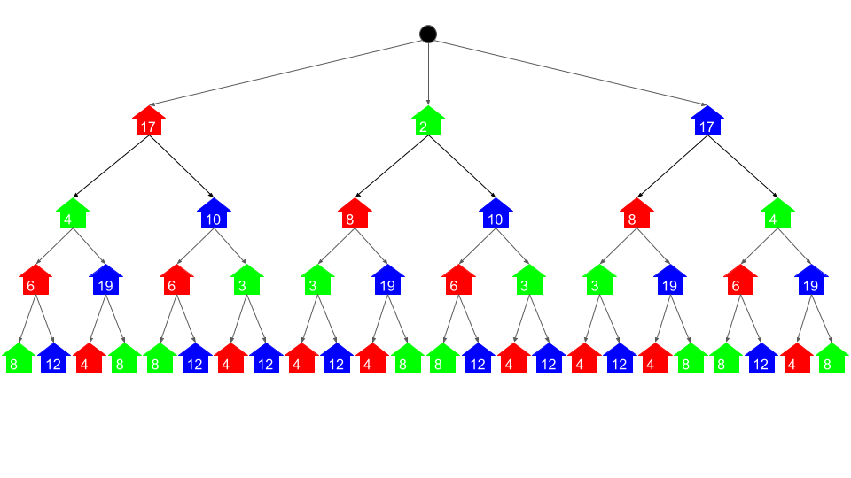
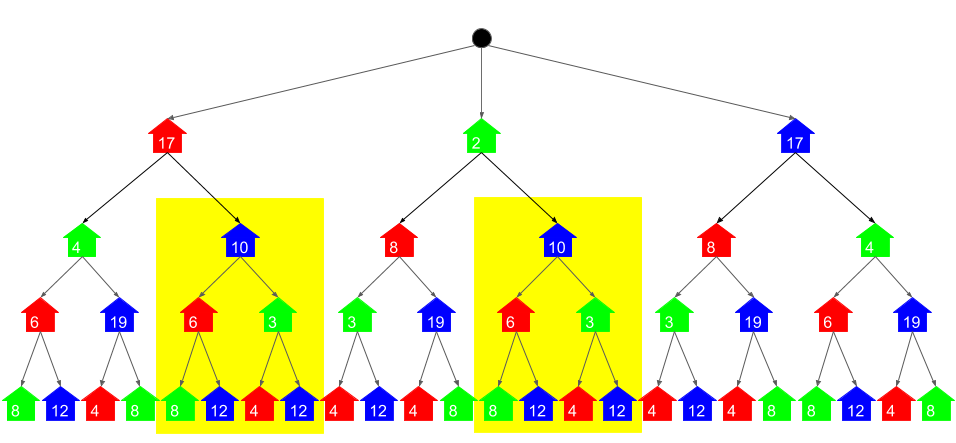
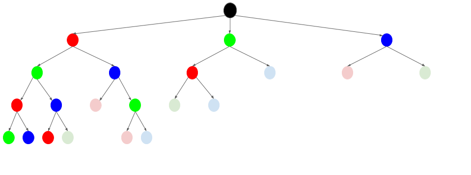
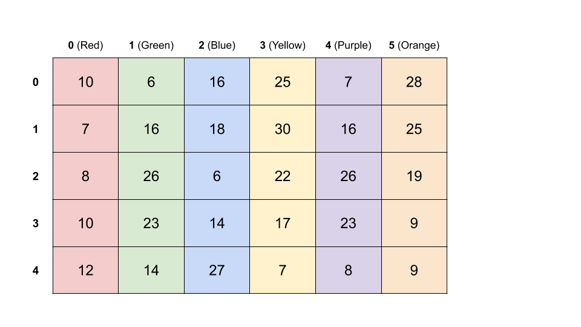
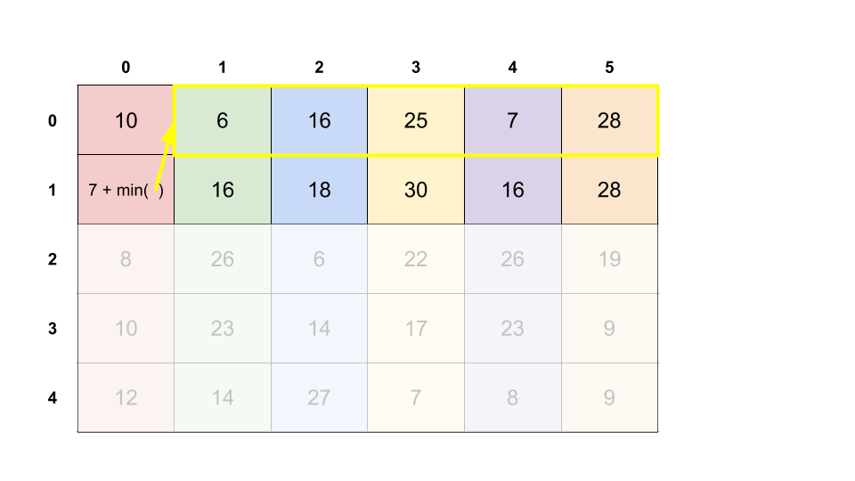
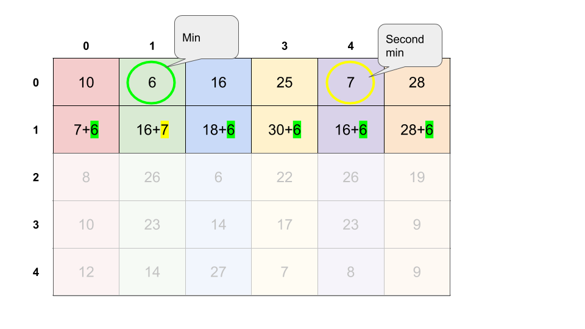

# Paint House II — Multiple Approaches

This document converts the provided explanation into a detailed Markdown note.

The discussion is about the generalized **Paint House II** problem, where:

- there are `n` houses
- there are `k` colors
- `costs[i][j]` is the cost of painting house `i` with color `j`
- no two adjacent houses can have the same color

The goal is to find the **minimum total painting cost**.

---

# Approach 1: Memoization

## Intuition







If you already know how to solve the basic **Paint House** problem when `k = 3`, this approach is the natural extension to arbitrary `k`.

We will call a painting arrangement **valid** if and only if no two adjacent houses have the same color.

We will call an input **valid** if it is possible to paint the houses in some valid way.

The LeetCode test cases are valid, but in an interview you may want to clarify whether invalid inputs can appear.

## Thinking Through Small Values of `k`

### Case 1: `k = 0`

If there are no colors, the only sensible valid input would be:

```text
n = 0
costs = []
```

In an interview, it would be worth asking whether impossible inputs such as:

```text
[[], [], [], []]
```

could appear. That would mean there are houses but no available colors.

### Case 2: `k = 1`

If there is only one color, then the only valid case is usually:

```text
n = 1
```

because with more than one house, adjacent houses would necessarily share the same color, which is not allowed.

### Case 3: `k = 2`

If there are two colors, the houses must alternate.

For example, with 5 houses and 2 colors, there are only two valid colorings:

- color0, color1, color0, color1, color0
- color1, color0, color1, color0, color1

You can compute both and choose the cheaper one.

### Case 4: `k = 3`

This becomes the classic Paint House problem.

The same recursive memoization idea extends directly to any `k > 3`.

---

## Recursive Definition

Define a function:

```text
paint(houseNumber, color)
```

It returns the minimum total cost of:

- painting `houseNumber` with `color`
- then painting all remaining houses optimally

Then the full answer is:

```text
min(
  paint(0, 0),
  paint(0, 1),
  ...,
  paint(0, k - 1)
)
```

### Recursive Formula

If `houseNumber` is the last house:

```text
paint(houseNumber, color) = costs[houseNumber][color]
```

Otherwise:

```text
paint(houseNumber, color) =
  costs[houseNumber][color]
  + min(
      paint(houseNumber + 1, nextColor)
      for all nextColor != color
    )
```

This recursion repeats many identical subproblems, so we memoize them.

---

## Java Implementation

```java
class Solution {

    private int n;
    private int k;
    private int[][] costs;
    private Map<String, Integer> memo;

    public int minCostII(int[][] costs) {
        if (costs.length == 0) return 0;

        this.k = costs[0].length;
        this.n = costs.length;
        this.costs = costs;
        this.memo = new HashMap<>();

        int minCost = Integer.MAX_VALUE;
        for (int color = 0; color < k; color++) {
            minCost = Math.min(minCost, memoSolve(0, color));
        }
        return minCost;
    }

    private int memoSolve(int houseNumber, int color) {

        // Base case
        if (houseNumber == n - 1) {
            return costs[houseNumber][color];
        }

        // Memoization lookup
        if (memo.containsKey(getKey(houseNumber, color))) {
            return memo.get(getKey(houseNumber, color));
        }

        int minRemainingCost = Integer.MAX_VALUE;
        for (int nextColor = 0; nextColor < k; nextColor++) {
            if (color == nextColor) continue;
            int currentRemainingCost = memoSolve(houseNumber + 1, nextColor);
            minRemainingCost = Math.min(currentRemainingCost, minRemainingCost);
        }

        int totalCost = costs[houseNumber][color] + minRemainingCost;
        memo.put(getKey(houseNumber, color), totalCost);
        return totalCost;
    }

    private String getKey(int n, int color) {
        return String.valueOf(n) + " " + String.valueOf(color);
    }
}
```

---

## Complexity Analysis

### Time Complexity

There are:

- `n` possible house indices
- `k` possible colors

So there are `n * k` unique subproblems.

For each subproblem, we loop through all `k` possible next colors.

Therefore:

```text
O(n * k^2)
```

### Space Complexity

Two sources of memory are used:

1. **Memoization table**:
   - stores one answer per `(house, color)`
   - total `O(n * k)`

2. **Recursion stack**:
   - at worst, one stack frame per house
   - total `O(n)`

So the dominant term is:

```text
O(n * k)
```

---

# Approach 2: Dynamic Programming

## Intuition





Instead of solving the problem recursively, we can solve it iteratively.

Think of the input as a grid:

- rows = houses
- columns = colors

We want to pick one cell from each row such that:

- adjacent rows do not pick the same column
- the total sum is minimized

This is a dynamic programming problem.

For each cell, we compute the cheapest total cost to reach that cell from the top while respecting the adjacency rule.

---

## DP Transition

For each house `house` and color `color`:

```text
costs[house][color] += min(
    costs[house - 1][previousColor]
    for all previousColor != color
)
```

This means:

- the new value at `costs[house][color]`
- becomes the cost of painting the current house this color
- plus the cheapest valid way to paint all previous houses

At the end, the answer is the minimum value in the last row.

---

## Java Implementation

```java
class Solution {
    public int minCostII(int[][] costs) {

        if (costs.length == 0) return 0;
        int k = costs[0].length;
        int n = costs.length;

        for (int house = 1; house < n; house++) {
            for (int color = 0; color < k; color++) {
                int min = Integer.MAX_VALUE;
                for (int previousColor = 0; previousColor < k; previousColor++) {
                    if (color == previousColor) continue;
                    min = Math.min(min, costs[house - 1][previousColor]);
                }
                costs[house][color] += min;
            }
        }

        int min = Integer.MAX_VALUE;
        for (int c : costs[n - 1]) {
            min = Math.min(min, c);
        }
        return min;
    }
}
```

---

## Complexity Analysis

### Time Complexity

There are `n * k` cells.

For each cell, we scan `k` colors in the previous row.

So:

```text
O(n * k^2)
```

### Space Complexity

If we update the input array in-place:

```text
O(1)
```

If we copy the input first to preserve it:

```text
O(n * k)
```

---

# Approach 3: Dynamic Programming with O(k) Additional Space

## Intuition

Approach 2 overwrites the input array.

If that is undesirable, we can avoid modifying the input while still using much less than `O(n * k)` extra space.

Observation:

To compute row `house`, we only need row `house - 1`.

So instead of storing the full DP table, we store only:

- `previousRow`
- `currentRow`

Each is an array of length `k`.

---

## Java Implementation

```java
class Solution {

    public int minCostII(int[][] costs) {

        if (costs.length == 0) return 0;
        int k = costs[0].length;
        int n = costs.length;

        int[] previousRow = costs[0];

        for (int house = 1; house < n; house++) {
            int[] currentRow = new int[k];
            for (int color = 0; color < k; color++) {
                int min = Integer.MAX_VALUE;
                for (int previousColor = 0; previousColor < k; previousColor++) {
                    if (color == previousColor) continue;
                    min = Math.min(min, previousRow[previousColor]);
                }
                currentRow[color] += costs[house][color] + min;
            }
            previousRow = currentRow;
        }

        int min = Integer.MAX_VALUE;
        for (int c : previousRow) {
            min = Math.min(min, c);
        }
        return min;
    }
}
```

---

## Complexity Analysis

### Time Complexity

Same as Approach 2:

```text
O(n * k^2)
```

### Space Complexity

We only store two rows of length `k`, so:

```text
O(k)
```

This version does **not** modify the input.

---

# Approach 4: Dynamic Programming with Optimized Time

## Intuition



All previous approaches spend `O(k)` time per cell scanning the previous row to find the minimum valid previous color.

That is why they are `O(n * k^2)`.

But we can do better.

### Key Observation

For each row, all we really need from the previous row is:

- the minimum value
- the second minimum value
- the column index of the minimum value

Why?

Because when computing the new cost for color `color`:

- if `color` is not the column of the previous minimum, we add the previous minimum
- otherwise, we must add the previous second minimum

So each cell can now be processed in `O(1)` time.

---

## Java Implementation

```java
class Solution {

    public int minCostII(int[][] costs) {

        if (costs.length == 0) return 0;
        int k = costs[0].length;
        int n = costs.length;

        for (int house = 1; house < n; house++) {

            int minColor = -1;
            int secondMinColor = -1;

            for (int color = 0; color < k; color++) {
                int cost = costs[house - 1][color];
                if (minColor == -1 || cost < costs[house - 1][minColor]) {
                    secondMinColor = minColor;
                    minColor = color;
                } else if (secondMinColor == -1 || cost < costs[house - 1][secondMinColor]) {
                    secondMinColor = color;
                }
            }

            for (int color = 0; color < k; color++) {
                if (color == minColor) {
                    costs[house][color] += costs[house - 1][secondMinColor];
                } else {
                    costs[house][color] += costs[house - 1][minColor];
                }
            }
        }

        int min = Integer.MAX_VALUE;
        for (int c : costs[n - 1]) {
            min = Math.min(min, c);
        }
        return min;
    }
}
```

---

## Complexity Analysis

### Time Complexity

For each row:

1. find minimum and second minimum in `O(k)`
2. update all `k` cells in `O(k)`

So each row costs `O(k)`.

For `n` rows:

```text
O(n * k)
```

This is optimal up to constant factors because every input cell must be examined at least once.

### Space Complexity

If done in-place:

```text
O(1)
```

---

# Approach 5: Dynamic Programming with Optimized Time and Space

## Intuition

Approach 4 is already optimal in time, but it overwrites the input.

We can preserve the input and still stay at:

- `O(n * k)` time
- `O(1)` extra space

The trick is to keep only summary information from the previous row:

- `prevMin`
- `prevSecondMin`
- `prevMinColor`

Then while scanning the current row, compute:

- the effective DP cost for each color
- the current row’s minimum
- the current row’s second minimum
- the current row’s minimum color

No DP table needs to be written at all.

---

## Java Implementation

```java
class Solution {

    public int minCostII(int[][] costs) {

        if (costs.length == 0) return 0;
        int k = costs[0].length;
        int n = costs.length;

        int prevMin = -1;
        int prevSecondMin = -1;
        int prevMinColor = -1;

        for (int color = 0; color < k; color++) {
            int cost = costs[0][color];
            if (prevMin == -1 || cost < prevMin) {
                prevSecondMin = prevMin;
                prevMinColor = color;
                prevMin = cost;
            } else if (prevSecondMin == -1 || cost < prevSecondMin) {
                prevSecondMin = cost;
            }
        }

        for (int house = 1; house < n; house++) {
            int min = -1;
            int secondMin = -1;
            int minColor = -1;

            for (int color = 0; color < k; color++) {
                int cost = costs[house][color];
                if (color == prevMinColor) {
                    cost += prevSecondMin;
                } else {
                    cost += prevMin;
                }

                if (min == -1 || cost < min) {
                    secondMin = min;
                    minColor = color;
                    min = cost;
                } else if (secondMin == -1 || cost < secondMin) {
                    secondMin = cost;
                }
            }

            prevMin = min;
            prevSecondMin = secondMin;
            prevMinColor = minColor;
        }

        return prevMin;
    }
}
```

---

## Complexity Analysis

### Time Complexity

Each row is processed in `O(k)`.

Across all rows:

```text
O(n * k)
```

### Space Complexity

Only a constant number of variables are used:

```text
O(1)
```

This version also preserves the input.

---

# Why This Is a Dynamic Programming Problem

This problem has the two classic DP properties:

## 1. Optimal Substructure

The optimal cost for painting a house with a given color depends on:

- the cost of painting that house that color
- plus the optimal cost of painting the previous (or next) houses under valid rules

That means the optimal solution can be built from optimal solutions to smaller subproblems.

## 2. Overlapping Subproblems

In the recursive formulation, the same subproblems such as:

```text
paint(house, color)
```

appear again and again.

Memoization avoids recomputing them.

When a problem has:

- optimal substructure
- overlapping subproblems

it is a natural candidate for dynamic programming.

---

# Complexity Summary

| Approach                  | Time Complexity | Space Complexity | Notes                                          |
| ------------------------- | --------------: | ---------------: | ---------------------------------------------- |
| Memoization               |    `O(n * k^2)` |       `O(n * k)` | Simple generalization of recursive Paint House |
| DP In-Place               |    `O(n * k^2)` |           `O(1)` | Overwrites input                               |
| DP with O(k) Extra Space  |    `O(n * k^2)` |           `O(k)` | Preserves input                                |
| Optimized Time DP         |      `O(n * k)` |           `O(1)` | Overwrites input                               |
| Optimized Time + Space DP |      `O(n * k)` |           `O(1)` | Preserves input                                |

---

# Key Takeaway

The main optimization is realizing that for each row you do **not** need to scan all `k` colors for every cell repeatedly.

You only need:

- the minimum from the previous row
- the second minimum from the previous row
- which color produced the minimum

That collapses the time complexity from:

```text
O(n * k^2)
```

to:

```text
O(n * k)
```

which is the optimal solution for the generalized Paint House II problem.
