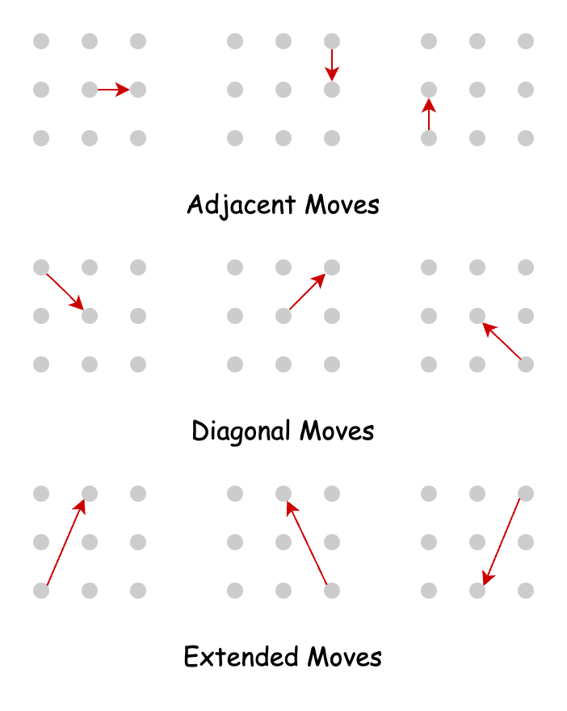
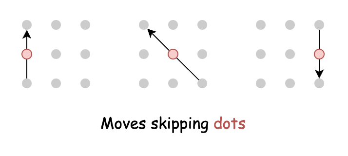
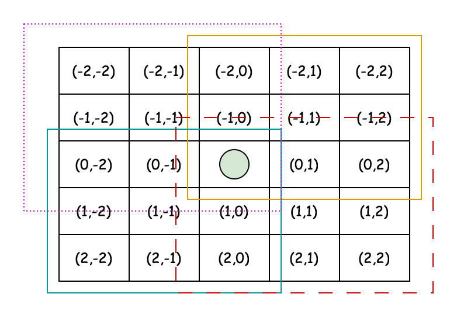
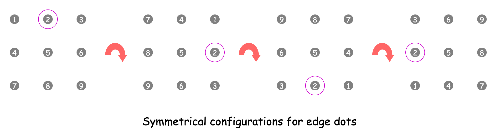

# Android Unlock Patterns — Detailed Notes

This document converts the provided explanation into a detailed Markdown note.

The problem is the classic **Android Unlock Patterns** problem on a `3 x 3` grid of dots.

---

## Problem Overview

Most Android phones feature a security mechanism known as a **lock pattern**.

It uses a `3 x 3` grid of dots. A valid pattern is created by connecting unmarked dots consecutively.

From any dot, there are two kinds of valid moves:



### 1. Single-step move

This connects directly to another dot without skipping over an unvisited dot.

### 2. Skip move

This connects to a non-neighboring dot by passing over exactly one intermediate dot, but only if that intermediate dot has already been visited.



---

## Key Observations

- From any dot, all other dots are reachable using either a direct move or a valid skip move.
- A dot cannot be visited twice.
- A dot may be passed over only if it is not being chosen as the next dot, and only if it has already been visited.
- We are given two integers:
  - `m`: minimum length of the pattern
  - `n`: maximum length of the pattern
- We must count all valid unlock patterns whose lengths are between `m` and `n`.

---

# Approach 1: Backtracking



## Intuition

A straightforward approach is to generate all possible valid patterns and count those whose lengths fall within `[m, n]`.

To do this, we recursively try all valid next moves from the current dot.

This is a natural **backtracking** problem:

- choose a next dot
- mark it visited
- recurse
- unmark it on the way back

If at any point no valid move exists, the recursion stops and backtracks.

---

## Move Representation

The provided explanation separates moves into two categories.

### Single-step moves

These are direct moves such as:

- horizontal
- vertical
- diagonal
- knight-like offsets that do not require jumping over a blocked intermediate dot

### Skip-dot moves

These are moves such as:

- `1 -> 3` (requires `2` to already be visited)
- `1 -> 7` (requires `4`)
- `1 -> 9` (requires `5`)
- and so on

The approach explicitly hardcodes all such moves.

---

## Algorithm

### Main method: `numberOfPatterns`

1. Initialize a counter `totalPatterns = 0`
2. For each of the 9 starting dots:
   - create a fresh visited matrix
   - call a recursive function from that starting dot
3. Sum up the results from all starts
4. Return the total

### Recursive helper: `countPatternsFromDot`

Parameters:

- `m`, `n`
- current pattern length
- current row and column
- visited matrix

Steps:

1. If current length exceeds `n`, return `0`
2. If current length is at least `m`, count the current pattern
3. Mark current dot as visited
4. Explore all valid single-step moves
5. Explore all valid skip-dot moves where the intermediate dot is already visited
6. Backtrack by unmarking current dot
7. Return the total count

---

## Java Implementation

```java
class Solution {

    private static final int[][] SINGLE_STEP_MOVES = {
        { 0, 1 }, { 0, -1 }, { 1, 0 }, { -1, 0 },
        { 1, 1 }, { -1, 1 }, { 1, -1 }, { -1, -1 },
        { -2, 1 }, { -2, -1 }, { 2, 1 }, { 2, -1 },
        { 1, -2 }, { -1, -2 }, { 1, 2 }, { -1, 2 },
    };

    private static final int[][] SKIP_DOT_MOVES = {
        { 0, 2 }, { 0, -2 }, { 2, 0 }, { -2, 0 },
        { -2, -2 }, { 2, 2 }, { 2, -2 }, { -2, 2 },
    };

    public int numberOfPatterns(int m, int n) {
        int totalPatterns = 0;

        for (int row = 0; row < 3; row++) {
            for (int col = 0; col < 3; col++) {
                boolean[][] visitedDots = new boolean[3][3];
                totalPatterns += countPatternsFromDot(m, n, 1, row, col, visitedDots);
            }
        }

        return totalPatterns;
    }

    private int countPatternsFromDot(
        int m,
        int n,
        int currentLength,
        int currentRow,
        int currentCol,
        boolean[][] visitedDots
    ) {
        if (currentLength > n) {
            return 0;
        }

        int validPatterns = 0;
        if (currentLength >= m) validPatterns++;

        visitedDots[currentRow][currentCol] = true;

        for (int[] move : SINGLE_STEP_MOVES) {
            int newRow = currentRow + move[0];
            int newCol = currentCol + move[1];
            if (isValidMove(newRow, newCol, visitedDots)) {
                validPatterns += countPatternsFromDot(
                    m, n, currentLength + 1, newRow, newCol, visitedDots
                );
            }
        }

        for (int[] move : SKIP_DOT_MOVES) {
            int newRow = currentRow + move[0];
            int newCol = currentCol + move[1];

            if (isValidMove(newRow, newCol, visitedDots)) {
                int middleRow = currentRow + move[0] / 2;
                int middleCol = currentCol + move[1] / 2;

                if (visitedDots[middleRow][middleCol]) {
                    validPatterns += countPatternsFromDot(
                        m, n, currentLength + 1, newRow, newCol, visitedDots
                    );
                }
            }
        }

        visitedDots[currentRow][currentCol] = false;
        return validPatterns;
    }

    private boolean isValidMove(int row, int col, boolean[][] visitedDots) {
        return row >= 0 && col >= 0 && row < 3 && col < 3 && !visitedDots[row][col];
    }
}
```

---

## Complexity Analysis

Let `n` be the maximum allowed pattern length.

### Time complexity

The explanation approximates the branching factor as about `8`, and there are `9` possible starting dots.

So the time complexity is approximated as:

```text
O(9 * 8^n)
```

### Space complexity

- Move arrays use constant space
- Visited matrix is fixed size `3 x 3`
- Recursion depth is at most `n`

So:

```text
O(n)
```

---

# Approach 2: Backtracking (Optimized)



## Intuition

The previous approach hardcodes move directions, which is awkward.

A cleaner way is to think in terms of **which dot must already be visited** before moving from one number to another.

For example:

- moving from `1` to `3` requires `2`
- moving from `1` to `9` requires `5`
- moving from `2` to `8` requires `5`

This suggests a **jump matrix**:

```text
jump[a][b] = c
```

meaning:

> to move from `a` to `b`, dot `c` must already be visited

If `jump[a][b] == 0`, then no intermediate dot is required.

### Major Symmetry Observation

The 9 dots are not all unique in terms of behavior.

They fall into 3 symmetry groups:

- Corners: `1, 3, 7, 9`
- Edges: `2, 4, 6, 8`
- Center: `5`

Each corner has the same number of patterns as the others.
Each edge has the same number of patterns as the others.

So instead of starting DFS from all 9 dots, we only need to do:

- one DFS from a corner, then multiply by 4
- one DFS from an edge, then multiply by 4
- one DFS from the center

This reduces redundant work significantly.

---

## Algorithm

### Main method: `numberOfPatterns`

1. Create a `jump` matrix of size `10 x 10`
2. Fill in all required intermediate jumps
3. Create a `visitedNumbers` array of size `10`
4. Count patterns from:
   - `1` (corner), multiply by `4`
   - `2` (edge), multiply by `4`
   - `5` (center)
5. Add all counts and return

### Recursive helper: `countPatternsFromNumber`

Parameters:

- current number
- current length
- min length
- max length
- jump matrix
- visited array

Steps:

1. If current length exceeds max length, return `0`
2. If current length is at least min length, count this pattern
3. Mark current number visited
4. Try every next number from `1` to `9`
5. Move is valid if:
   - next number is unvisited
   - and either no jump is required
   - or the required jumped-over number has already been visited
6. Recurse
7. Backtrack
8. Return total

---

## Java Implementation

```java
class Solution {

    public int numberOfPatterns(int m, int n) {
        int[][] jump = new int[10][10];

        jump[1][3] = jump[3][1] = 2;
        jump[4][6] = jump[6][4] = 5;
        jump[7][9] = jump[9][7] = 8;
        jump[1][7] = jump[7][1] = 4;
        jump[2][8] = jump[8][2] = 5;
        jump[3][9] = jump[9][3] = 6;
        jump[1][9] = jump[9][1] = jump[3][7] = jump[7][3] = 5;

        boolean[] visitedNumbers = new boolean[10];
        int totalPatterns = 0;

        totalPatterns += countPatternsFromNumber(1, 1, m, n, jump, visitedNumbers) * 4;
        totalPatterns += countPatternsFromNumber(2, 1, m, n, jump, visitedNumbers) * 4;
        totalPatterns += countPatternsFromNumber(5, 1, m, n, jump, visitedNumbers);

        return totalPatterns;
    }

    private int countPatternsFromNumber(
        int currentNumber,
        int currentLength,
        int minLength,
        int maxLength,
        int[][] jump,
        boolean[] visitedNumbers
    ) {
        if (currentLength > maxLength) return 0;

        int validPatterns = 0;
        if (currentLength >= minLength) {
            validPatterns++;
        }

        visitedNumbers[currentNumber] = true;

        for (int nextNumber = 1; nextNumber <= 9; nextNumber++) {
            int jumpOverNumber = jump[currentNumber][nextNumber];

            if (
                !visitedNumbers[nextNumber] &&
                (jumpOverNumber == 0 || visitedNumbers[jumpOverNumber])
            ) {
                validPatterns += countPatternsFromNumber(
                    nextNumber,
                    currentLength + 1,
                    minLength,
                    maxLength,
                    jump,
                    visitedNumbers
                );
            }
        }

        visitedNumbers[currentNumber] = false;

        return validPatterns;
    }
}
```

---

## Complexity Analysis

Let `n` be the maximum allowed pattern length.

### Time complexity

Because of symmetry, only 3 DFS starting classes are used instead of 9.

The branching factor is again approximated as about `8`.

So the runtime is approximated as:

```text
O(3 * 8^n)
```

### Space complexity

- `jump` matrix is fixed-size
- visited array is fixed-size
- recursion depth at most `n`

So:

```text
O(n)
```

---

# Approach 3: Memoization

## Intuition

The backtracking solution still recomputes the same subproblems.

For example, if two different paths reach:

- the same current dot
- with the same set of visited dots

then the number of valid future patterns from that state is identical.

So we should memoize based on the **state**:

1. current number
2. visited set

### State Compression Using Bits

A boolean visited array is inconvenient as a DP key.

Since there are only 9 dots, we can encode visited state as a bitmask.

Each bit represents whether a number has been visited.

Example:

- bit 0 corresponds to number 1
- bit 1 corresponds to number 2
- ...
- bit 8 corresponds to number 9

This turns the visited state into a single integer.

Then the DP table can be indexed by:

```text
dp[currentNumber][visitedMask]
```

This dramatically reduces repeated work.

---

## Bit Operations

We need three helper operations.

### `setBit(num, position)`

Marks a dot as visited.

### `clearBit(num, position)`

Removes a dot from the visited set during backtracking.

### `isSet(num, position)`

Checks whether a dot has already been visited.

---

## Algorithm

### Main method: `numberOfPatterns`

1. Build the jump matrix
2. Initialize:
   - `visitedNumbers = 0`
   - `totalPatterns = 0`
   - `dp = new Integer[10][1 << 10]`
3. Use symmetry:
   - count from 1 and multiply by 4
   - count from 2 and multiply by 4
   - count from 5 once
4. Return total

### Recursive helper: `countPatternsFromNumber`

State parameters:

- current number
- current length
- visited bitmask

Steps:

1. If current length exceeds max length, return `0`
2. If memoized result exists, return it
3. If current length is at least min length, count the current pattern
4. Mark current number as visited
5. Try all next numbers from `1` to `9`
6. Recurse only if:
   - next number is unvisited
   - and either no jump is required
   - or jump-over number is already visited
7. Backtrack by clearing the current bit
8. Memoize and return

---

## Java Implementation

```java
class Solution {

    public int numberOfPatterns(int m, int n) {
        int[][] jump = new int[10][10];

        jump[1][3] = jump[3][1] = 2;
        jump[4][6] = jump[6][4] = 5;
        jump[7][9] = jump[9][7] = 8;
        jump[1][7] = jump[7][1] = 4;
        jump[2][8] = jump[8][2] = 5;
        jump[3][9] = jump[9][3] = 6;
        jump[1][9] = jump[9][1] = jump[3][7] = jump[7][3] = 5;

        int visitedNumbers = 0;
        int totalPatterns = 0;
        Integer[][] dp = new Integer[10][1 << 10];

        totalPatterns += countPatternsFromNumber(1, 1, m, n, jump, visitedNumbers, dp) * 4;
        totalPatterns += countPatternsFromNumber(2, 1, m, n, jump, visitedNumbers, dp) * 4;
        totalPatterns += countPatternsFromNumber(5, 1, m, n, jump, visitedNumbers, dp);

        return totalPatterns;
    }

    private int countPatternsFromNumber(
        int currentNumber,
        int currentLength,
        int minLength,
        int maxLength,
        int[][] jump,
        int visitedNumbers,
        Integer[][] dp
    ) {
        if (currentLength > maxLength) return 0;

        if (dp[currentNumber][visitedNumbers] != null) {
            return dp[currentNumber][visitedNumbers];
        }

        int validPatterns = 0;
        if (currentLength >= minLength) {
            validPatterns++;
        }

        visitedNumbers = setBit(visitedNumbers, currentNumber);

        for (int nextNumber = 1; nextNumber <= 9; nextNumber++) {
            int jumpOverNumber = jump[currentNumber][nextNumber];

            if (
                !isSet(visitedNumbers, nextNumber) &&
                (jumpOverNumber == 0 || isSet(visitedNumbers, jumpOverNumber))
            ) {
                validPatterns += countPatternsFromNumber(
                    nextNumber,
                    currentLength + 1,
                    minLength,
                    maxLength,
                    jump,
                    visitedNumbers,
                    dp
                );
            }
        }

        visitedNumbers = clearBit(visitedNumbers, currentNumber);

        return dp[currentNumber][visitedNumbers] = validPatterns;
    }

    private int setBit(int num, int position) {
        num |= 1 << (position - 1);
        return num;
    }

    private int clearBit(int num, int position) {
        num ^= 1 << (position - 1);
        return num;
    }

    private boolean isSet(int num, int position) {
        int bitAtPosition = (num >> (position - 1)) & 1;
        return bitAtPosition == 1;
    }
}
```

---

## Complexity Analysis

### Time complexity

The DP table size is:

```text
10 * (1 << 10)
```

which equals:

```text
10 * 1024 = 10240
```

This is a constant upper bound.

So the explanation simplifies the runtime to:

```text
O(1)
```

This is constant with respect to the problem input because the grid size is fixed at 9 dots.

### Space complexity

- `jump` matrix: constant
- `dp` table: constant
- recursion depth: at most `n`

So:

```text
O(n)
```

where `n` is the maximum allowed pattern length, due to recursion stack depth.

---

# Comparison of Approaches

| Approach               | Main Idea                            |                   Time Complexity | Space Complexity |
| ---------------------- | ------------------------------------ | --------------------------------: | ---------------: |
| Backtracking           | Try all valid patterns directly      |                      `O(9 * 8^n)` |           `O(n)` |
| Optimized Backtracking | Use jump matrix + symmetry           |                      `O(3 * 8^n)` |           `O(n)` |
| Memoization            | Cache by `(currentDot, visitedMask)` | `O(1)` for fixed-size state space |           `O(n)` |

---

# Key Takeaways

1. The problem is naturally solved with **backtracking** because we build patterns step by step and undo moves.
2. The first big optimization is recognizing the **symmetry** among corner dots and edge dots.
3. The strongest optimization is recognizing overlapping subproblems and using **memoization**.
4. Because the board size is fixed at 9 dots, the memoized state space is bounded and effectively constant.

---

# Final Insight

Even though the recursive search appears exponential, the fixed-size board allows the memoized solution to collapse into a very small state space.

That makes the memoization approach the most powerful and elegant solution for this problem.
