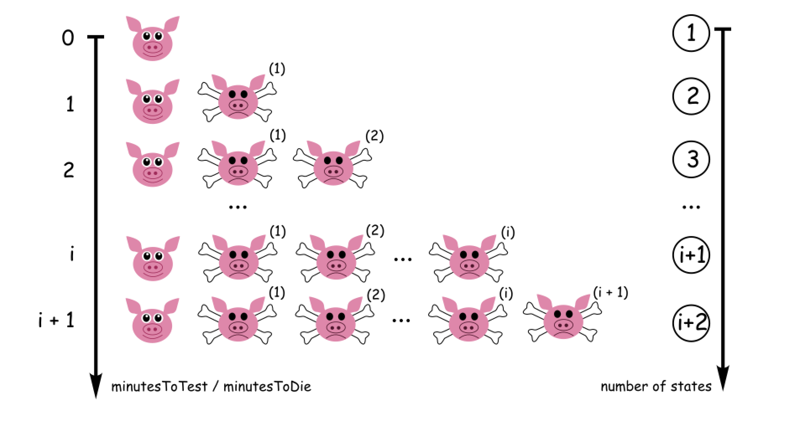
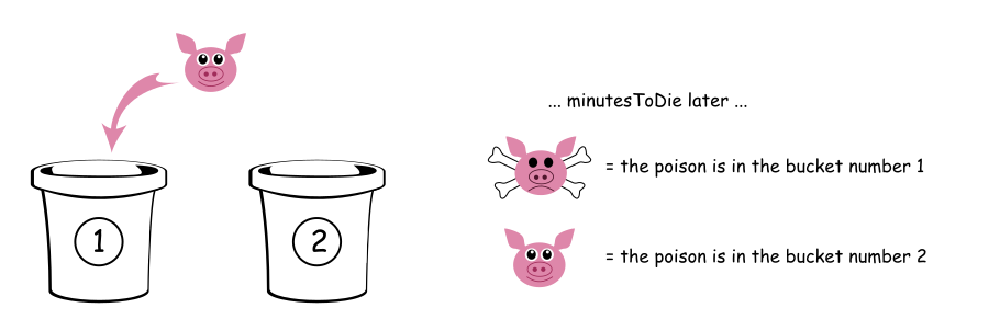
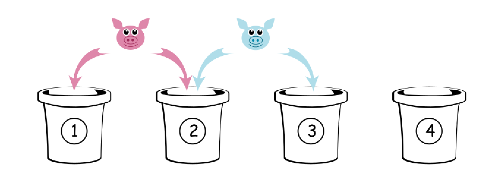
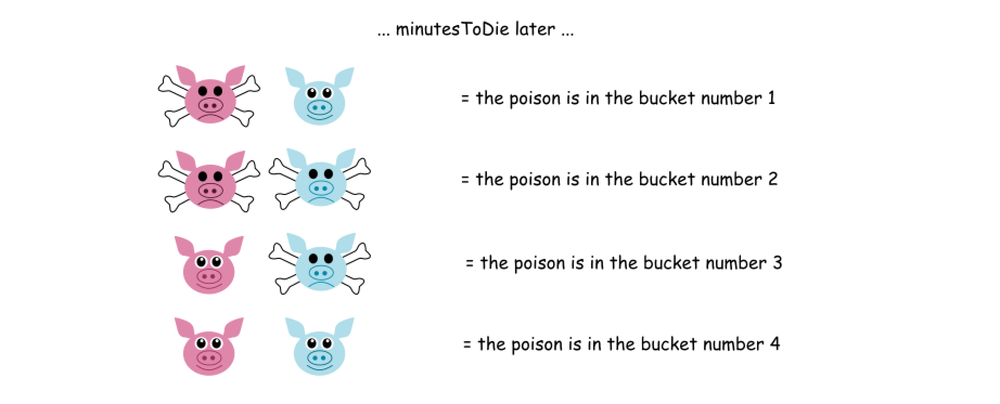
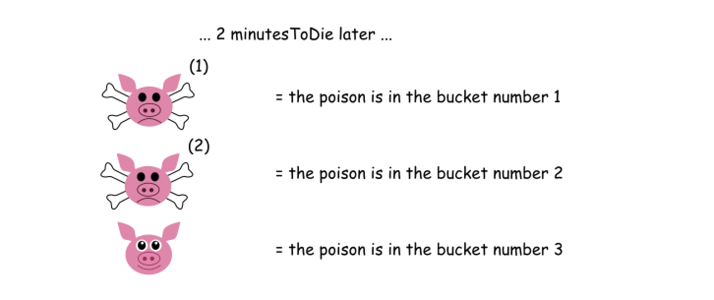

# 458. Poor Pigs — Exhaustive Solution Notes

## Overview

This problem looks unusual at first because it is not a standard dynamic programming, graph, or greedy problem.

Instead, it is really an **information encoding** problem.

We are given:

- `buckets` total buckets
- exactly **one** poisonous bucket
- `minutesToDie` = time after drinking poison before a pig dies
- `minutesToTest` = total testing time available

We must find the **minimum number of pigs** needed to identify the poisonous bucket within the allowed time.

The key insight is that each pig is not just "alive" or "dead".
Because testing can happen in multiple rounds, a pig can die in different rounds, or survive all rounds.
So each pig can represent multiple possible states.

That turns the problem into:

> How many multi-state "signals" do we need to distinguish all buckets?

This write-up explains the standard solution in detail.

---

## Problem Statement

There are `buckets` buckets of liquid, and exactly one of them is poisonous.

You may use some number of pigs to test the buckets.

Rules:

1. Choose some live pigs to feed.
2. For each pig, choose any number of buckets to feed it.
3. Feeding happens instantly.
4. Wait `minutesToDie` minutes.
5. Any pig that drank poison dies after `minutesToDie` minutes.
6. Repeat until you run out of time.

Return the **minimum number of pigs** needed to determine exactly which bucket is poisonous within `minutesToTest` minutes.

---

## Example 1

**Input**

```text
buckets = 4
minutesToDie = 15
minutesToTest = 15
```

**Output**

```text
2
```

**Explanation**

There is only one round of testing.

We can assign buckets like this:

- Pig 1 drinks from buckets `1` and `2`
- Pig 2 drinks from buckets `2` and `3`

After 15 minutes:

- Pig 1 dead, Pig 2 alive → bucket `1`
- Pig 1 alive, Pig 2 dead → bucket `3`
- both dead → bucket `2`
- both alive → bucket `4`

So `2` pigs are enough.

---

## Example 2

**Input**

```text
buckets = 4
minutesToDie = 15
minutesToTest = 30
```

**Output**

```text
2
```

**Explanation**

There are two rounds of testing.

At time `0`:

- Pig 1 drinks bucket `1`
- Pig 2 drinks bucket `2`

At time `15`:

- if a pig dies, we know the poisoned bucket
- if neither dies, use the second round

At time `15`:

- Pig 1 drinks bucket `3`
- Pig 2 drinks bucket `4`

At time `30`, the outcome identifies the poisoned bucket.

---

## Constraints

- `1 <= buckets <= 1000`
- `1 <= minutesToDie <= minutesToTest <= 100`

---

# Core Insight

This problem is about how many distinct outcomes we can encode using pigs.

Each pig can have multiple possible final outcomes, not just two.

That is the whole trick.

---

# Step 1: How Many Rounds Do We Have?

A pig takes exactly `minutesToDie` minutes to show whether it drank poison.

So the number of full test rounds we can perform is:

```text
rounds = minutesToTest / minutesToDie
```

This is integer division because only complete rounds matter.

---

# Step 2: How Many States Does One Pig Have?

A pig can end the experiment in one of several states:

- dies after round 1
- dies after round 2
- dies after round 3
- ...
- dies after round `rounds`
- survives all rounds

So the total number of states per pig is:

```text
states = rounds + 1
```

Equivalently:

```text
states = minutesToTest / minutesToDie + 1
```

---

# Why These Are Truly Different States

Suppose we have:

```text
minutesToDie = 15
minutesToTest = 30
```

Then:

```text
rounds = 2
states = 3
```

One pig can end in exactly one of these final outcomes:

1. dies after first round
2. dies after second round
3. survives entirely

These three outcomes are distinguishable, so this pig can encode one of three values.

That is why a pig is not just a binary device here.

---

# "Pig as a Qubit" Interpretation

A classical bit has two states:

```text
0 or 1
```

A pig in this problem can have more than two distinguishable outcomes.

That is why some explanations compare a pig here to a "qubit" or more generally a multi-state information carrier.

The comparison is informal, but the mathematical point is useful:

- one pig can represent `states` possibilities
- two pigs can represent `states × states`
- three pigs can represent `states × states × states`
- and so on

So with `x` pigs, the total number of distinguishable outcomes is:

```text
states^x
```

---

# Step 3: How Many Buckets Can `x` Pigs Distinguish?

If each pig has `states` possible outcomes, then `x` pigs together can represent:

```text
states^x
```

distinct combined outcomes.

To uniquely identify the poisonous bucket among `buckets` buckets, we need:

```text
states^x >= buckets
```

So the problem becomes:

> Find the smallest integer `x` such that `states^x >= buckets`

That `x` is the answer.

---

# Small Examples

## Case 1: One Pig, One Round

If:

```text
minutesToTest / minutesToDie = 1
```

then:

```text
states = 2
```

One pig has two outcomes:

- dead
- alive

So one pig can distinguish at most `2` buckets.

---

## Case 2: Two Pigs, One Round

Each pig has 2 states.

So total outcomes:

```text
2^2 = 4
```

That means two pigs can distinguish 4 buckets.

This matches Example 1.

---

## Case 3: One Pig, Two Rounds

If:

```text
minutesToTest / minutesToDie = 2
```

then:

```text
states = 3
```

One pig has three possible outcomes:

- dies after round 1
- dies after round 2
- survives all rounds

So one pig can distinguish:

```text
3
```

buckets.

---

## Case 4: Two Pigs, Two Rounds

Each pig has 3 states.

So total distinguishable outcomes:

```text
3^2 = 9
```

That means two pigs can distinguish up to 9 buckets.











---

# Deriving the Formula

We need:

```text
states^x >= buckets
```

Take logarithms:

```text
x >= log_states(buckets)
```

Using natural logarithms:

```text
x >= ln(buckets) / ln(states)
```

Since `x` must be an integer and we need the **minimum** such integer:

```text
x = ceil(ln(buckets) / ln(states))
```

That is the final formula.

---

# Full Mathematical Solution

Let:

```text
states = minutesToTest / minutesToDie + 1
```

Then the minimum number of pigs is the smallest integer `x` such that:

```text
states^x >= buckets
```

So:

```text
x = ceil(log(buckets) / log(states))
```

where the logarithm base can be anything as long as it is the same in numerator and denominator.

---

# Floating-Point Note

In Java and many other languages, floating-point calculations are not exact.

For example:

```text
log(125) / log(5)
```

should mathematically be exactly `3`, but due to floating-point representation it might become something like:

```text
2.9999999999999996
```

If we apply `ceil` directly, that still gives `3`, which is fine.

But in some edge cases near an integer boundary, tiny floating-point errors can cause trouble.

So it is common to subtract a tiny tolerance such as:

```text
1e-10
```

before applying `ceil`.

That helps avoid rounding issues.

---

## Java Implementation

```java
class Solution {
    public int poorPigs(int buckets, int minutesToDie, int minutesToTest) {
        int states = minutesToTest / minutesToDie + 1;

        // Subtract a tiny tolerance to reduce floating-point edge issues
        return (int) Math.ceil(Math.log(buckets) / Math.log(states) - 1e-10);
    }
}
```

---

# Step-by-Step Example 1

Input:

```text
buckets = 4
minutesToDie = 15
minutesToTest = 15
```

## Step 1: Compute states

```text
states = 15 / 15 + 1 = 2
```

Each pig has 2 states.

## Step 2: Find smallest `x`

Need:

```text
2^x >= 4
```

Try values:

- `x = 1` → `2^1 = 2` not enough
- `x = 2` → `2^2 = 4` enough

So answer:

```text
2
```

---

# Step-by-Step Example 2

Input:

```text
buckets = 4
minutesToDie = 15
minutesToTest = 30
```

## Step 1: Compute states

```text
states = 30 / 15 + 1 = 3
```

Each pig has 3 states.

## Step 2: Find smallest `x`

Need:

```text
3^x >= 4
```

Try values:

- `x = 1` → `3^1 = 3` not enough
- `x = 2` → `3^2 = 9` enough

So answer:

```text
2
```

---

# Why This Is Optimal

The solution is optimal because it is based on information capacity.

If `x` pigs each have `states` possible outcomes, then there are at most:

```text
states^x
```

distinct observable final results.

If this number is less than `buckets`, then two different buckets would lead to the same observable result, meaning we could not uniquely identify the poison.

So any valid strategy must satisfy:

```text
states^x >= buckets
```

And our formula finds the smallest such `x`.

That proves optimality.

---

# Alternative Iterative Version

Instead of using logarithms, we can multiply until we reach or exceed `buckets`.

This avoids floating-point issues entirely.

```java
class Solution {
    public int poorPigs(int buckets, int minutesToDie, int minutesToTest) {
        int states = minutesToTest / minutesToDie + 1;
        int pigs = 0;
        int capacity = 1;

        while (capacity < buckets) {
            capacity *= states;
            pigs++;
        }

        return pigs;
    }
}
```

This is often preferred because it is simple and exact.

Since constraints are tiny, this loop is extremely fast.

---

# Complexity Analysis

## Logarithm-Based Solution

### Time Complexity

```text
O(1)
```

Only a few arithmetic operations are performed.

### Space Complexity

```text
O(1)
```

Only a few variables are used.

---

## Iterative Multiplication Version

### Time Complexity

The number of loop iterations is very small, roughly the answer itself.

With the given constraints this is effectively constant, though more formally it is:

```text
O(log_states(buckets))
```

### Space Complexity

```text
O(1)
```

---

# Common Mistakes

## 1. Thinking Each Pig Has Only Two States

This is the biggest conceptual mistake.

A pig can die in different rounds, and those are different observable outcomes.

So each pig has:

```text
rounds + 1
```

states, not just 2.

---

## 2. Forgetting the "+1"

If there are `rounds` testing rounds, the pig can:

- die in round 1
- die in round 2
- ...
- die in round `rounds`
- survive all rounds

That is:

```text
rounds + 1
```

states.

Not just `rounds`.

---

## 3. Confusing Number of Rounds with Number of Feedings

The number of complete testing rounds is:

```text
minutesToTest / minutesToDie
```

because after each feeding we must wait `minutesToDie` minutes.

---

## 4. Floating-Point Precision Issues

Using logarithms is mathematically fine, but implementations may need care.

That is why a small tolerance like `1e-10` is sometimes used, or an iterative integer solution can be used instead.

---

# Interview Perspective

This is a classic "information theory disguised as a puzzle" problem.

A strong explanation should proceed like this:

1. Count the number of testing rounds.
2. Realize each pig has multiple distinguishable final states.
3. Therefore, `x` pigs can encode `states^x` possibilities.
4. Require:
   ```text
   states^x >= buckets
   ```
5. Solve for the smallest integer `x`.

That is the core reasoning interviewers care about.

---

# Final Summary

## Key Formula

Let:

```text
states = minutesToTest / minutesToDie + 1
```

Then the minimum number of pigs is the smallest integer `x` such that:

```text
states^x >= buckets
```

So:

```text
x = ceil(log(buckets) / log(states))
```

---

## Complexity

- Time: `O(1)`
- Space: `O(1)`

---

# Best Final Java Solution

```java
class Solution {
    public int poorPigs(int buckets, int minutesToDie, int minutesToTest) {
        int states = minutesToTest / minutesToDie + 1;
        return (int) Math.ceil(Math.log(buckets) / Math.log(states) - 1e-10);
    }
}
```

---

# Best Integer-Only Java Solution

```java
class Solution {
    public int poorPigs(int buckets, int minutesToDie, int minutesToTest) {
        int states = minutesToTest / minutesToDie + 1;
        int pigs = 0;
        int capacity = 1;

        while (capacity < buckets) {
            capacity *= states;
            pigs++;
        }

        return pigs;
    }
}
```

Both solutions are correct, but the integer-only version avoids floating-point concerns entirely.
