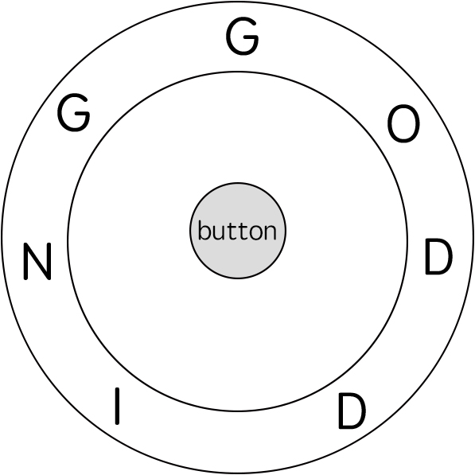

# 514. Freedom Trail

import pypandoc

md = """

# Freedom Trail (Fallout 4 Dial Problem)

## Problem Description

In the video game **Fallout 4**, the quest **"Road to Freedom"** requires players to reach a metal dial called the **Freedom Trail Ring** and use it to spell a specific keyword in order to open a door.

You are given:

- **ring** — a string representing the characters engraved around a circular ring.
- **key** — a string representing the keyword that must be spelled.

Your goal is to determine the **minimum number of steps required to spell the entire keyword**.

---

# Game Mechanics

Initially:

- The **first character of the ring** is aligned at the **12:00 position**.

To spell characters of `key`, you perform the following actions repeatedly.

### Step 1 — Rotate the Ring

You can rotate the ring:

- **Clockwise** by one position → cost = **1 step**
- **Anticlockwise** by one position → cost = **1 step**

The goal is to rotate until a character equal to `key[i]` is aligned at **12:00**.

### Step 2 — Press the Button

Once the correct character is aligned:

- Press the **center button** to confirm the character.
- This action costs **1 step**.

Then proceed to the next character in `key`.

---

# Objective

Return:

```
The minimum number of steps required to spell the entire key.
```

---

# Example 1



## Input

```
ring = "godding"
key  = "gd"
```

## Output

```
4
```

## Explanation

Initial ring:

```
g o d d i n g
^
12:00
```

### Spell 'g'

- Already aligned at 12:00.
- Press button.

Steps:

```
1 step
```

### Spell 'd'

We rotate anticlockwise:

```
godding -> d d i n g g o
```

Rotation cost:

```
2 steps
```

Press button:

```
1 step
```

Total:

```
1 + 2 + 1 = 4
```

---

# Example 2

## Input

```
ring = "godding"
key  = "godding"
```

## Output

```
13
```

---

# Constraints

```
1 <= ring.length <= 100
1 <= key.length <= 100
```

Characters allowed:

```
lowercase English letters
```

Additional guarantee:

```
It is always possible to spell the key.
```

---
