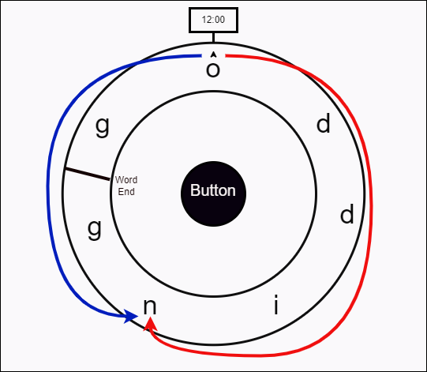
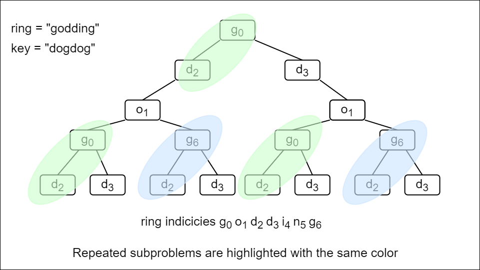
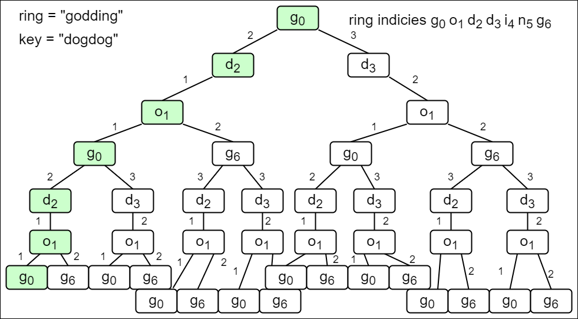

# Freedom Trail — Exhaustive Solution Notes

## Overview

We are given:

- a circular string `ring`
- a target string `key`

Initially, `ring[0]` is aligned at the **12:00** position.

To spell each character of `key`, we may:

1. rotate the ring clockwise or anticlockwise
2. align one occurrence of the required character at 12:00
3. press the center button

Each single rotation costs **1 step**.
Each press also costs **1 step**.

The goal is to compute the **minimum total number of steps** required to spell the entire key.

This problem is a classic shortest-cost state transition problem and can be solved in multiple ways:

1. **Top-Down Dynamic Programming**
2. **Bottom-Up Dynamic Programming**
3. **Space-Optimized Bottom-Up DP**
4. **Shortest Path / Dijkstra-style Search**

All four approaches rely on the same central idea:

> the cost of spelling the rest of the keyword depends on:
>
> - which index of the ring is currently at 12:00
> - which index of the key we are trying to spell next

---

## Problem Statement

In the video game Fallout 4, the quest "Road to Freedom" requires players to use the Freedom Trail Ring to spell a keyword.

You are given:

- `ring`: a string engraved around a circular dial
- `key`: the target keyword to spell

Initially, the first character of the ring is aligned at 12:00.

For each character `key[i]`:

- rotate the ring clockwise or anticlockwise until some occurrence of `key[i]` is aligned at 12:00
- each single-position rotation costs `1`
- once aligned, press the center button, which also costs `1`

Return the minimum number of steps required to spell the entire key.

---

## Example 1

**Input**

```text
ring = "godding"
key = "gd"
```

**Output**

```text
4
```

**Explanation**

Initially `g` is already at 12:00.

### Spell `'g'`

- no rotation needed
- press button → `1` step

### Spell `'d'`

There are two `d` characters in the ring.
The best move is to rotate by 2 steps and then press.

So the total is:

```text
1 + 2 + 1 = 4
```

---

## Example 2

**Input**

```text
ring = "godding"
key = "godding"
```

**Output**

```text
13
```

---

## Constraints

- `1 <= ring.length, key.length <= 100`
- `ring` and `key` consist of lowercase English letters
- it is guaranteed that `key` can always be spelled

---

# Core Observation

The ring is circular.

If we are currently at index `curr` and want to move to index `next`, then there are always two possible directions:

- direct rotation without wrapping
- wrap around the circle in the opposite direction

So the cost of rotating from `curr` to `next` is:

```text
distance = min(|curr - next|, ringLength - |curr - next|)
```

This is the most fundamental helper calculation in the problem.

---

# Helper Function: `countSteps`

Let:

- `curr` = current ring index aligned at 12:00
- `next` = target ring index we want to align
- `ringLength` = size of the ring

Then:

```text
stepsBetween = |curr - next|
stepsAround  = ringLength - stepsBetween
countSteps   = min(stepsBetween, stepsAround)
```

This gives the minimum number of rotations required.

---

# Why Greedy Fails

A tempting idea is:

> For each key character, always choose the nearest occurrence in the ring.

That does not always produce the global optimum.

Why?

Because the occurrence we choose now affects the starting position for the next character.

If a character appears multiple times in the ring, then different choices may produce different future costs.

So we must optimize globally, not greedily.

---

## Greedy Counterexample Idea

Suppose the ring has multiple copies of a character, and the key contains characters that depend heavily on where we stop next.

The nearest current match may put us in a poor position for future characters, while a slightly more expensive current choice may be better overall.

That is why dynamic programming or shortest path is needed.

---

# State Definition Used by the Good Solutions

A natural DP / graph state is:

```text
(ringIndex, keyIndex)
```

where:

- `ringIndex` = which index of `ring` is currently aligned at 12:00
- `keyIndex` = which character of `key` we still need to spell next

This state is sufficient because:

- the future only depends on the current dial position
- and the next target character

---

# Approach 1: Top-Down Dynamic Programming

## Intuition

Define a recursive function:

```text
tryLock(ringIndex, keyIndex)
```

meaning:

> the minimum number of steps needed to spell `key[keyIndex ... end]`
> when `ring[ringIndex]` is currently aligned at 12:00

At this state, we need to spell `key[keyIndex]`.

That character may appear at several positions in `ring`.

For each occurrence `charIndex` of `key[keyIndex]` in the ring:

1. rotate from `ringIndex` to `charIndex`
2. press the button
3. recursively spell the remaining suffix of the key

So the transition is:

```text
1 + countSteps(ringIndex, charIndex) + tryLock(charIndex, keyIndex + 1)
```

Take the minimum over all valid `charIndex`.



---

## Base Case

If:

```text
keyIndex == key.length()
```

then the whole keyword has already been spelled.

So:

```text
return 0
```

No more rotations or presses are required.

---

## Why Memoization Is Necessary

Without memoization, the same state `(ringIndex, keyIndex)` may be recomputed many times.

That causes exponential blow-up.

So we store the best answer for every state in a map:

```text
bestSteps[(ringIndex, keyIndex)]
```

Then whenever a state repeats, we return the cached value immediately.

---

## Recurrence

For state `(ringIndex, keyIndex)`:

```text
dp(ringIndex, keyIndex) =
    min over all charIndex where ring[charIndex] == key[keyIndex] of
    (
        countSteps(ringIndex, charIndex)
        + 1
        + dp(charIndex, keyIndex + 1)
    )
```



---

## Java Implementation — Top-Down DP

```java
import java.util.*;

class Solution {
    private static final int MAX = Integer.MAX_VALUE;

    public int findRotateSteps(String ring, String key) {
        Map<String, Integer> bestSteps = new HashMap<>();
        return tryLock(0, 0, ring, key, bestSteps);
    }

    private int countSteps(int curr, int next, int ringLength) {
        int stepsBetween = Math.abs(curr - next);
        int stepsAround = ringLength - stepsBetween;
        return Math.min(stepsBetween, stepsAround);
    }

    private int tryLock(int ringIndex, int keyIndex, String ring, String key,
                        Map<String, Integer> bestSteps) {
        if (keyIndex == key.length()) {
            return 0;
        }

        String state = ringIndex + "#" + keyIndex;
        if (bestSteps.containsKey(state)) {
            return bestSteps.get(state);
        }

        int minSteps = MAX;

        for (int charIndex = 0; charIndex < ring.length(); charIndex++) {
            if (ring.charAt(charIndex) == key.charAt(keyIndex)) {
                int totalSteps =
                        countSteps(ringIndex, charIndex, ring.length())
                        + 1
                        + tryLock(charIndex, keyIndex + 1, ring, key, bestSteps);

                minSteps = Math.min(minSteps, totalSteps);
            }
        }

        bestSteps.put(state, minSteps);
        return minSteps;
    }
}
```

---

## Complexity Analysis — Top-Down DP

Let:

- `R` = `ring.length()`
- `K` = `key.length()`

### Time Complexity

There are at most:

```text
R × K
```

distinct states.

For each state, we may scan all `R` positions in the ring looking for matching characters.

So the total time complexity is:

```text
O(K × R^2)
```

---

### Space Complexity

Memoization table stores up to:

```text
O(R × K)
```

states.

Recursion depth can go up to:

```text
O(K)
```

So the total space complexity is:

```text
O(R × K)
```

---

# Approach 2: Bottom-Up Dynamic Programming

## Intuition

The top-down solution is clean, but recursion has stack overhead.

We can compute the same DP table iteratively.

Let:

```text
bestSteps[ringIndex][keyIndex]
```

mean:

> the minimum number of steps to spell `key[keyIndex ... end]`
> when `ring[ringIndex]` is currently at 12:00

This is exactly the same state as the top-down solution, but now stored explicitly in a 2D table.

---

## Base Case

When `keyIndex == keyLen`, the whole key has already been spelled.

So for every `ringIndex`:

```text
bestSteps[ringIndex][keyLen] = 0
```

That is the last column of the DP table.

---

## Fill Order

We must compute from the end of the key backward.

Why?

Because:

```text
bestSteps[ringIndex][keyIndex]
```

depends on:

```text
bestSteps[charIndex][keyIndex + 1]
```

So the `keyIndex + 1` column must already be known.

That means:

- iterate `keyIndex` from `keyLen - 1` down to `0`
- for each `keyIndex`, iterate all `ringIndex`

---

## Recurrence

For each state `(ringIndex, keyIndex)`:

```text
bestSteps[ringIndex][keyIndex] =
    min over all charIndex where ring[charIndex] == key[keyIndex] of
    (
        1
        + countSteps(ringIndex, charIndex)
        + bestSteps[charIndex][keyIndex + 1]
    )
```

---

## Java Implementation — Bottom-Up DP

```java
import java.util.*;

class Solution {
    public int findRotateSteps(String ring, String key) {
        int ringLen = ring.length();
        int keyLen = key.length();
        int[][] bestSteps = new int[ringLen][keyLen + 1];

        for (int[] row : bestSteps) {
            Arrays.fill(row, Integer.MAX_VALUE);
        }

        for (int ringIndex = 0; ringIndex < ringLen; ringIndex++) {
            bestSteps[ringIndex][keyLen] = 0;
        }

        for (int keyIndex = keyLen - 1; keyIndex >= 0; keyIndex--) {
            for (int ringIndex = 0; ringIndex < ringLen; ringIndex++) {
                for (int charIndex = 0; charIndex < ringLen; charIndex++) {
                    if (ring.charAt(charIndex) == key.charAt(keyIndex)) {
                        bestSteps[ringIndex][keyIndex] = Math.min(
                            bestSteps[ringIndex][keyIndex],
                            1
                            + countSteps(ringIndex, charIndex, ringLen)
                            + bestSteps[charIndex][keyIndex + 1]
                        );
                    }
                }
            }
        }

        return bestSteps[0][0];
    }

    private int countSteps(int curr, int next, int ringLength) {
        int stepsBetween = Math.abs(curr - next);
        int stepsAround = ringLength - stepsBetween;
        return Math.min(stepsBetween, stepsAround);
    }
}
```

---

## Complexity Analysis — Bottom-Up DP

### Time Complexity

There are:

- `K` iterations over key positions
- `R` iterations over current ring positions
- `R` iterations to try all matching occurrences

So total time complexity is:

```text
O(K × R^2)
```

---

### Space Complexity

The DP table has size:

```text
R × (K + 1)
```

So the total space complexity is:

```text
O(R × K)
```

---

# Approach 3: Space-Optimized Bottom-Up DP

## Intuition

In the bottom-up solution, to compute the current `keyIndex` column, we only ever use the next column:

```text
keyIndex + 1
```

So we do not actually need the entire 2D table.

We only need:

- `prev` = values for `keyIndex + 1`
- `curr` = values for `keyIndex`

This reduces space from `O(R × K)` to `O(R)`.

---

## State Meaning

Let:

- `prev[charIndex]` = minimum steps needed for the suffix starting at `keyIndex + 1`
- `curr[ringIndex]` = minimum steps needed for the suffix starting at `keyIndex`

We compute `curr` from `prev`, then copy or swap them for the next iteration.

---

## Recurrence

For each `ringIndex`:

```text
curr[ringIndex] =
    min over all charIndex where ring[charIndex] == key[keyIndex] of
    (
        1
        + countSteps(ringIndex, charIndex)
        + prev[charIndex]
    )
```

This is the same recurrence as before, but using 1D arrays.

---

## Java Implementation — Space-Optimized DP

```java
import java.util.*;

class Solution {
    public int findRotateSteps(String ring, String key) {
        int ringLen = ring.length();
        int keyLen = key.length();

        int[] prev = new int[ringLen];
        int[] curr = new int[ringLen];

        Arrays.fill(prev, 0);

        for (int keyIndex = keyLen - 1; keyIndex >= 0; keyIndex--) {
            Arrays.fill(curr, Integer.MAX_VALUE);

            for (int ringIndex = 0; ringIndex < ringLen; ringIndex++) {
                for (int charIndex = 0; charIndex < ringLen; charIndex++) {
                    if (ring.charAt(charIndex) == key.charAt(keyIndex)) {
                        curr[ringIndex] = Math.min(
                            curr[ringIndex],
                            1
                            + countSteps(ringIndex, charIndex, ringLen)
                            + prev[charIndex]
                        );
                    }
                }
            }

            prev = curr.clone();
        }

        return prev[0];
    }

    private int countSteps(int curr, int next, int ringLength) {
        int stepsBetween = Math.abs(curr - next);
        int stepsAround = ringLength - stepsBetween;
        return Math.min(stepsBetween, stepsAround);
    }
}
```

---

## Complexity Analysis — Space-Optimized DP

### Time Complexity

The nested loops are unchanged:

```text
O(K × R^2)
```

---

### Space Complexity

We use only two arrays of length `R`:

```text
O(R)
```

---

# Approach 4: Shortest Path / Dijkstra

## Intuition



This problem can also be interpreted as a shortest path problem on a graph of states.

Each state is:

```text
(ringIndex, keyIndex)
```

From a state `(ringIndex, keyIndex)`, we may move to:

```text
(nextIndex, keyIndex + 1)
```

for any `nextIndex` such that:

```text
ring[nextIndex] == key[keyIndex]
```

The transition cost is:

```text
countSteps(ringIndex, nextIndex)
```

The button press cost can either be added in each move or all at the end.
In the implementation below, rotation costs are accumulated during Dijkstra, and `key.length()` is added at the end to account for the presses.

So the graph is weighted, and we want the shortest path from:

```text
(0, 0)
```

to any state:

```text
(any ringIndex, keyLen)
```

This is a good fit for Dijkstra’s algorithm.

---

## Preprocessing Optimization

We do not want to scan the whole ring every time to find where a character occurs.

So we preprocess:

```text
characterIndices[c] = list of all ring indices where character c occurs
```

Then when spelling `key[keyIndex]`, we only consider those relevant positions.

---

## Dijkstra State

Each heap entry stores:

```text
(totalSteps, ringIndex, keyIndex)
```

where:

- `totalSteps` = rotation cost accumulated so far
- `ringIndex` = current aligned position
- `keyIndex` = next key character to spell

The heap always expands the currently cheapest state first.

---

## Why Dijkstra Works

This is a weighted shortest path problem:

- states are nodes
- moves between states have non-negative edge weights
- we want minimum total cost

So Dijkstra is correct.

It is different from naive greedy because it does **not** just choose the nearest next occurrence locally.

Instead, it always expands the globally cheapest state seen so far.

---

## Java Implementation — Shortest Path

```java
import java.util.*;

class Solution {
    public int findRotateSteps(String ring, String key) {
        int ringLen = ring.length();
        int keyLen = key.length();

        Map<Character, List<Integer>> characterIndices = new HashMap<>();
        for (int i = 0; i < ringLen; i++) {
            char ch = ring.charAt(i);
            characterIndices.computeIfAbsent(ch, k -> new ArrayList<>()).add(i);
        }

        PriorityQueue<int[]> heap = new PriorityQueue<>(Comparator.comparingInt(a -> a[0]));
        heap.offer(new int[] {0, 0, 0});

        Set<String> seen = new HashSet<>();

        int totalSteps = 0;

        while (!heap.isEmpty()) {
            int[] state = heap.poll();
            totalSteps = state[0];
            int ringIndex = state[1];
            int keyIndex = state[2];

            if (keyIndex == keyLen) {
                return totalSteps + keyLen;
            }

            String currentState = ringIndex + "#" + keyIndex;
            if (seen.contains(currentState)) {
                continue;
            }
            seen.add(currentState);

            for (int nextIndex : characterIndices.get(key.charAt(keyIndex))) {
                heap.offer(new int[] {
                    totalSteps + countSteps(ringIndex, nextIndex, ringLen),
                    nextIndex,
                    keyIndex + 1
                });
            }
        }

        return -1; // guaranteed not to happen by problem statement
    }

    private int countSteps(int curr, int next, int ringLen) {
        int stepsBetween = Math.abs(curr - next);
        int stepsAround = ringLen - stepsBetween;
        return Math.min(stepsBetween, stepsAround);
    }
}
```

---

## Complexity Analysis — Shortest Path

### Time Complexity

There are at most:

```text
R × K
```

distinct `(ringIndex, keyIndex)` states.

Each push/pop on the heap costs:

```text
O(log(R × K))
```

So the total time complexity is:

```text
O(R × K × log(R × K))
```

This is typically more precise than the DP solutions when character occurrence lists are used efficiently.

---

### Space Complexity

We store:

- `characterIndices` → `O(R)`
- priority queue → up to `O(R × K)`
- seen set → up to `O(R × K)`

So total space complexity is:

```text
O(R × K)
```

---

# Comparing the Approaches

## Top-Down DP

### Strengths

- easiest to derive from the recursive thinking
- memoization avoids repeated work
- elegant state definition

### Weaknesses

- recursion overhead
- still scans all ring positions for every state in the simple implementation

---

## Bottom-Up DP

### Strengths

- iterative
- no recursion stack
- explicit recurrence table

### Weaknesses

- requires full 2D table
- can feel mechanical

---

## Space-Optimized DP

### Strengths

- same recurrence as bottom-up
- reduces space from `O(R × K)` to `O(R)`

### Weaknesses

- slightly less intuitive than the full table

---

## Dijkstra / Shortest Path

### Strengths

- elegant graph interpretation
- naturally handles global optimality
- often the cleanest conceptual “weighted path” model

### Weaknesses

- requires heap + state management
- more abstract if you are more comfortable with DP than shortest-path thinking

---

# Important Optimization Not Used Above but Common

A common improvement for the DP solutions is to preprocess the ring:

```text
positions[c] = list of indices where c occurs in ring
```

Then instead of scanning all `R` ring positions inside the inner loop, you only iterate through positions matching the current key character.

That can reduce practical runtime significantly.

The recurrence stays exactly the same.

---

# Example Walkthrough

Consider:

```text
ring = "godding"
key = "gd"
```

Ring indices:

```text
0:g 1:o 2:d 3:d 4:i 5:n 6:g
```

Initial state:

```text
ringIndex = 0
keyIndex = 0
```

### Spell `'g'`

Possible matching ring indices:

```text
0 and 6
```

From `0`:

- to `0`: cost `0`
- to `6`: cost `1` (wrap backwards)

Best is `0`.

Press button:

- total so far = `1`

### Spell `'d'`

Possible matching indices:

```text
2 and 3
```

From `0`:

- to `2`: min(2, 7-2=5) = 2
- to `3`: min(3, 7-3=4) = 3

Best is `2`.

Press button:

- +1

Total:

```text
0 + 1 + 2 + 1 = 4
```

---

# Common Mistakes

## 1. Using greedy nearest occurrence only

That fails because choosing the nearest current match may worsen later moves.

---

## 2. Forgetting the press cost

Every key character needs one center-button press.

So the total answer always includes:

```text
key.length()
```

either explicitly or as part of the recurrence.

---

## 3. Treating the ring like a line instead of a circle

The correct distance is:

```text
min(|i - j|, n - |i - j|)
```

not just `|i - j|`.

---

## 4. Not accounting for repeated characters in the ring

A target key character may appear in many places.
All of them may need to be considered.

---

# Final Summary

## State

A natural state is:

```text
(ringIndex, keyIndex)
```

meaning:

- `ring[ringIndex]` is aligned at 12:00
- we still need to spell `key[keyIndex...]`

---

## Core Recurrence

```text
dp(ringIndex, keyIndex) =
    min over all charIndex where ring[charIndex] == key[keyIndex] of
    (
        countSteps(ringIndex, charIndex)
        + 1
        + dp(charIndex, keyIndex + 1)
    )
```

---

## Best Complexities

### Top-Down DP

- Time: `O(K × R^2)`
- Space: `O(K × R)`

### Bottom-Up DP

- Time: `O(K × R^2)`
- Space: `O(K × R)`

### Space-Optimized Bottom-Up DP

- Time: `O(K × R^2)`
- Space: `O(R)`

### Shortest Path / Dijkstra

- Time: `O(R × K × log(R × K))`
- Space: `O(R × K)`

---

# Best Final Java Solution (Top-Down DP)

```java
import java.util.*;

class Solution {
    public int findRotateSteps(String ring, String key) {
        Map<String, Integer> memo = new HashMap<>();
        return dfs(0, 0, ring, key, memo);
    }

    private int dfs(int ringIndex, int keyIndex, String ring, String key,
                    Map<String, Integer> memo) {
        if (keyIndex == key.length()) {
            return 0;
        }

        String state = ringIndex + "#" + keyIndex;
        if (memo.containsKey(state)) {
            return memo.get(state);
        }

        int ans = Integer.MAX_VALUE;

        for (int i = 0; i < ring.length(); i++) {
            if (ring.charAt(i) == key.charAt(keyIndex)) {
                int diff = Math.abs(ringIndex - i);
                int step = Math.min(diff, ring.length() - diff);
                ans = Math.min(ans, step + 1 + dfs(i, keyIndex + 1, ring, key, memo));
            }
        }

        memo.put(state, ans);
        return ans;
    }
}
```

---

# Best Final Java Solution (Space-Optimized Bottom-Up)

```java
import java.util.*;

class Solution {
    public int findRotateSteps(String ring, String key) {
        int ringLen = ring.length();
        int keyLen = key.length();

        int[] prev = new int[ringLen];
        int[] curr = new int[ringLen];

        Arrays.fill(prev, 0);

        for (int keyIndex = keyLen - 1; keyIndex >= 0; keyIndex--) {
            Arrays.fill(curr, Integer.MAX_VALUE);

            for (int ringIndex = 0; ringIndex < ringLen; ringIndex++) {
                for (int charIndex = 0; charIndex < ringLen; charIndex++) {
                    if (ring.charAt(charIndex) == key.charAt(keyIndex)) {
                        int diff = Math.abs(ringIndex - charIndex);
                        int step = Math.min(diff, ringLen - diff);
                        curr[ringIndex] = Math.min(curr[ringIndex], step + 1 + prev[charIndex]);
                    }
                }
            }

            prev = curr.clone();
        }

        return prev[0];
    }
}
```

These are the standard exhaustive solutions for the Freedom Trail problem.
