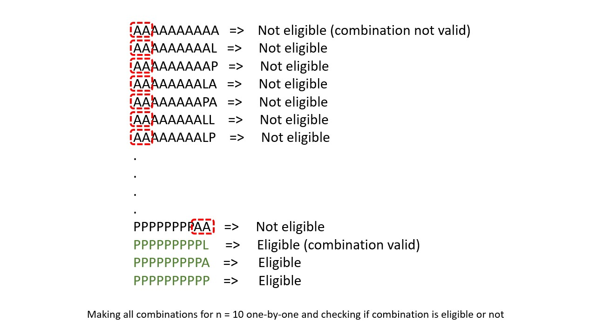
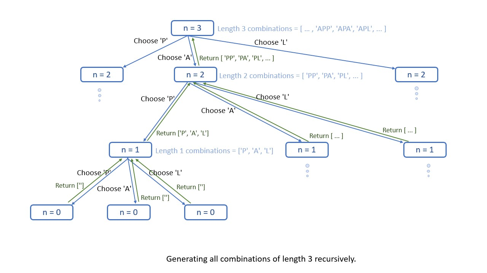
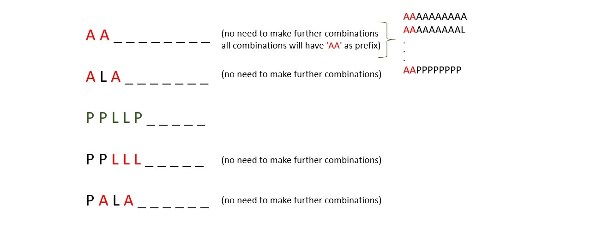
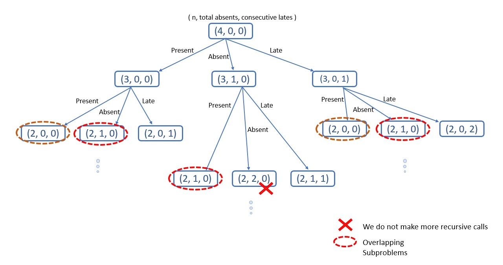
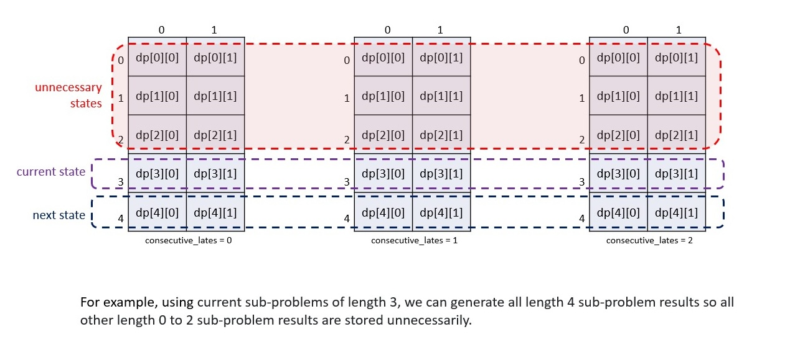

# 552. Student Attendance Record II — Exhaustive Solution Notes

## Overview

We need to count the number of attendance records of length `n` that are eligible for an award.

A record is valid if:

1. it contains **strictly fewer than 2** absences `'A'`
2. it never contains **3 or more consecutive** lates `'L'`

Each position can be one of:

- `'P'` — Present
- `'A'` — Absent
- `'L'` — Late

The answer can be very large, so we return it modulo:

```text
10^9 + 7
```

This problem is a classic dynamic programming problem because while building the string, the validity of future choices depends on:

- how many `'A'` characters have already been used
- how many consecutive trailing `'L'` characters the current prefix ends with

This write-up explains three approaches in detail:

1. **Top-Down Dynamic Programming with Memoization**
2. **Bottom-Up Dynamic Programming**
3. **Space-Optimized Bottom-Up Dynamic Programming**









---

## Problem Statement

An attendance record is a string of length `n` using characters:

- `'A'` = absent
- `'L'` = late
- `'P'` = present

A student is eligible for an award if:

- the total number of `'A'` characters is less than `2`
- there is no substring `"LLL"`

Return the number of valid attendance records of length `n`, modulo `10^9 + 7`.

---

## Example 1

**Input**

```text
n = 2
```

**Output**

```text
8
```

**Explanation**

The valid strings are:

```text
PP, AP, PA, LP, PL, AL, LA, LL
```

The only invalid string is:

```text
AA
```

because it contains 2 absences.

---

## Example 2

**Input**

```text
n = 1
```

**Output**

```text
3
```

Valid strings:

```text
P, A, L
```

---

## Example 3

**Input**

```text
n = 10101
```

**Output**

```text
183236316
```

---

## Constraints

- `1 <= n <= 10^5`

---

# Why Brute Force Is Too Slow

A naive solution would generate all strings of length `n` using the 3 choices:

```text
P, A, L
```

That gives:

```text
3^n
```

possible strings.

For `n = 100000`, this is completely impossible.

So we must count valid strings without generating them explicitly.

---

# Core Dynamic Programming Insight

While building the record left to right, the future only depends on two things about the current prefix:

1. how many absences have already been used
2. how many consecutive lates the prefix currently ends with

That means the state can be represented by:

```text
(length remaining or built, totalAbsences, consecutiveLates)
```

Since:

- `totalAbsences` can only be `0` or `1`
- `consecutiveLates` can only be `0`, `1`, or `2`

the number of states per length is tiny.

That is why we can solve the problem in linear time.

---

# State Definition

A natural DP state is:

```text
f(n, a, l)
```

meaning:

> number of valid attendance records of length `n`
> that can still be built, given:
>
> - `a` absences already used
> - `l` consecutive trailing lates already present

This is the state used in the top-down approach.

---

# Allowed Transitions

From a valid state `(n, a, l)`, we may append:

## 1. `'P'`

- absences unchanged
- trailing lates reset to `0`

Transition:

```text
f(n - 1, a, 0)
```

---

## 2. `'A'`

Allowed only if `a == 0`.

- absences become `a + 1`
- trailing lates reset to `0`

Transition:

```text
f(n - 1, a + 1, 0)
```

---

## 3. `'L'`

Allowed only if `l < 2`.

- absences unchanged
- trailing lates become `l + 1`

Transition:

```text
f(n - 1, a, l + 1)
```

---

# Approach 1: Top-Down Dynamic Programming with Memoization

## Intuition

We recursively build the attendance string one position at a time.

At each step, we choose one of:

```text
P, A, L
```

but only if the resulting record remains valid.

If a state becomes invalid:

- absences are at least 2, or
- consecutive lates are at least 3

then we stop immediately and return `0`.

If `n == 0`, then we have built a full valid record, so return `1`.

The same subproblems repeat many times, so we memoize them.

---

## Base Cases

### Invalid state

If:

```text
totalAbsences >= 2
```

or

```text
consecutiveLates >= 3
```

then the record is invalid.

Return:

```text
0
```

---

### Fully built valid record

If:

```text
n == 0
```

then we have successfully built one full valid record.

Return:

```text
1
```

---

## Recurrence

For valid state `(n, totalAbsences, consecutiveLates)`:

```text
count =
    eligible(n - 1, totalAbsences, 0)              // choose 'P'
  + eligible(n - 1, totalAbsences + 1, 0)          // choose 'A'
  + eligible(n - 1, totalAbsences, consecutiveLates + 1) // choose 'L'
```

with the understanding that invalid states return `0`.

Take modulo `10^9 + 7` at each step.

---

## Why Memoization Helps

The same states such as:

```text
(n, 0, 0)
(n, 0, 1)
(n, 1, 0)
```

can be reached through many different paths.

Without memoization, we would recompute them repeatedly.

Because there are only:

```text
n × 2 × 3
```

possible states, memoization reduces the solution to linear time.

---

## Java Implementation — Top-Down DP

```java
import java.util.*;

class Solution {

    private final int MOD = 1000000007;
    private int[][][] memo;

    private int eligibleCombinations(
        int n,
        int totalAbsences,
        int consecutiveLates
    ) {
        if (totalAbsences >= 2 || consecutiveLates >= 3) {
            return 0;
        }

        if (n == 0) {
            return 1;
        }

        if (memo[n][totalAbsences][consecutiveLates] != -1) {
            return memo[n][totalAbsences][consecutiveLates];
        }

        int count = 0;

        // Choose 'P'
        count = eligibleCombinations(n - 1, totalAbsences, 0) % MOD;

        // Choose 'A'
        count = (count + eligibleCombinations(n - 1, totalAbsences + 1, 0)) % MOD;

        // Choose 'L'
        count = (count + eligibleCombinations(n - 1, totalAbsences, consecutiveLates + 1)) % MOD;

        return memo[n][totalAbsences][consecutiveLates] = count;
    }

    public int checkRecord(int n) {
        memo = new int[n + 1][2][3];

        for (int[][] array2D : memo) {
            for (int[] array1D : array2D) {
                Arrays.fill(array1D, -1);
            }
        }

        return eligibleCombinations(n, 0, 0);
    }
}
```

---

## Complexity Analysis — Top-Down DP

### Time Complexity

There are at most:

```text
n × 2 × 3
```

distinct states.

Each state does only constant work.

So the total time complexity is:

```text
O(n)
```

---

### Space Complexity

The memo table takes:

```text
O(n × 2 × 3) = O(n)
```

The recursion stack can go as deep as `n`.

So total space complexity is:

```text
O(n)
```

---

# Approach 2: Bottom-Up Dynamic Programming

## Intuition

The top-down memoized recursion can be converted into iterative tabulation.

Instead of solving states on demand, we build them from smaller lengths upward.

Define:

```text
dp[len][a][l]
```

as:

> number of valid attendance records of length `len`
> with exactly `a` absences used
> and ending with exactly `l` consecutive lates

This is slightly different in wording from the top-down version, but it represents the same information.

---

## Base Case

For length `0`:

```text
dp[0][0][0] = 1
```

There is exactly one empty record with:

- 0 absences
- 0 trailing lates

All other states for length `0` are zero.

---

## Transition

From `dp[len][a][l]`, generate records of length `len + 1`:

### Append `'P'`

- absences stay the same
- trailing lates reset to 0

```text
dp[len + 1][a][0] += dp[len][a][l]
```

---

### Append `'A'`

Allowed only if `a < 1`.

```text
dp[len + 1][a + 1][0] += dp[len][a][l]
```

---

### Append `'L'`

Allowed only if `l < 2`.

```text
dp[len + 1][a][l + 1] += dp[len][a][l]
```

All operations are modulo `10^9 + 7`.

---

## Final Answer

At the end, sum all valid states of length `n`:

```text
sum(dp[n][a][l]) for a in {0,1}, l in {0,1,2}
```



---

## Java Implementation — Bottom-Up DP

```java
class Solution {

    public int checkRecord(int n) {
        int MOD = 1000000007;
        int[][][] dp = new int[n + 1][2][3];

        dp[0][0][0] = 1;

        for (int len = 0; len < n; ++len) {
            for (int totalAbsences = 0; totalAbsences <= 1; ++totalAbsences) {
                for (int consecutiveLates = 0; consecutiveLates <= 2; ++consecutiveLates) {
                    int curr = dp[len][totalAbsences][consecutiveLates];
                    if (curr == 0) {
                        continue;
                    }

                    // Append 'P'
                    dp[len + 1][totalAbsences][0] =
                        (dp[len + 1][totalAbsences][0] + curr) % MOD;

                    // Append 'A'
                    if (totalAbsences < 1) {
                        dp[len + 1][totalAbsences + 1][0] =
                            (dp[len + 1][totalAbsences + 1][0] + curr) % MOD;
                    }

                    // Append 'L'
                    if (consecutiveLates < 2) {
                        dp[len + 1][totalAbsences][consecutiveLates + 1] =
                            (dp[len + 1][totalAbsences][consecutiveLates + 1] + curr) % MOD;
                    }
                }
            }
        }

        int count = 0;
        for (int totalAbsences = 0; totalAbsences <= 1; ++totalAbsences) {
            for (int consecutiveLates = 0; consecutiveLates <= 2; ++consecutiveLates) {
                count = (count + dp[n][totalAbsences][consecutiveLates]) % MOD;
            }
        }

        return count;
    }
}
```

---

## Complexity Analysis — Bottom-Up DP

### Time Complexity

We iterate over:

```text
n × 2 × 3
```

states.

Each transition is constant work.

So total time complexity is:

```text
O(n)
```

---

### Space Complexity

The 3D DP table stores:

```text
(n + 1) × 2 × 3
```

values.

So the space complexity is:

```text
O(n)
```

---

# Approach 3: Bottom-Up DP, Space Optimized

## Intuition

In the bottom-up DP, when computing results for length `len + 1`, we only need results for length `len`.

That means we do **not** need the whole `n + 1` table.

We only need two 2D arrays:

- `dpCurrState[a][l]` = counts for current length
- `dpNextState[a][l]` = counts for next length

After computing the next layer, we replace current with next.

This reduces space from `O(n)` to `O(1)`.

---

## State Meaning

At each iteration:

```text
dpCurrState[totalAbsences][consecutiveLates]
```

stores the number of valid records of the current length with:

- `totalAbsences` absences
- `consecutiveLates` trailing lates

From this, we generate `dpNextState`.

---

## Initialization

For length `0`:

```text
dpCurrState[0][0] = 1
```

All other states are zero.

---

## Transition

Exactly the same as before:

### Append `'P'`

```text
dpNextState[a][0] += dpCurrState[a][l]
```

### Append `'A'`

if `a < 1`:

```text
dpNextState[a + 1][0] += dpCurrState[a][l]
```

### Append `'L'`

if `l < 2`:

```text
dpNextState[a][l + 1] += dpCurrState[a][l]
```

Take modulo at every update.

After each length:

- assign next → current
- reset next to zeros

---

## Java Implementation — Space-Optimized DP

```java
class Solution {

    public int checkRecord(int n) {
        int MOD = 1000000007;

        int[][] dpCurrState = new int[2][3];
        int[][] dpNextState = new int[2][3];

        dpCurrState[0][0] = 1;

        for (int len = 0; len < n; ++len) {
            for (int totalAbsences = 0; totalAbsences <= 1; ++totalAbsences) {
                for (int consecutiveLates = 0; consecutiveLates <= 2; ++consecutiveLates) {
                    int curr = dpCurrState[totalAbsences][consecutiveLates];
                    if (curr == 0) {
                        continue;
                    }

                    // Append 'P'
                    dpNextState[totalAbsences][0] =
                        (dpNextState[totalAbsences][0] + curr) % MOD;

                    // Append 'A'
                    if (totalAbsences < 1) {
                        dpNextState[totalAbsences + 1][0] =
                            (dpNextState[totalAbsences + 1][0] + curr) % MOD;
                    }

                    // Append 'L'
                    if (consecutiveLates < 2) {
                        dpNextState[totalAbsences][consecutiveLates + 1] =
                            (dpNextState[totalAbsences][consecutiveLates + 1] + curr) % MOD;
                    }
                }
            }

            // Move next state into current state
            for (int a = 0; a < 2; a++) {
                for (int l = 0; l < 3; l++) {
                    dpCurrState[a][l] = dpNextState[a][l];
                    dpNextState[a][l] = 0;
                }
            }
        }

        int count = 0;
        for (int totalAbsences = 0; totalAbsences <= 1; ++totalAbsences) {
            for (int consecutiveLates = 0; consecutiveLates <= 2; ++consecutiveLates) {
                count = (count + dpCurrState[totalAbsences][consecutiveLates]) % MOD;
            }
        }

        return count;
    }
}
```

---

## Complexity Analysis — Space-Optimized DP

### Time Complexity

We still iterate over the same:

```text
n × 2 × 3
```

states.

So time complexity remains:

```text
O(n)
```

---

### Space Complexity

We only use two fixed-size `2 × 3` arrays.

So the space complexity is:

```text
O(1)
```

---

# Why These DP States Are Sufficient

The future validity of a record does not depend on the full prefix string.
It only depends on:

1. how many absences have already been used
2. how many consecutive lates the current prefix ends with

That means the problem has a very small state space per length, which is why the DP is efficient.

This is the key modeling insight.

---

# Example Walkthrough for n = 2

We want all valid strings of length 2.

Start:

```text
dp[0][0][0] = 1
```

### After 1 character

Possible states:

- `'P'` → `(0 A, 0 trailing L)`
- `'A'` → `(1 A, 0 trailing L)`
- `'L'` → `(0 A, 1 trailing L)`

So total = 3.

### After 2 characters

From these states, transitions produce:

```text
PP, AP, PA, LP, PL, AL, LA, LL
```

Total = 8.

This matches the sample answer.

---

# Common Mistakes

## 1. Forgetting that only trailing L's matter

We do not care about the total number of L's in the string.
We only care whether the current suffix ends with 0, 1, or 2 consecutive L's.

---

## 2. Allowing 2 or more absences

The rule is:

```text
strictly fewer than 2 absences
```

So valid absence counts are only:

```text
0 or 1
```

---

## 3. Not resetting trailing L count when appending P or A

Appending `'P'` or `'A'` breaks any run of trailing L's.

So the next state's consecutive-late count must become 0.

---

## 4. Forgetting modulo arithmetic at every update

The number of valid strings grows very quickly.
Always take modulo after additions.

---

# Comparing the Approaches

## Top-Down DP

### Strengths

- easiest to derive from recursive thinking
- naturally expresses the state

### Weaknesses

- recursion stack uses extra space
- may be less convenient for very large `n`

---

## Bottom-Up DP

### Strengths

- iterative
- avoids recursion
- explicit table of transitions

### Weaknesses

- stores all lengths even though only the previous one is needed

---

## Space-Optimized Bottom-Up DP

### Strengths

- same logic as bottom-up
- optimal space usage
- clean and fast

### Weaknesses

- slightly more bookkeeping

---

# Final Summary

## Problem Type

This is a state-based dynamic programming problem.

The relevant state is:

- number of absences used: `0 or 1`
- number of trailing consecutive lates: `0, 1, or 2`

---

## Approaches

### 1. Top-Down DP with Memoization

- Time: `O(n)`
- Space: `O(n)`

### 2. Bottom-Up DP

- Time: `O(n)`
- Space: `O(n)`

### 3. Space-Optimized Bottom-Up DP

- Time: `O(n)`
- Space: `O(1)`

---

## Best Practical Java Solution

The space-optimized bottom-up DP is usually the best balance of clarity and efficiency.

```java
class Solution {

    public int checkRecord(int n) {
        int MOD = 1000000007;

        int[][] curr = new int[2][3];
        int[][] next = new int[2][3];

        curr[0][0] = 1;

        for (int len = 0; len < n; len++) {
            for (int a = 0; a < 2; a++) {
                for (int l = 0; l < 3; l++) {
                    int val = curr[a][l];
                    if (val == 0) {
                        continue;
                    }

                    // Add 'P'
                    next[a][0] = (next[a][0] + val) % MOD;

                    // Add 'A'
                    if (a < 1) {
                        next[a + 1][0] = (next[a + 1][0] + val) % MOD;
                    }

                    // Add 'L'
                    if (l < 2) {
                        next[a][l + 1] = (next[a][l + 1] + val) % MOD;
                    }
                }
            }

            for (int a = 0; a < 2; a++) {
                for (int l = 0; l < 3; l++) {
                    curr[a][l] = next[a][l];
                    next[a][l] = 0;
                }
            }
        }

        int ans = 0;
        for (int a = 0; a < 2; a++) {
            for (int l = 0; l < 3; l++) {
                ans = (ans + curr[a][l]) % MOD;
            }
        }

        return ans;
    }
}
```

This is the standard efficient solution for the problem.
