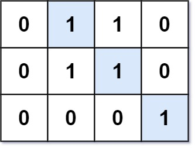
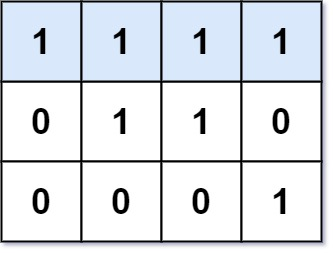

from textwrap import dedent

md = dedent("""

# 562. Longest Line of Consecutive One in Matrix

## Problem Statement

Given an `m x n` binary matrix `mat`, return the **length of the longest line of consecutive 1s** in the matrix.

A line can be formed in four possible directions:

- Horizontal
- Vertical
- Diagonal
- Anti-diagonal

---

## Example 1



**Input**

```
mat = [[0,1,1,0],
       [0,1,1,0],
       [0,0,0,1]]
```

**Output**

```
3
```

---

## Example 2



**Input**

```
mat = [[1,1,1,1],
       [0,1,1,0],
       [0,0,0,1]]
```

**Output**

```
4
```

---

## Constraints

- `m == mat.length`
- `n == mat[i].length`
- `1 <= m, n <= 10^4`
- `1 <= m * n <= 10^4`
- `mat[i][j]` is either `0` or `1`

---
