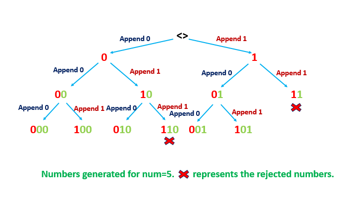
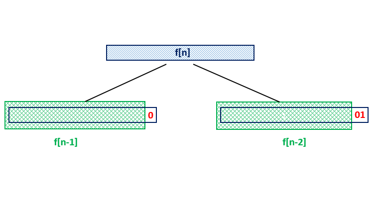

# 600. Non-negative Integers without Consecutive Ones — Exhaustive Solution Notes

## Overview

We are given a positive integer `n` and asked to count how many integers in the range:

```text
[0, n]
```

have binary representations that **do not contain consecutive ones**.

For example:

- `5 = 101` is valid
- `3 = 11` is invalid because it contains `"11"`

This problem looks like a counting problem over binary strings, and the accepted solution combines:

- **bit manipulation**
- a **Fibonacci-like DP recurrence**
- scanning the bits of `n` from the most significant bit to the least significant bit

This write-up explains three approaches:

1. **Brute Force**
2. **Better Brute Force**
3. **Using Bit Manipulation + Fibonacci DP** — the accepted approach

---

## Problem Statement

Given a positive integer `n`, return the number of integers in the range `[0, n]` whose binary representations do **not** contain consecutive `1`s.

---

## Example 1

**Input**

```text
n = 5
```

**Output**

```text
5
```

**Explanation**

The integers from `0` to `5` are:

| Integer | Binary |
| ------: | :----- |
|       0 | 0      |
|       1 | 1      |
|       2 | 10     |
|       3 | 11     |
|       4 | 100    |
|       5 | 101    |

Only `3 = 11` contains consecutive ones.

So the valid numbers are:

```text
0, 1, 2, 4, 5
```

Total:

```text
5
```

---

## Example 2

**Input**

```text
n = 1
```

**Output**

```text
2
```

Valid numbers:

```text
0, 1
```

---

## Example 3

**Input**

```text
n = 2
```

**Output**

```text
3
```

Valid numbers:

```text
0, 1, 2
```

---

## Constraints

- `1 <= n <= 10^9`

---

# Core Observation

The problem is about binary strings that do **not** contain the substring:

```text
11
```

So the question becomes:

> How many binary numbers less than or equal to `n` can be formed without having consecutive ones?

That leads naturally to a counting recurrence.

---

# Approach 1: Brute Force [Time Limit Exceeded]

## Intuition

The most direct solution is:

1. iterate through every integer from `0` to `n`
2. check whether its binary representation contains consecutive ones
3. count how many pass

To check for consecutive ones, we look at adjacent bit positions.

---

## How to Check Whether a Number Has Consecutive Ones

Suppose we want to know whether bit position `x` in `n` is set.

We can create:

```text
1 << x
```

Then:

```text
n & (1 << x)
```

is non-zero if the bit is set.

So to test for consecutive ones, we scan adjacent pairs of bits:

- bit `i`
- bit `i - 1`

If both are `1`, the number is invalid.

---

## Java Implementation — Brute Force

```java
class Solution {
    public int findIntegers(int num) {
        int count = 0;
        for (int i = 0; i <= num; i++) {
            if (check(i)) {
                count++;
            }
        }
        return count;
    }

    public boolean check(int n) {
        int i = 31;
        while (i > 0) {
            if ((n & (1 << i)) != 0 && (n & (1 << (i - 1))) != 0) {
                return false;
            }
            i--;
        }
        return true;
    }
}
```

---

## Complexity Analysis — Brute Force

### Time Complexity

For every number from `0` to `n`, we scan up to 32 bit positions.

So the time complexity is:

```text
O(32 × n) = O(n)
```

This is too slow for large `n`.

---

### Space Complexity

Only constant extra space is used.

So the space complexity is:

```text
O(1)
```

---

# Approach 2: Better Brute Force [Still Too Slow]

## Intuition



Instead of generating all numbers and then filtering out invalid ones, we generate only numbers that **never create consecutive ones** in the first place.

We build binary numbers recursively.

At each step, we decide which bit to place next.

If the previous bit was:

- `0` → we may place either `0` or `1`
- `1` → we may place only `0`

That prevents invalid numbers from being generated.

This is better than checking all numbers, but it still does not scale well enough for the largest input.

---

## Recursive Generation Idea

We generate numbers bit by bit from the least significant side upward.

The recursive state includes:

- `i` = current bit position
- `sum` = current numeric value formed so far
- `num` = upper limit
- `prev` = whether the previously added bit was `1`

If `sum > num`, we stop because the generated number is already too large.

If we have shifted beyond the largest needed bit, we count the number.

---

## Java Implementation — Better Brute Force

```java
class Solution {
    public int findIntegers(int num) {
        return find(0, 0, num, false);
    }

    public int find(int i, int sum, int num, boolean prev) {
        if (sum > num) {
            return 0;
        }
        if ((1 << i) > num) {
            return 1;
        }

        if (prev) {
            return find(i + 1, sum, num, false);
        }

        return find(i + 1, sum, num, false)
             + find(i + 1, sum + (1 << i), num, true);
    }
}
```

---

## Complexity Analysis — Better Brute Force

### Time Complexity

Only valid numbers are generated.

So if `x` is the number of valid results, the time complexity is roughly:

```text
O(x)
```

This is much better than plain brute force, but still not optimal.

---

### Space Complexity

The recursion depth is bounded by the number of bits in an integer, about 32.

So the space complexity is:

```text
O(32) = O(1)
```

if considered constant, or `O(log n)` more formally.

---

# Approach 3: Using Bit Manipulation [Accepted]

## Intuition



This is the standard accepted approach.

The key idea is to count valid binary strings of each length first, then use the bits of `n` to count how many valid numbers are less than or equal to it.

This works because the number of binary strings without consecutive ones follows a **Fibonacci-like recurrence**.

---

# Step 1: Count Valid Binary Strings of Length `i`

Let:

```text
f[i]
```

be the number of binary strings of length `i` that do **not** contain consecutive ones.

We derive:

```text
f[i] = f[i - 1] + f[i - 2]
```

Why?

Consider a valid binary string of length `i`.

### Case 1: It starts with `0`

Then the remaining `i - 1` bits can be any valid string of length `i - 1`.

Contribution:

```text
f[i - 1]
```

### Case 2: It starts with `10`

If it starts with `1`, the next bit must be `0` to avoid consecutive ones.

Then the remaining `i - 2` bits can be any valid string of length `i - 2`.

Contribution:

```text
f[i - 2]
```

So:

```text
f[i] = f[i - 1] + f[i - 2]
```

This is exactly a Fibonacci recurrence.

---

## Base Values

For 0 bits:

```text
f[0] = 1
```

There is one empty string.

For 1 bit:

```text
f[1] = 2
```

The valid strings are:

```text
0, 1
```

Then:

```text
f[2] = 3   -> 00, 01, 10
f[3] = 5
f[4] = 8
...
```

---

# Step 2: Use the Bits of `n`

Now we scan the bits of `n` from the most significant bit down to the least significant bit.

Whenever we encounter a `1` at position `i`, we can count all valid numbers obtained by putting `0` at that position and freely choosing the remaining `i` lower bits in any valid way.

That contributes:

```text
f[i]
```

to the answer.

Then we continue scanning with the actual prefix of `n`.

If at any point we encounter **two consecutive ones** in `n`, then we stop immediately, because every number with the same prefix beyond that point would violate the rule.

If we finish the scan without ever seeing consecutive ones, then `n` itself is valid, so we add `1`.

---

# Why Adding `f[i]` Works

Suppose we are scanning `n` and see a `1` at bit position `i`.

If we flip that bit to `0`, then every smaller suffix of `i` bits can vary over all valid binary strings of length `i`.

The number of such valid suffixes is:

```text
f[i]
```

So `f[i]` counts exactly the numbers smaller than `n` formed at that branching point.

---

# Example: `n = 5`

Binary form:

```text
101
```

Precompute:

```text
f[0] = 1
f[1] = 2
f[2] = 3
f[3] = 5
...
```

Now scan from highest bit to lowest:

### Bit 2 is `1`

Add:

```text
f[2] = 3
```

These correspond to valid numbers of the form:

```text
0xx
```

### Bit 1 is `0`

Do nothing.

### Bit 0 is `1`

Add:

```text
f[0] = 1
```

No consecutive ones were found in `101`.

So add `1` for `n` itself.

Total:

```text
3 + 1 + 1 = 5
```

Correct answer.

---

# Example: `n = 3`

Binary form:

```text
11
```

Scan:

### Bit 1 is `1`

Add:

```text
f[1] = 2
```

### Bit 0 is also `1`

Add:

```text
f[0] = 1
```

Now we have found consecutive ones.

So we subtract 1 and stop, or equivalently stop before adding the final `1` for `n`.

Result becomes:

```text
3
```

which counts:

```text
0, 1, 2
```

correctly.

---

# Why `sum--` Is Needed When Consecutive Ones Are Found

In the standard implementation, when we see a `1` at position `i`, we immediately add `f[i]`.

If the next bit is also `1`, then the current number `n` itself and all larger suffixes under that prefix are invalid.

At that point, we have effectively overcounted by one path, so we do:

```text
sum--
```

and break.

Then the final `sum + 1` at the end correctly handles whether `n` itself should be counted.

---

## Java Implementation — Bit Manipulation + DP

```java
class Solution {
    public int findIntegers(int num) {
        int[] f = new int[32];
        f[0] = 1;
        f[1] = 2;

        for (int i = 2; i < f.length; i++) {
            f[i] = f[i - 1] + f[i - 2];
        }

        int i = 30;
        int sum = 0;
        int prevBit = 0;

        while (i >= 0) {
            if ((num & (1 << i)) != 0) {
                sum += f[i];

                if (prevBit == 1) {
                    sum--;
                    break;
                }

                prevBit = 1;
            } else {
                prevBit = 0;
            }

            i--;
        }

        return sum + 1;
    }
}
```

---

# Step-by-Step Meaning of the Variables

## `f[i]`

Number of valid binary strings of length `i` without consecutive ones.

## `sum`

Number of valid integers counted so far that are strictly smaller than the current prefix of `n`.

## `prevBit`

Keeps track of whether the previous bit we saw was `1`.

This is how we detect consecutive ones.

---

# Complexity Analysis — Bit Manipulation Approach

### Time Complexity

We do:

1. one loop of length 32 to fill `f`
2. one loop of length 31/32 to scan the bits of `n`

So time complexity is:

```text
O(32) = O(1)
```

or more formally `O(log n)`.

---

### Space Complexity

We use the array `f` of size 32.

So space complexity is:

```text
O(32) = O(1)
```

---

# Why This Is Better Than the Other Approaches

The brute-force methods still depend on enumerating many numbers.

The accepted solution does not enumerate numbers at all.

Instead, it:

1. counts how many valid binary strings exist for each length
2. uses the prefix of `n` to accumulate how many valid numbers are smaller than `n`

This is much faster and is the right way to solve the problem.

---

# Common Mistakes

## 1. Forgetting to include `0`

The range is:

```text
[0, n]
```

So `0` must be counted.

This is naturally handled by the final logic.

---

## 2. Using a simple Fibonacci sequence without understanding bit positions

The recurrence counts **binary strings of fixed length**, not just arbitrary Fibonacci values.

You must align `f[i]` carefully with bit position `i`.

---

## 3. Not stopping when consecutive ones appear

Once `n` itself contains `"11"` in its prefix during the scan, no longer numbers along that prefix need to be considered.

We must stop early.

---

## 4. Missing the final `+1`

If the scan finishes without finding consecutive ones, then `n` itself is valid and should be included.

That is why the final return is:

```java
return sum + 1;
```

---

# Comparing the Approaches

## Brute Force

### Strengths

- very simple
- easy to understand initially

### Weaknesses

- far too slow
- checks all numbers individually

---

## Better Brute Force

### Strengths

- avoids generating obviously invalid numbers
- more efficient than plain brute force

### Weaknesses

- still not the intended optimal approach
- still tied to explicit generation

---

## Bit Manipulation + DP

### Strengths

- elegant
- very fast
- uses only constant extra space
- accepted and standard

### Weaknesses

- less obvious at first if unfamiliar with digit DP / Fibonacci counting

---

# Final Summary

## Core Recurrence

Let:

```text
f[i] = number of valid binary strings of length i with no consecutive ones
```

Then:

```text
f[i] = f[i - 1] + f[i - 2]
```

with:

```text
f[0] = 1
f[1] = 2
```

---

## Main Counting Idea

Scan the bits of `n` from MSB to LSB.

Whenever a `1` appears at bit `i`, add:

```text
f[i]
```

because that counts all valid numbers formed by putting `0` at this bit and choosing any valid suffix of length `i`.

If two consecutive ones appear, stop immediately.

If the scan finishes normally, add `1` to include `n` itself.

---

## Complexities

### Brute Force

- Time: `O(32 × n)`
- Space: `O(1)`

### Better Brute Force

- Time: roughly `O(x)` where `x` is number of generated valid numbers
- Space: `O(log n)`

### Accepted Bit Manipulation Approach

- Time: `O(32)` = `O(1)` or `O(log n)`
- Space: `O(32)` = `O(1)`

---

# Best Final Java Solution

```java
class Solution {
    public int findIntegers(int num) {
        int[] f = new int[32];
        f[0] = 1;
        f[1] = 2;

        for (int i = 2; i < 32; i++) {
            f[i] = f[i - 1] + f[i - 2];
        }

        int sum = 0;
        int prevBit = 0;

        for (int i = 30; i >= 0; i--) {
            if ((num & (1 << i)) != 0) {
                sum += f[i];

                if (prevBit == 1) {
                    sum--;
                    return sum + 1;
                }

                prevBit = 1;
            } else {
                prevBit = 0;
            }
        }

        return sum + 1;
    }
}
```

This is the standard accepted solution for the problem.
