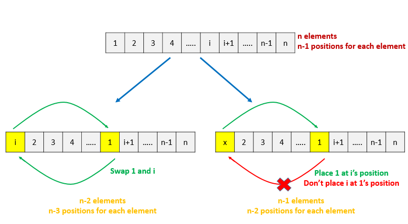

# Derangements — Detailed Notes

This document converts the provided explanation into a detailed Markdown note.

A **derangement** of `n` elements is a permutation in which **no element remains in its original position**.

If the original arrangement is:

```text
[1, 2, 3, ..., n]
```

then a derangement is a permutation `p` such that for every index `i`:

```text
p[i] != i
```

The goal is to compute the number of such derangements, usually modulo:

```text
10^9 + 7
```

---

# What Is a Derangement?

Consider `n = 3`.

All permutations of `[1, 2, 3]` are:

- `[1, 2, 3]`
- `[1, 3, 2]`
- `[2, 1, 3]`
- `[2, 3, 1]`
- `[3, 1, 2]`
- `[3, 2, 1]`

Among these, only the following are derangements:

- `[2, 3, 1]`
- `[3, 1, 2]`

because in both of them, no number stays in its original position.

So:

```text
D(3) = 2
```

where `D(n)` denotes the number of derangements of `n` elements.

---

# Approach 1: Brute Force

## Intuition

The most straightforward solution is:

1. Generate **every permutation** of the numbers from `1` to `n`
2. Check whether that permutation is a derangement
3. Count all valid derangements

This is conceptually simple, but computationally extremely expensive.

---

## Why It Works

A permutation is a derangement if and only if every element is displaced.

So if we generate all permutations and filter those that satisfy the derangement condition, the count we obtain is correct.

---

## Complexity Analysis

Let `n` be the number of elements.

### Time Complexity

There are:

```text
n!
```

possible permutations.

For each permutation, we need to scan all `n` positions to verify that no element stayed in its original place.

So total time is:

```text
O(n * n!)
```

The provided explanation also writes this as:

```text
O((n + 1)!)
```

which is an equivalent factorial-scale upper bound.

### Space Complexity

We need space to store one permutation:

```text
O(n)
```

---

## Verdict

Correct, but infeasible for large `n`.

---

# Approach 2: Recursion with Memoization

## Intuition

Instead of explicitly generating permutations, we derive a recurrence relation for `D(n)`.

Let us think about where element `1` goes.

In any derangement, `1` cannot stay in position `1`, so it must go to one of the other `n - 1` positions.

Suppose `1` is placed in the original position of element `i`.

Now there are two possibilities for element `i`.



---

## Case Analysis

### Case 1: `i` goes to position `1`

Then:

- `1` goes to `i`'s position
- `i` goes to `1`'s position

These two elements are now fixed in displaced positions.

The remaining `n - 2` elements must form a derangement among themselves.

So this contributes:

```text
D(n - 2)
```

---

### Case 2: `i` does **not** go to position `1`

Then:

- `1` is placed at `i`'s position
- `i` is displaced, but not to position `1`

This effectively reduces the problem to a derangement-like problem on the remaining `n - 1` elements.

So this contributes:

```text
D(n - 1)
```

---

## Recurrence Relation

Since there are `n - 1` choices for where to place `1`, the total number of derangements is:

```text
D(n) = (n - 1) * (D(n - 1) + D(n - 2))
```

This is the classic derangement recurrence.

---

## Base Cases

We also need:

```text
D(0) = 1
D(1) = 0
```

### Why `D(0) = 1`?

There is exactly one way to arrange zero elements: the empty arrangement.

### Why `D(1) = 0`?

A single element cannot be displaced from its only position.

---

## Memoization

If we implement the recurrence directly with recursion, the same values like `D(n - 1)` and `D(n - 2)` will be recomputed many times.

To avoid repeated work, we store results in a memoization array.

That reduces the time complexity from exponential to linear.

---

## Java Implementation

```java
public class Solution {
    public int findDerangement(int n) {
        Integer[] memo = new Integer[n + 1];
        return find(n, memo);
    }

    public int find(int n, Integer[] memo) {
        if (n == 0)
            return 1;
        if (n == 1)
            return 0;
        if (memo[n] != null)
            return memo[n];

        memo[n] = (int)(((n - 1L) * (find(n - 1, memo) + find(n - 2, memo))) % 1000000007);
        return memo[n];
    }
}
```

---

## Complexity Analysis

### Time Complexity

Each value `D(i)` is computed once and stored in the memo array.

So:

```text
O(n)
```

### Space Complexity

The memo array has length `n + 1`:

```text
O(n)
```

The recursion stack can also go as deep as `n`, so the overall space complexity remains:

```text
O(n)
```

---

## Important Caution

The recursion depth is `O(n)`.

If `n` is very large, recursive implementations may hit stack depth or memory limits.

That motivates iterative dynamic programming.

---

# Approach 3: Dynamic Programming

## Intuition

The recurrence relation:

```text
D(n) = (n - 1) * (D(n - 1) + D(n - 2))
```

depends only on smaller values.

So instead of recursion, we can compute the answer bottom-up using a DP array.

---

## DP Definition

Let:

```text
dp[i]
```

denote the number of derangements of `i` elements.

Then:

```text
dp[0] = 1
dp[1] = 0
dp[i] = (i - 1) * (dp[i - 1] + dp[i - 2])
```

with all computations done modulo:

```text
1000000007
```

---

## How the DP Is Filled

We start from the known base values:

- `dp[0] = 1`
- `dp[1] = 0`

Then for each `i` from `2` to `n`, we apply the recurrence formula.

At the end, `dp[n]` is the answer.

---

## Java Implementation

```java
public class Solution {
    public int findDerangement(int n) {
        if (n == 0)
            return 1;
        if (n == 1)
            return 0;

        int[] dp = new int[n + 1];
        dp[0] = 1;
        dp[1] = 0;

        for (int i = 2; i <= n; i++)
            dp[i] = (int)(((i - 1L) * (dp[i - 1] + dp[i - 2])) % 1000000007);

        return dp[n];
    }
}
```

---

## Complexity Analysis

### Time Complexity

We fill the DP array once from `2` to `n`:

```text
O(n)
```

### Space Complexity

The DP array stores `n + 1` values:

```text
O(n)
```

---

# Approach 4: Constant Space Dynamic Programming

## Intuition

From the recurrence:

```text
D(i) = (i - 1) * (D(i - 1) + D(i - 2))
```

we see that `D(i)` depends only on the previous two values:

- `D(i - 1)`
- `D(i - 2)`

Therefore, instead of keeping the entire DP array, we only need two variables.

This reduces space from `O(n)` to `O(1)`.

---

## Variable Meaning

Let:

- `first` = `D(i - 2)`
- `second` = `D(i - 1)`

Then at each step:

```text
current = (i - 1) * (first + second)
```

After computing `current`, we shift the variables forward.

---

## Java Implementation

```java
public class Solution {
    public int findDerangement(int n) {
        if (n == 0)
            return 1;
        if (n == 1)
            return 0;

        int first = 1, second = 0;
        for (int i = 2; i <= n; i++) {
            int temp = second;
            second = (int)(((i - 1L) * (first + second)) % 1000000007);
            first = temp;
        }
        return second;
    }
}
```

---

## Complexity Analysis

### Time Complexity

A single loop runs from `2` to `n`:

```text
O(n)
```

### Space Complexity

Only a constant number of variables is used:

```text
O(1)
```

---

# Approach 5: Formula Using Inclusion–Exclusion

## Intuition

There is also a direct mathematical formula for derangements.

This formula comes from the **inclusion–exclusion principle** in combinatorics.

The idea is:

- Start with all permutations
- Subtract those where at least one element remains fixed
- Add back those where at least two elements remain fixed
- Continue alternating

This eventually gives a closed-form summation for the number of derangements.

---

# Inclusion–Exclusion Principle Refresher

For two finite sets `A` and `B`:

```text
|A ∪ B| = |A| + |B| - |A ∩ B|
```

For three sets:

```text
|A ∪ B ∪ C|
= |A| + |B| + |C|
- |A ∩ B| - |A ∩ C| - |B ∩ C|
+ |A ∩ B ∩ C|
```

In general, inclusion–exclusion alternates between adding and subtracting intersections.

---

# Applying It to Derangements

Let `A_i` be the set of permutations in which element `i` stays in its original position.

We want the number of permutations where **none** of the `A_i` happen.

That is:

```text
|A_1^c ∩ A_2^c ∩ ... ∩ A_n^c|
```

Using inclusion–exclusion, the number of derangements becomes:

```text
D(n) = n! - C(n,1)(n-1)! + C(n,2)(n-2)! - C(n,3)(n-3)! + ...
```

This simplifies to the classic summation:

```text
D(n) = n! * (1 - 1/1! + 1/2! - 1/3! + ... + (-1)^n / n!)
```

Equivalently:

```text
D(n) = n! * Σ(k = 0 to n) [(-1)^k / k!]
```

---

## Why This Formula Makes Sense

- `n!` counts all permutations
- subtract permutations fixing one element
- add back permutations fixing two elements
- subtract those fixing three elements
- and so on

This exactly counts permutations with **zero fixed points**.

---

## Java Implementation

```java
public class Solution {
    public int findDerangement(int n) {
        long mul = 1, sum = 0, M = 1000000007;
        for (int i = n; i >= 0; i--) {
            sum = (sum + M + mul * (i % 2 == 0 ? 1 : -1)) % M;
            mul = (mul * i) % M;
        }
        return (int) sum;
    }
}
```

---

## Complexity Analysis

### Time Complexity

A single loop runs from `n` down to `0`:

```text
O(n)
```

### Space Complexity

Only a few scalar variables are used:

```text
O(1)
```

---

# Comparison of Approaches

| Approach                | Main Idea                                   | Time Complexity | Space Complexity |
| ----------------------- | ------------------------------------------- | --------------: | ---------------: |
| Brute Force             | Generate all permutations and test each one | factorial scale |           `O(n)` |
| Recursion + Memoization | Use recurrence and cache results            |          `O(n)` |           `O(n)` |
| Dynamic Programming     | Fill a DP array bottom-up                   |          `O(n)` |           `O(n)` |
| Constant Space DP       | Keep only the previous two values           |          `O(n)` |           `O(1)` |
| Formula                 | Use inclusion–exclusion summation           |          `O(n)` |           `O(1)` |

---

# Key Takeaways

## 1. The recurrence is the central insight

The most important identity is:

```text
D(n) = (n - 1) * (D(n - 1) + D(n - 2))
```

This is what drives both memoization and dynamic programming.

## 2. Base cases matter

Everything depends on:

```text
D(0) = 1
D(1) = 0
```

## 3. Memoization and DP give the same asymptotic time

Both avoid repeated work and compute each subproblem once.

## 4. Constant-space DP is often the most practical coding solution

It is simple, efficient, and avoids recursion depth issues.

## 5. Inclusion–exclusion provides the combinatorial interpretation

It explains why derangements have the alternating-factorial formula.

---

# Final Insight

There are two elegant ways to understand derangements:

1. **Structural / recursive viewpoint**
   Think about where element `1` goes and derive the recurrence.

2. **Combinatorial viewpoint**
   Use inclusion–exclusion to count permutations with no fixed points.

Both lead to efficient `O(n)` solutions, but in practice, the **constant-space DP** version is usually the cleanest implementation.
