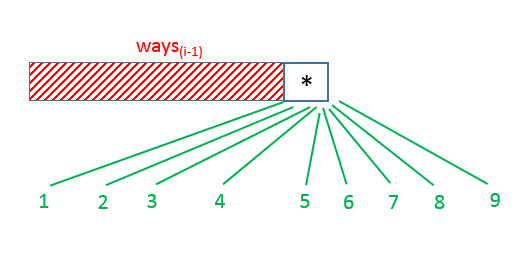
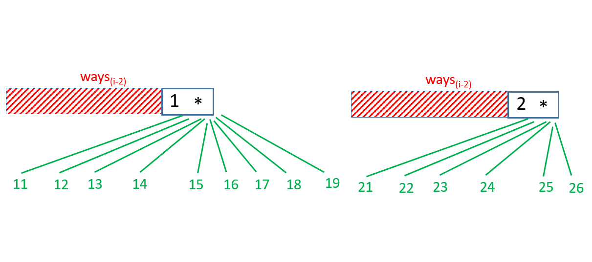

# 639. Decode Ways II — Exhaustive Solution Notes

## Overview

This problem is an extension of the classic **Decode Ways** problem.

The usual mapping is:

```text
'A' -> "1"
'B' -> "2"
...
'Z' -> "26"
```

A valid decoding partitions the string into 1-digit or 2-digit chunks, where each chunk maps to a letter from `1` to `26`.

The new complication is the wildcard character:

```text
'*'
```

which can represent **any digit from `1` to `9`**.

That means the number of decoding possibilities can grow very quickly, so we must compute the answer modulo:

```text
10^9 + 7
```

The main challenge is carefully counting all valid single-character and two-character decoding possibilities involving digits and `*`.

This write-up explains three approaches:

1. **Recursion with Memoization**
2. **Dynamic Programming**
3. **Constant Space Dynamic Programming**

The third one is the most practical final solution.

---

## Problem Statement

A message contains digits and possibly the `'*'` character.

The mapping is:

```text
1  -> A
2  -> B
...
26 -> Z
```

A `'*'` can represent any digit from `1` to `9`.

Return the total number of ways to decode the full string modulo `10^9 + 7`.

---

## Example 1

**Input**

```text
s = "*"
```

**Output**

```text
9
```

**Explanation**

`*` can be:

```text
1, 2, 3, 4, 5, 6, 7, 8, 9
```

So there are `9` valid decodings.

---

## Example 2

**Input**

```text
s = "1*"
```

**Output**

```text
18
```

**Explanation**

`"1*"` can represent:

```text
11, 12, 13, 14, 15, 16, 17, 18, 19
```

Each of these has 2 decoding ways, for example:

```text
11 -> "AA" or "K"
```

So the total is:

```text
9 × 2 = 18
```

---

## Example 3

**Input**

```text
s = "2*"
```

**Output**

```text
15
```

**Explanation**

`"2*"` can represent:

```text
21, 22, 23, 24, 25, 26, 27, 28, 29
```

For:

- `21` to `26`, there are 2 decodings each
- `27` to `29`, there is only 1 decoding each

So:

```text
6 × 2 + 3 × 1 = 15
```

---

## Constraints

- `1 <= s.length <= 10^5`
- `s[i]` is a digit or `'*'`

---

# Core Insight

At any index `i`, the total number of decodings up to that point depends only on:

1. the contribution of `s[i]` as a **single character**
2. the contribution of `s[i-1]s[i]` as a **pair**

That means this is a natural dynamic programming problem.

We do not need to remember the full decoding history.
We only need counts up to the previous one or two positions.

---

# How to Think About Contributions

When processing a character at position `i`, we count:

## 1. Single-character decodings

Examples:

- `'1'` through `'9'` each contribute 1 way
- `'0'` contributes 0 ways by itself
- `'*'` contributes 9 ways by itself

## 2. Two-character decodings with the previous character

Examples:

- `"10"` through `"26"` may be valid
- `"06"` is invalid
- `"1*"` contributes 9 valid pairs: `11` to `19`
- `"2*"` contributes 6 valid pairs: `21` to `26`
- `"**"` contributes:
  - `11` to `19` → 9 ways
  - `21` to `26` → 6 ways
  - total = 15 ways

This case analysis is the heart of the problem.

---

# Approach 1: Recursion with Memoization

## Intuition

Define:

```text
ways(s, i)
```

as the number of ways to decode the prefix `s[0...i]`.

Then at position `i`, we consider:

- decoding `s[i]` alone
- decoding `s[i-1]s[i]` as a pair

The result depends on the character at `i` and sometimes also on the character at `i - 1`.

A recursive solution naturally follows this logic.

Because many subproblems repeat, we memoize results.





---

## Base Case

If:

```text
i < 0
```

then we have successfully decoded everything before index 0.

That contributes exactly:

```text
1
```

valid decoding.

This is a standard DP base case for prefix-decoding problems.

---

## Case Analysis for `s[i]`

### Case 1: `s[i] == '*'`

As a single character, `*` can be any of:

```text
1 to 9
```

So it contributes:

```text
9 × ways(i - 1)
```

Now consider pairs with `s[i - 1]`.

#### If previous character is `'1'`

Then:

```text
1* -> 11 to 19
```

That gives:

```text
9 × ways(i - 2)
```

#### If previous character is `'2'`

Then:

```text
2* -> 21 to 26
```

That gives:

```text
6 × ways(i - 2)
```

#### If previous character is `'*'`

Then:

```text
** -> 11..19 and 21..26
```

That gives:

```text
15 × ways(i - 2)
```

---

### Case 2: `s[i]` is a digit `'0'` to `'9'`

As a single character:

- if `s[i] != '0'`, it contributes:
  ```text
  ways(i - 1)
  ```
- if `s[i] == '0'`, it contributes:
  ```text
  0
  ```

Now consider valid two-character pairings with `s[i - 1]`.

#### If previous character is `'1'`

Then `"1d"` is valid for any digit `d` from `0` to `9`.

So add:

```text
ways(i - 2)
```

#### If previous character is `'2'`

Then `"2d"` is valid only if `d <= 6`.

So if:

```text
s[i] <= '6'
```

add:

```text
ways(i - 2)
```

#### If previous character is `'*'`

Now `*` could be `1` or `2`, depending on the current digit.

- if current digit is `'0'` to `'6'`, then previous `*` can be `1` or `2`
  → contributes:

  ```text
  2 × ways(i - 2)
  ```

- if current digit is `'7'` to `'9'`, then previous `*` can only be `1`
  → contributes:
  ```text
  1 × ways(i - 2)
  ```

---

## Java Implementation — Recursion with Memoization

```java
class Solution {
    int M = 1000000007;

    public int numDecodings(String s) {
        Long[] memo = new Long[s.length()];
        return (int) ways(s, s.length() - 1, memo);
    }

    public long ways(String s, int i, Long[] memo) {
        if (i < 0)
            return 1;

        if (memo[i] != null)
            return memo[i];

        if (s.charAt(i) == '*') {
            long res = 9 * ways(s, i - 1, memo) % M;

            if (i > 0 && s.charAt(i - 1) == '1')
                res = (res + 9 * ways(s, i - 2, memo)) % M;
            else if (i > 0 && s.charAt(i - 1) == '2')
                res = (res + 6 * ways(s, i - 2, memo)) % M;
            else if (i > 0 && s.charAt(i - 1) == '*')
                res = (res + 15 * ways(s, i - 2, memo)) % M;

            memo[i] = res;
            return memo[i];
        }

        long res = s.charAt(i) != '0' ? ways(s, i - 1, memo) : 0;

        if (i > 0 && s.charAt(i - 1) == '1')
            res = (res + ways(s, i - 2, memo)) % M;
        else if (i > 0 && s.charAt(i - 1) == '2' && s.charAt(i) <= '6')
            res = (res + ways(s, i - 2, memo)) % M;
        else if (i > 0 && s.charAt(i - 1) == '*')
            res = (res + (s.charAt(i) <= '6' ? 2 : 1) * ways(s, i - 2, memo)) % M;

        memo[i] = res;
        return memo[i];
    }
}
```

---

## Complexity Analysis — Memoized Recursion

### Time Complexity

Each index `i` is solved once.

So time complexity is:

```text
O(n)
```

where `n = s.length()`.

---

### Space Complexity

- memo array: `O(n)`
- recursion stack: `O(n)`

So total space complexity is:

```text
O(n)
```

---

# Approach 2: Dynamic Programming

## Intuition

The recursive solution only depends on:

- `ways(i - 1)`
- `ways(i - 2)`

So we can compute answers iteratively from left to right.

Define:

```text
dp[i]
```

as the number of ways to decode the prefix of length `i`.

That means:

- `dp[0]` = number of ways to decode the empty prefix
- `dp[1]` = number of ways to decode the first character
- and so on

---

## DP Definition

```text
dp[i] = number of ways to decode s[0...i-1]
```

So the answer is:

```text
dp[s.length()]
```

---

## Base Initialization

### Empty string

There is one way to decode the empty prefix:

```text
dp[0] = 1
```

### First character

If `s[0]` is:

- `'*'` → 9 ways
- `'0'` → 0 ways
- anything else `'1'` to `'9'` → 1 way

So:

```text
dp[1] = ...
```

based on that case.

---

## Transition

For each index `i` from `1` to `s.length() - 1`, compute `dp[i + 1]` using:

- single-character contribution from `s[i]`
- two-character contribution from `s[i - 1]s[i]`

The exact case analysis is identical to the recursive solution.

---

## Java Implementation — Dynamic Programming

```java
class Solution {
    int M = 1000000007;

    public int numDecodings(String s) {
        long[] dp = new long[s.length() + 1];
        dp[0] = 1;
        dp[1] = s.charAt(0) == '*' ? 9 : s.charAt(0) == '0' ? 0 : 1;

        for (int i = 1; i < s.length(); i++) {
            if (s.charAt(i) == '*') {
                dp[i + 1] = 9 * dp[i] % M;

                if (s.charAt(i - 1) == '1')
                    dp[i + 1] = (dp[i + 1] + 9 * dp[i - 1]) % M;
                else if (s.charAt(i - 1) == '2')
                    dp[i + 1] = (dp[i + 1] + 6 * dp[i - 1]) % M;
                else if (s.charAt(i - 1) == '*')
                    dp[i + 1] = (dp[i + 1] + 15 * dp[i - 1]) % M;
            } else {
                dp[i + 1] = s.charAt(i) != '0' ? dp[i] : 0;

                if (s.charAt(i - 1) == '1')
                    dp[i + 1] = (dp[i + 1] + dp[i - 1]) % M;
                else if (s.charAt(i - 1) == '2' && s.charAt(i) <= '6')
                    dp[i + 1] = (dp[i + 1] + dp[i - 1]) % M;
                else if (s.charAt(i - 1) == '*')
                    dp[i + 1] = (dp[i + 1] + (s.charAt(i) <= '6' ? 2 : 1) * dp[i - 1]) % M;
            }
        }

        return (int) dp[s.length()];
    }
}
```

---

## Complexity Analysis — Dynamic Programming

### Time Complexity

We scan the string once.

So time complexity is:

```text
O(n)
```

---

### Space Complexity

The `dp` array uses:

```text
O(n)
```

space.

---

# Approach 3: Constant Space Dynamic Programming

## Intuition

From the iterative DP, we see that `dp[i + 1]` depends only on:

- `dp[i]`
- `dp[i - 1]`

So instead of storing the whole array, we only need two variables.

Let:

- `first` = previous previous value = `dp[i - 1]`
- `second` = previous value = `dp[i]`

At each step we compute the new value, then shift the variables forward.

This reduces space to constant.

---

## Variable Meaning

Initially:

- `first = dp[0]`
- `second = dp[1]`

Then while scanning, `second` becomes the current answer for the prefix ending at the current character.

---

## Java Implementation — Constant Space DP

```java
class Solution {
    int M = 1000000007;

    public int numDecodings(String s) {
        long first = 1;
        long second = s.charAt(0) == '*' ? 9 : s.charAt(0) == '0' ? 0 : 1;

        for (int i = 1; i < s.length(); i++) {
            long temp = second;

            if (s.charAt(i) == '*') {
                second = 9 * second % M;

                if (s.charAt(i - 1) == '1')
                    second = (second + 9 * first) % M;
                else if (s.charAt(i - 1) == '2')
                    second = (second + 6 * first) % M;
                else if (s.charAt(i - 1) == '*')
                    second = (second + 15 * first) % M;
            } else {
                second = s.charAt(i) != '0' ? second : 0;

                if (s.charAt(i - 1) == '1')
                    second = (second + first) % M;
                else if (s.charAt(i - 1) == '2' && s.charAt(i) <= '6')
                    second = (second + first) % M;
                else if (s.charAt(i - 1) == '*')
                    second = (second + (s.charAt(i) <= '6' ? 2 : 1) * first) % M;
            }

            first = temp;
        }

        return (int) second;
    }
}
```

---

## Complexity Analysis — Constant Space DP

### Time Complexity

Single pass over the string:

```text
O(n)
```

---

### Space Complexity

Only a few variables are used:

```text
O(1)
```

---

# Detailed Case Summary

This is the most important part of the whole problem.

---

## Single Character Cases

### Current char is `'*'`

It can be:

```text
1 to 9
```

So contribution:

```text
9 × dp[i]
```

### Current char is `'0'`

Cannot be decoded alone.

Contribution:

```text
0
```

### Current char is `'1'` to `'9'`

Can be decoded alone.

Contribution:

```text
1 × dp[i]
```

---

## Two Character Cases

Let previous char be `p`, current char be `c`.

### `p == '1'`

Then:

- `"10"` to `"19"` are all valid
- if `c == '*'`, then 9 possibilities
- else 1 possibility

### `p == '2'`

Then:

- `"20"` to `"26"` are valid
- if `c == '*'`, then 6 possibilities
- if `c <= '6'`, then 1 possibility
- otherwise 0

### `p == '*'`

This is the most delicate case.

If `c == '*'`:

- previous `*` can be `1` with current `1..9` → 9 cases
- previous `*` can be `2` with current `1..6` → 6 cases
- total = 15

If `c <= '6'`:

- previous `*` can be `1` or `2`
- total = 2 possibilities

If `c > '6'`:

- previous `*` can only be `1`
- total = 1 possibility

---

# Why `'0'` Is Special

The digit `'0'` cannot stand alone.

It is only valid as part of:

```text
10 or 20
```

or when paired through `*` in valid ways.

That is why every solution treats `'0'` carefully.

This is one of the most common sources of bugs in this problem.

---

# Common Mistakes

## 1. Treating `'*'` as including `0`

It does **not**.

`'*'` means only:

```text
1 to 9
```

not `0`.

---

## 2. Letting `'0'` decode alone

This is invalid.

`"0"` has zero decodings by itself.

---

## 3. Mishandling `"**"`

`"**"` does **not** give `81` valid two-digit decodings.

Only:

- `11` to `19` → 9
- `21` to `26` → 6

Total:

```text
15
```

---

## 4. Forgetting modulo at every step

Counts grow very quickly, so take modulo after every addition and multiplication.

---

# Comparing the Approaches

## Recursion with Memoization

### Strengths

- follows the case logic naturally
- easy to derive from the problem statement

### Weaknesses

- recursion stack may be large
- less practical for `n = 10^5`

---

## Dynamic Programming

### Strengths

- iterative
- easy to reason about from left to right

### Weaknesses

- uses `O(n)` extra space

---

## Constant Space Dynamic Programming

### Strengths

- same logic as DP
- optimal `O(1)` extra space
- best practical solution

### Weaknesses

- slightly less transparent than the full DP array

---

# Final Summary

## Problem Type

This is a dynamic programming problem where each position depends only on the previous one or two positions.

---

## Key State Transition

At every index, count:

1. ways using current character alone
2. ways using current and previous character together

Carefully handle all combinations of:

- digit
- `'0'`
- `'*'`

---

## Best Complexities

### Memoized Recursion

- Time: `O(n)`
- Space: `O(n)`

### DP Array

- Time: `O(n)`
- Space: `O(n)`

### Constant Space DP

- Time: `O(n)`
- Space: `O(1)`

---

# Best Final Java Solution

```java
class Solution {
    int M = 1000000007;

    public int numDecodings(String s) {
        long first = 1;
        long second = s.charAt(0) == '*' ? 9 : s.charAt(0) == '0' ? 0 : 1;

        for (int i = 1; i < s.length(); i++) {
            long temp = second;

            if (s.charAt(i) == '*') {
                second = 9 * second % M;

                if (s.charAt(i - 1) == '1')
                    second = (second + 9 * first) % M;
                else if (s.charAt(i - 1) == '2')
                    second = (second + 6 * first) % M;
                else if (s.charAt(i - 1) == '*')
                    second = (second + 15 * first) % M;
            } else {
                second = s.charAt(i) != '0' ? second : 0;

                if (s.charAt(i - 1) == '1')
                    second = (second + first) % M;
                else if (s.charAt(i - 1) == '2' && s.charAt(i) <= '6')
                    second = (second + first) % M;
                else if (s.charAt(i - 1) == '*')
                    second = (second + (s.charAt(i) <= '6' ? 2 : 1) * first) % M;
            }

            first = temp;
        }

        return (int) second;
    }
}
```

This is the standard optimal solution for Decode Ways II.
