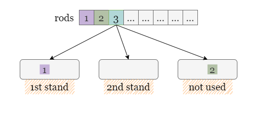
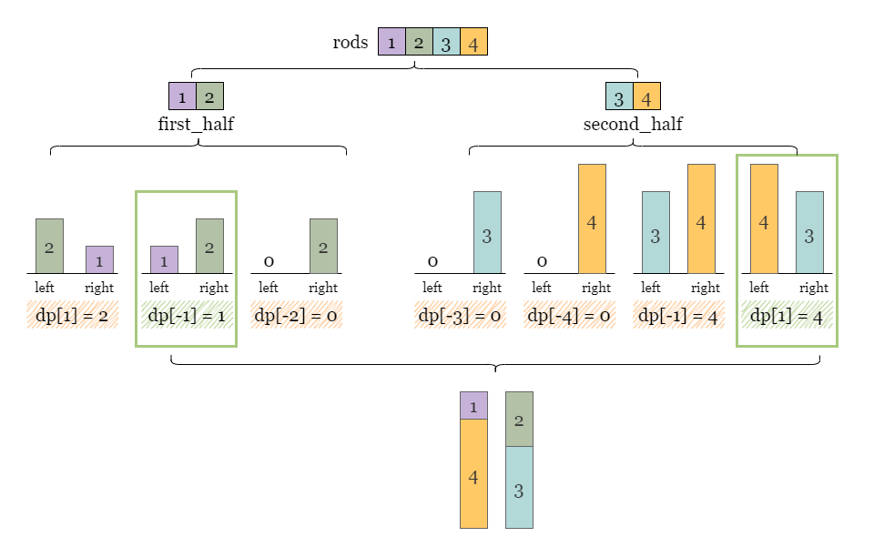
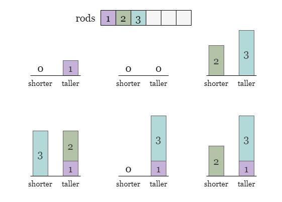
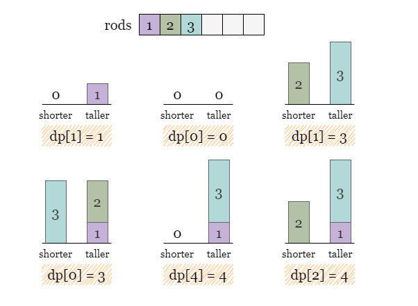
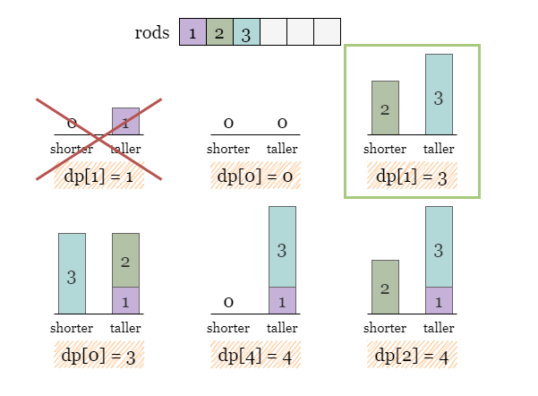
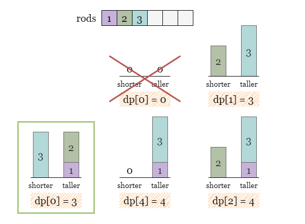
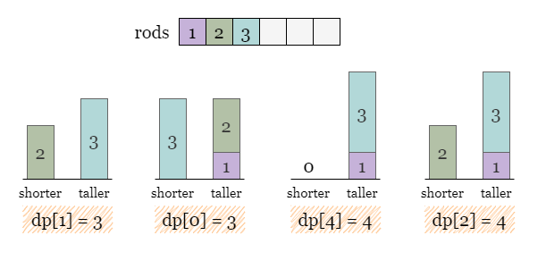
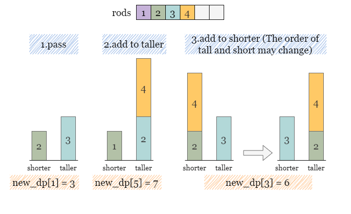

# 956. Tallest Billboard — Exhaustive Solution Notes

## Overview

We are given a set of rods. We may weld rods together to form two supports for a billboard.

The billboard is valid only if:

- the two supports have **equal height**
- each rod is used at most once
- rods can also be left unused

Our goal is to maximize the common height of the two supports.

If no non-zero equal-height supports can be formed, return `0`.

This problem looks like a partition problem, but the twist is that we want the **largest equal subset sum**, not just whether some equal partition exists.

This write-up explains two accepted approaches:

1. **Meet in the Middle**
2. **Dynamic Programming**

Both are standard and useful. The DP approach is usually the most practical one to remember.



---

## Problem Statement

You are given an array `rods`, where each element is the length of a rod.

You want to build two supports of equal height using disjoint subsets of these rods.

Return the maximum possible common height.

If this is impossible, return `0`.

---

## Example 1

**Input**

```text
rods = [1,2,3,6]
```

**Output**

```text
6
```

**Explanation**

Choose:

- left support: `{1,2,3}` → height `6`
- right support: `{6}` → height `6`

So the answer is:

```text
6
```

---

## Example 2

**Input**

```text
rods = [1,2,3,4,5,6]
```

**Output**

```text
10
```

**Explanation**

Choose:

- left support: `{2,3,5}` → height `10`
- right support: `{4,6}` → height `10`

So the tallest billboard has height:

```text
10
```

---

## Example 3

**Input**

```text
rods = [1,2]
```

**Output**

```text
0
```

**Explanation**

It is impossible to build two supports with equal positive height.

---

## Constraints

- `1 <= rods.length <= 20`
- `1 <= rods[i] <= 1000`
- `sum(rods[i]) <= 5000`

---

# Why Brute Force Is Too Slow

For each rod, we have three choices:

1. put it on the left support
2. put it on the right support
3. do not use it

So the total number of possibilities is:

```text
3^n
```

When `n = 20`, this becomes too large for naive brute force.

That is why we need smarter approaches.

---

# Approach 1: Meet in the Middle

## Intuition

The brute-force search is too expensive over all rods, but `n <= 20` is small enough that if we split the array into two halves, each half has size about `10`.

Then instead of:

```text
3^n
```

we do roughly:

```text
2 * 3^(n/2)
```

which is dramatically smaller.

This is the classic **meet-in-the-middle** technique.

---

## Representing a Half-Solution

Suppose for a given half of the rods we form two partial supports:

- left height = `left`
- right height = `right`

What matters when combining the two halves?

The important quantity is the **difference**:

```text
diff = left - right
```

If one half has:

```text
diff = +3
```

that means its left support is taller by 3.

Then to balance everything when combining with the other half, we want the second half to have:

```text
diff = -3
```

so that together the final supports become equal.

---

## What Should the HashMap Store?

For each difference:

```text
diff = left - right
```

we want to know the **largest left height** that can produce that difference.

So we store:

```text
map[diff] = maximum left
```

Why is storing `left` enough?

Because if two halves have opposite differences:

- first half: `left1 - right1 = diff`
- second half: `left2 - right2 = -diff`

then:

```text
left1 + left2 = right1 + right2
```

So the final equal height is:

```text
left1 + left2
```

Thus storing `left` is sufficient.

---

## Generating All States for One Half

We begin with:

```text
states = {(0, 0)}
```

meaning neither side has any rods yet.

For each rod `r`, every existing state `(left, right)` can generate three possibilities:

1. skip the rod
2. add `r` to the left side → `(left + r, right)`
3. add `r` to the right side → `(left, right + r)`

After processing all rods in the half, we convert all states into the hashmap representation:

```text
diff = left - right
value = max(left)
```

---

## Combining the Two Halves

After building:

- `firstHalf`
- `secondHalf`

we iterate over all `diff` values in `firstHalf`.

If `secondHalf` contains `-diff`, then the two halves can be combined into equal supports.

The resulting height is:

```text
firstHalf[diff] + secondHalf[-diff]
```

Take the maximum over all such matches.



---

## Java Implementation — Meet in the Middle

```java
class Solution {

    // Helper function to collect every combination `(left, right)`
    Map<Integer, Integer> helper(int[] rods, int leftIndex, int rightIndex) {
        Set<Pair<Integer, Integer>> states = new HashSet<>();
        states.add(new Pair(0, 0));

        for (int i = leftIndex; i < rightIndex; ++i) {
            int r = rods[i];
            Set<Pair<Integer, Integer>> newStates = new HashSet<>();

            for (Pair<Integer, Integer> p : states) {
                newStates.add(new Pair(p.getKey() + r, p.getValue()));
                newStates.add(new Pair(p.getKey(), p.getValue() + r));
            }

            states.addAll(newStates);
        }

        Map<Integer, Integer> dp = new HashMap<>();
        for (Pair<Integer, Integer> p : states) {
            int left = p.getKey(), right = p.getValue();
            dp.put(
                left - right,
                Math.max(dp.getOrDefault(left - right, 0), left)
            );
        }
        return dp;
    }

    public int tallestBillboard(int[] rods) {
        int n = rods.length;
        Map<Integer, Integer> firstHalf = helper(rods, 0, n / 2);
        Map<Integer, Integer> secondHalf = helper(rods, n / 2, n);

        int answer = 0;
        for (int diff : firstHalf.keySet()) {
            if (secondHalf.containsKey(-diff)) {
                answer = Math.max(
                    answer,
                    firstHalf.get(diff) + secondHalf.get(-diff)
                );
            }
        }
        return answer;
    }
}
```

---

## Complexity Analysis — Meet in the Middle

Let `n` be the number of rods.

### Time Complexity

Each half has size about `n/2`.

Each rod has 3 choices, so one half has about:

```text
3^(n/2)
```

states.

We do this for both halves, so overall time is:

```text
O(3^(n/2))
```

The editorial writes it as:

```text
O(3^(n/2))
```

up to constant factors for both halves.

---

### Space Complexity

We may store up to:

```text
O(3^(n/2))
```

states / hashmap entries.

---

# Approach 2: Dynamic Programming

## Intuition



The meet-in-the-middle solution is elegant, but there is an even more standard dynamic programming approach that works very well because:

```text
sum(rods) <= 5000
```

That small total sum lets us DP over differences.

---

## Better State Representation











Instead of tracking:

```text
(left, right)
```

directly, track only:

```text
diff = taller - shorter
```

and for each difference, remember the **maximum taller height** we can achieve.

Define:

```text
dp[diff] = taller
```

This is enough information because:

- `diff` tells us how imbalanced the two supports are
- `taller` tells us how tall the taller side currently is
- then the shorter side is:

```text
shorter = taller - diff
```

This compact representation is the key DP optimization.

---

## Initial State

Initially both supports have height 0:

```text
taller = 0
shorter = 0
diff = 0
```

So:

```text
dp[0] = 0
```

---

## Why We Keep Only the Maximum Taller Height

Suppose we have two ways to achieve the same difference `diff`.

If one state has a larger taller height than the other, then the smaller one is never useful.

Why?

Because for the same imbalance, having more total height is always better for future combinations.

So for each `diff`, we store only the best (largest) taller height.

That is why the hashmap never needs to keep multiple values for the same difference.

---

## Transitions for a New Rod `r`

Suppose currently we have a state:

```text
dp[diff] = taller
```

Then:

```text
shorter = taller - diff
```

Now for the new rod `r`, there are three possibilities.

### Option 1: Skip `r`

The state remains unchanged.

This is handled by copying `dp` into `newDp` before processing transitions.

---

### Option 2: Add `r` to the taller side

Then:

- new taller = `taller + r`
- new shorter = `shorter`
- new difference = `diff + r`

So update:

```text
newDp[diff + r] = max(newDp[diff + r], taller + r)
```

---

### Option 3: Add `r` to the shorter side

Then the shorter side becomes:

```text
shorter + r
```

Now two things can happen:

- it stays shorter
- or it becomes the new taller side

So:

```text
newDiff = abs((shorter + r) - taller)
newTaller = max(shorter + r, taller)
```

Then update:

```text
newDp[newDiff] = max(newDp[newDiff], newTaller)
```

---

## Final Answer

At the end, the best equal supports correspond to:

```text
diff = 0
```

because then:

```text
taller = shorter
```

So the answer is:

```text
dp[0]
```

---

## Java Implementation — Dynamic Programming

```java
public class Solution {

    public int tallestBillboard(int[] rods) {
        // dp[taller - shorter] = taller
        Map<Integer, Integer> dp = new HashMap<>();
        dp.put(0, 0);

        for (int r : rods) {
            // newDp means we don't add r to these stands.
            Map<Integer, Integer> newDp = new HashMap<>(dp);

            for (Map.Entry<Integer, Integer> entry : dp.entrySet()) {
                int diff = entry.getKey();
                int taller = entry.getValue();
                int shorter = taller - diff;

                // Add r to the taller stand
                int newTaller = newDp.getOrDefault(diff + r, 0);
                newDp.put(diff + r, Math.max(newTaller, taller + r));

                // Add r to the shorter stand
                int newDiff = Math.abs(shorter + r - taller);
                int newTaller2 = Math.max(shorter + r, taller);
                newDp.put(
                    newDiff,
                    Math.max(newTaller2, newDp.getOrDefault(newDiff, 0))
                );
            }

            dp = newDp;
        }

        // Return the maximum height with 0 difference.
        return dp.getOrDefault(0, 0);
    }
}
```

---

## Complexity Analysis — Dynamic Programming

Let:

- `n` = number of rods
- `m` = sum of all rod lengths

### Time Complexity

We process each rod once.

For each rod, we iterate through all current differences in `dp`.

There can be at most `m` different differences.

So total time complexity is:

```text
O(n * m)
```

---

### Space Complexity

The hashmap stores at most one entry per possible difference.

The difference ranges up to `m`.

So space complexity is:

```text
O(m)
```

---

# Why the DP Works

The state:

```text
dp[diff] = taller
```

captures exactly the essential information needed for future rods.

Given the same difference, only the configuration with the maximum taller height matters.

Each rod has exactly three choices:

- skip
- add to taller
- add to shorter

The transition covers all these possibilities.

By iterating through all rods and updating the state map, the DP explores every possible partition efficiently without explicitly enumerating all `3^n` assignments.

At the end, `dp[0]` is the largest possible equal height.

---

# Comparing the Two Approaches

## Meet in the Middle

### Strengths

- very natural when `n` is small
- exploits `n <= 20`
- elegant subset-combination reasoning

### Weaknesses

- exponential in `n/2`
- more cumbersome to implement
- relies heavily on the small `n` constraint

---

## Dynamic Programming

### Strengths

- very practical
- exploits `sum(rods) <= 5000`
- easier to reason about once the `diff -> taller` state is understood
- usually the best solution to remember

### Weaknesses

- needs careful derivation of the transitions
- the `taller/shorter` representation is slightly unintuitive at first

---

# Common Mistakes

## 1. Trying subset-sum on only one side

This is not enough because rods may be distributed between two sides in many ways, and unused rods are allowed.

---

## 2. Storing `(left, right)` directly in DP

That leads to too many redundant states.

Tracking only `diff` and the best `taller` height is much more efficient.

---

## 3. Updating the hashmap in place

If you modify `dp` while iterating it, you may reuse the same rod multiple times in one iteration.

That is why we must create:

```text
newDp = copy of dp
```

before processing the current rod.

---

## 4. Forgetting that the answer is `dp[0]`

Only difference `0` corresponds to equal supports.

---

# Final Summary

## Main Idea

We want two disjoint subsets of rods with equal sum and maximum height.

The best DP state is:

```text
dp[diff] = tallest taller-side height
```

where:

```text
diff = taller - shorter
```

Each rod can:

1. be skipped
2. be added to the taller side
3. be added to the shorter side

At the end:

```text
dp[0]
```

is the maximum equal height.

---

## Accepted Approaches

### Meet in the Middle

- Time: `O(3^(n/2))`
- Space: `O(3^(n/2))`

### Dynamic Programming

- Time: `O(n * m)`
- Space: `O(m)`

where `m = sum(rods)`.

---

# Best Final Java Solution

The dynamic programming approach is usually the best one to remember and use.

```java
public class Solution {

    public int tallestBillboard(int[] rods) {
        // dp[taller - shorter] = taller
        Map<Integer, Integer> dp = new HashMap<>();
        dp.put(0, 0);

        for (int r : rods) {
            Map<Integer, Integer> newDp = new HashMap<>(dp);

            for (Map.Entry<Integer, Integer> entry : dp.entrySet()) {
                int diff = entry.getKey();
                int taller = entry.getValue();
                int shorter = taller - diff;

                // Add r to the taller stand
                newDp.put(diff + r,
                    Math.max(newDp.getOrDefault(diff + r, 0), taller + r));

                // Add r to the shorter stand
                int newDiff = Math.abs(shorter + r - taller);
                int newTaller = Math.max(shorter + r, taller);
                newDp.put(newDiff,
                    Math.max(newDp.getOrDefault(newDiff, 0), newTaller));
            }

            dp = newDp;
        }

        return dp.getOrDefault(0, 0);
    }
}
```

This is the standard accepted DP solution for **Tallest Billboard**.
