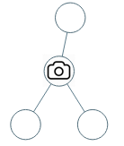
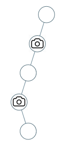

# 968. Binary Tree Cameras — Exhaustive Solution Notes

## Overview

We are given the root of a binary tree.

We may place cameras on some nodes. A camera placed on a node can monitor:

- the node itself
- its parent
- its left child
- its right child

The goal is to place the **minimum number of cameras** so that **every node in the tree is monitored**.

This is a classic tree-DP / greedy tree problem. The main challenge is that a camera only covers a **local neighborhood**, so naive top-down placement can easily waste cameras.

This write-up explains two accepted approaches:

1. **Dynamic Programming**
2. **Greedy**

Both run in linear time.

---

## Problem Statement

Given the root of a binary tree, install cameras on some nodes so that every node is monitored.

Each camera covers:

- its parent
- itself
- its immediate children

Return the minimum number of cameras needed.

---

## Example 1



**Input**

```text
root = [0,0,null,0,0]
```

**Output**

```text
1
```

**Explanation**

A single camera placed at the correct internal node can monitor:

- that node itself
- its parent
- both its children

So one camera is enough.

---

## Example 2



**Input**

```text
root = [0,0,null,0,null,0,null,null,0]
```

**Output**

```text
2
```

**Explanation**

At least two cameras are required to cover all nodes.

---

## Constraints

- number of nodes is in the range `[1, 1000]`
- `Node.val == 0`

---

# Key Observation

A camera is usually **not** best placed on a leaf.

Why?

If you place a camera on a leaf, it covers:

- the leaf
- its parent

But if you place the camera on the leaf’s parent instead, it covers:

- the parent
- the leaf
- possibly the leaf’s sibling
- the parent’s parent

So, in general:

> It is often better to place cameras as high as possible while still covering the deepest uncovered nodes.

This is what makes bottom-up reasoning natural.

---

# Approach 1: Dynamic Programming

## Intuition

Instead of greedily deciding immediately where to put cameras, we compute, for each subtree, the minimum cameras needed under different coverage conditions.

The editorial describes **three states** for a subtree rooted at `node`.

These states are very precise and extremely useful.

Let `solve(node)` return an array of 3 values:

### State 0 — Strict Subtree

All nodes **below** this node are covered, but **this node itself is not covered**.

### State 1 — Normal Subtree

All nodes **in the subtree including this node** are covered, but **there is no camera at this node**.

### State 2 — Camera Placed

All nodes **in the subtree including this node** are covered, and **there is a camera at this node**.

Once we compute these three values for the left and right children, we can derive the three values for the current node.

---

## Why These 3 States Are Enough

At a node, the only thing that really matters for the parent is:

- whether this node is covered
- whether this node has a camera
- whether the subtree below is fully covered

That is exactly what these three states capture.

So even though the full tree can be complicated, the interaction between a node and its parent is small and local.

That is what makes tree DP possible.

---

## State Transitions

Suppose:

- `L = solve(node.left)`
- `R = solve(node.right)`

We compute three values:

- `d0` = minimum cameras for state 0 at current node
- `d1` = minimum cameras for state 1 at current node
- `d2` = minimum cameras for state 2 at current node

---

## State 0: Strict Subtree

In state 0:

- the current node is **not covered**
- all nodes below it must already be covered

That means both children must be in **state 1**:

- each child subtree is fully covered
- neither child has a camera covering the current node

So:

```text
d0 = L[1] + R[1]
```

---

## State 1: Covered, No Camera Here

In state 1:

- current node is covered
- current node has no camera

So the current node must be covered by **at least one child camera**.

That means:

- each child must be either covered without camera (state 1) or with camera (state 2)
- and **at least one child must be in state 2**

There are two minimal combinations to consider:

1. left child has camera, right child is either state 1 or 2
2. right child has camera, left child is either state 1 or 2

So:

```text
d1 = min(L[2] + min(R[1], R[2]),
         R[2] + min(L[1], L[2]))
```

---

## State 2: Place Camera Here

In state 2:

- current node has a camera

That means current node covers:

- itself
- its parent
- its children

So each child can be in any state as long as its subtree below is valid.

For a child, the valid possibilities are:

- state 0: child itself uncovered, but subtree below covered
- state 1: fully covered, no camera
- state 2: fully covered, has camera

But since the camera at current node already covers the child itself, the child does not need to be covered by its own subtree. So child state 0 is allowed.

Thus for each child we take:

```text
min(child[0], child[1], child[2])
```

The editorial simplifies this as:

```text
min(child[0], min(child[1], child[2]))
```

Then add 1 for the camera at current node.

So:

```text
d2 = 1 + min(L[0], min(L[1], L[2])) + min(R[0], min(R[1], R[2]))
```

The implementation uses helper values to make this cleaner.

---

## Base Case for Null Nodes

If `node == null`, the editorial returns:

```java
new int[]{0, 0, 99999}
```

Why?

### Null in state 0

A null subtree with root “not covered” is harmless, so cost `0`.

### Null in state 1

A null subtree is already fully covered, so cost `0`.

### Null in state 2

We cannot place a camera on a null node, so use a huge number to make this state impossible.

That is why state 2 is set to a large sentinel like `99999`.

---

## Final Answer

At the root, we must ensure the root itself is covered.

So the root cannot be in state 0.

Therefore the answer is:

```text
min(ans[1], ans[2])
```

where `ans = solve(root)`.

---

## Java Implementation — Dynamic Programming

```java
class Solution {
    public int minCameraCover(TreeNode root) {
        int[] ans = solve(root);
        return Math.min(ans[1], ans[2]);
    }

    // 0: Strict ST; all nodes below this are covered, but not this one
    // 1: Normal ST; all nodes below and including this are covered, no camera here
    // 2: Placed camera; all nodes below and including this are covered, and camera here
    public int[] solve(TreeNode node) {
        if (node == null)
            return new int[]{0, 0, 99999};

        int[] L = solve(node.left);
        int[] R = solve(node.right);

        int mL12 = Math.min(L[1], L[2]);
        int mR12 = Math.min(R[1], R[2]);

        int d0 = L[1] + R[1];
        int d1 = Math.min(L[2] + mR12, R[2] + mL12);
        int d2 = 1 + Math.min(L[0], mL12) + Math.min(R[0], mR12);

        return new int[]{d0, d1, d2};
    }
}
```

---

## Complexity Analysis — Dynamic Programming

Let `N` be the number of nodes in the tree.

### Time Complexity

Each node is processed exactly once, and each processing step does only constant work.

So the time complexity is:

```text
O(N)
```

### Space Complexity

The recursion depth is proportional to the height of the tree `H`.

So the auxiliary space complexity is:

```text
O(H)
```

In the worst case of a skewed tree, this becomes `O(N)`.

---

# Approach 2: Greedy

## Intuition

The greedy insight is even more elegant.

Instead of trying to cover the tree from the top down, cover it from the **bottom up**.

Think about a leaf node.

A camera on the leaf covers:

- leaf
- parent

But a camera on the parent covers:

- parent
- leaf
- possibly sibling
- grandparent

So if a node has an uncovered child, then placing a camera on that node is always a strong choice.

This leads to a post-order traversal strategy:

1. process children first
2. then decide whether the current node needs a camera

---

## Greedy Rule

After processing the children of a node:

- if either child is not covered, we **must** place a camera at the current node
- if the current node is the root and still not covered, we must also place a camera there

This works because it always places cameras at the lowest possible positions that can still cover uncovered descendants efficiently.

---

## Why Post-Order Traversal

We need to know whether children are already covered before deciding what to do at the current node.

That means:

- process left subtree
- process right subtree
- then process current node

So this is naturally a **post-order DFS**.

---

## Covered Set Strategy

The editorial implementation uses a `Set<TreeNode>` called `covered`.

Initially, it contains:

```text
null
```

This is a nice trick so that missing children are treated as already covered.

When we place a camera at `node`, we add to `covered`:

- `node`
- `par`
- `node.left`
- `node.right`

because the camera covers exactly those nodes.

---

## Root Handling

There is one extra case:

If the root ends up uncovered after processing its children, we must place a camera on it, because it has no parent that could cover it later.

That is why the condition checks:

```text
(par == null && !covered.contains(node))
```

---

## Java Implementation — Greedy

```java
class Solution {
    int ans;
    Set<TreeNode> covered;

    public int minCameraCover(TreeNode root) {
        ans = 0;
        covered = new HashSet<>();
        covered.add(null);

        dfs(root, null);
        return ans;
    }

    public void dfs(TreeNode node, TreeNode par) {
        if (node != null) {
            dfs(node.left, node);
            dfs(node.right, node);

            if ((par == null && !covered.contains(node)) ||
                !covered.contains(node.left) ||
                !covered.contains(node.right)) {
                ans++;
                covered.add(node);
                covered.add(par);
                covered.add(node.left);
                covered.add(node.right);
            }
        }
    }
}
```

---

## Complexity Analysis — Greedy

Let `N` be the number of nodes in the tree.

### Time Complexity

Each node is visited exactly once in DFS.

Each set operation is `O(1)` average-case.

So the time complexity is:

```text
O(N)
```

### Space Complexity

The recursion stack uses `O(H)` where `H` is the tree height.

The `covered` set may store up to `O(N)` nodes.

The editorial states `O(H)` focusing on recursion stack, but practically, since the set can hold many nodes, the total extra space is more accurately:

```text
O(N)
```

Still, following the provided editorial statement, the recursion-based auxiliary depth is `O(H)`.

---

# Why the Greedy Strategy Is Correct

The greedy rule is:

> If a node has any uncovered child, put a camera here.

Why is this safe?

Because if a child is uncovered, then the only nodes that can cover it are:

- the child itself
- the parent
- possibly one of its children

But if we are processing bottom-up, the child’s children have already been considered. So the best remaining place to cover that uncovered child is its parent.

This makes placing the camera at the parent optimal.

This bottom-up logic ensures no unnecessary cameras are placed on leaves.

---

# Comparing the Two Approaches

## Dynamic Programming

### Strengths

- very systematic
- explicitly models all possible local states
- easy to reason about formally

### Weaknesses

- state transitions are more complex
- harder to derive in an interview under time pressure

---

## Greedy

### Strengths

- elegant and concise
- simpler implementation
- intuitive once the bottom-up insight is seen

### Weaknesses

- less obvious initially why it is always correct
- correctness proof is more subtle than the DP formulation

---

# Common Mistakes

## 1. Placing cameras on leaves

This is usually wasteful. A camera on the parent usually covers more nodes.

---

## 2. Forgetting to handle the root

The root has no parent, so if it remains uncovered after DFS, we must place a camera there.

---

## 3. Using pre-order instead of post-order

Decisions depend on child states, so the traversal must be bottom-up.

---

## 4. Mishandling null children

The greedy solution treats `null` as already covered, which greatly simplifies the logic.

---

# Final Summary

## Key Idea

Cameras are most effective when placed on the **parents of uncovered nodes**, not on the uncovered nodes themselves.

This makes a bottom-up traversal natural.

---

## Accepted Approaches

### Dynamic Programming

Define 3 states for each subtree:

- subtree below covered, node not covered
- subtree fully covered, no camera here
- subtree fully covered, camera here

Then combine child states.

- Time: `O(N)`
- Space: `O(H)`

### Greedy

Use post-order DFS:

- if a node has any uncovered child, place a camera here
- if root is uncovered at the end, place a camera there

- Time: `O(N)`
- Space: `O(H)` recursion depth, plus storage for covered nodes

---

# Best Final Java Solution

The greedy solution is usually the cleanest accepted solution to remember.

```java
class Solution {
    int ans;
    Set<TreeNode> covered;

    public int minCameraCover(TreeNode root) {
        ans = 0;
        covered = new HashSet<>();
        covered.add(null);

        dfs(root, null);
        return ans;
    }

    public void dfs(TreeNode node, TreeNode par) {
        if (node != null) {
            dfs(node.left, node);
            dfs(node.right, node);

            if ((par == null && !covered.contains(node)) ||
                !covered.contains(node.left) ||
                !covered.contains(node.right)) {
                ans++;
                covered.add(node);
                covered.add(par);
                covered.add(node.left);
                covered.add(node.right);
            }
        }
    }
}
```

This is the standard elegant greedy solution for **Binary Tree Cameras**.
