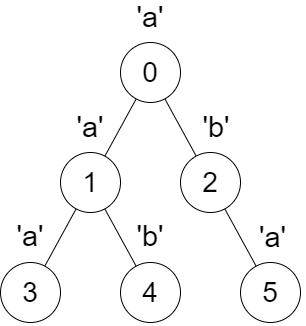
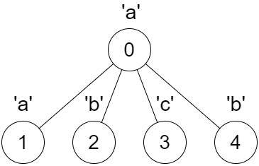

# 3327. Check if DFS Strings Are Palindromes

## Problem Description

You are given a **tree** rooted at node `0`, consisting of `n` nodes numbered from `0` to `n - 1`.

The tree is represented by an array:

```
parent
```

where:

- `parent[i]` is the parent of node `i`
- `parent[0] == -1` because node `0` is the root

You are also given a string:

```
s
```

of length `n`, where:

- `s[i]` is the character assigned to node `i`

---

# DFS String Construction

We construct a string called:

```
dfsStr
```

using the following recursive DFS procedure.

Define a function:

```
dfs(int x)
```

which performs the following steps:

1. Iterate over each **child `y` of node `x`** in **increasing order** of their node numbers.
2. For each child, call:

```
dfs(y)
```

3. After all children have been processed, append the character:

```
s[x]
```

to the end of `dfsStr`.

Important notes:

- `dfsStr` is **shared across all recursive calls**
- the order of traversal is strictly defined by increasing child node numbers

---

# Task

You must compute a boolean array:

```
answer
```

of size `n`.

For each node `i` from `0` to `n - 1`:

1. Reset `dfsStr` to an empty string
2. Call:

```
dfs(i)
```

3. After DFS completes, check whether `dfsStr` is a **palindrome**

If `dfsStr` is a palindrome:

```
answer[i] = true
```

Otherwise:

```
answer[i] = false
```

Finally, return the array `answer`.

---

# Example 1



## Input

```
parent = [-1,0,0,1,1,2]
s = "aababa"
```

## Output

```
[true,true,false,true,true,true]
```

## Explanation

### dfs(0)

Traversal produces:

```
dfsStr = "abaaba"
```

This string **is a palindrome**.

---

### dfs(1)

Traversal produces:

```
dfsStr = "aba"
```

This **is a palindrome**.

---

### dfs(2)

Traversal produces:

```
dfsStr = "ab"
```

This **is not a palindrome**.

---

### dfs(3)

```
dfsStr = "a"
```

A single character is always a palindrome.

---

### dfs(4)

```
dfsStr = "b"
```

Palindrome.

---

### dfs(5)

```
dfsStr = "a"
```

Palindrome.

---

# Example 2



## Input

```
parent = [-1,0,0,0,0]
s = "aabcb"
```

## Output

```
[true,true,true,true,true]
```

## Explanation

For every node `x`, the string generated by `dfs(x)` forms a **palindrome**.

Therefore all entries in `answer` are `true`.

---

# Constraints

```
n == parent.length == s.length

1 <= n <= 10^5

0 <= parent[i] <= n - 1 for all i >= 1

parent[0] == -1

parent represents a valid tree

s consists only of lowercase English letters
```
