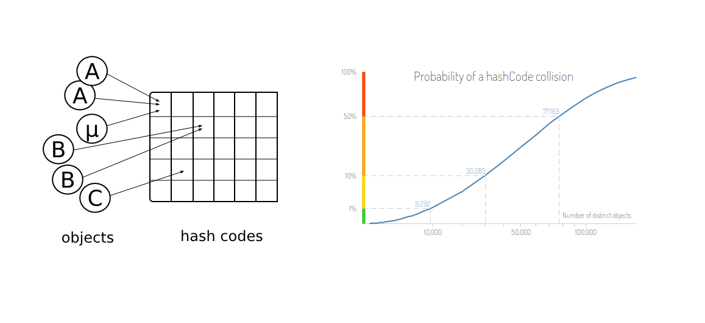

# 535. Encode and Decode TinyURL

## Detailed Notes on Multiple Encoding Strategies

## Overview

This problem asks us to design a system that can:

- encode a long URL into a short URL
- decode the short URL back into the original long URL

The problem is intentionally flexible.

It does **not** require one specific encoding algorithm.

It only requires one guarantee:

> if a URL is encoded, then decoding the returned short URL must recover the original long URL

Because of that flexibility, many possible approaches exist.

This document explains five different approaches in detail:

1. **Using a Simple Counter**
2. **Variable-Length Encoding**
3. **Using `hashCode()`**
4. **Using a Random Number**
5. **Random Fixed-Length Encoding**

---

# Core Design Requirement

No matter which strategy we use, a TinyURL system fundamentally needs a mapping between:

- short code → original URL

In many designs, this mapping is stored in a hash map.

Encoding generates a code and stores:

```text
code -> longUrl
```

Decoding extracts the code from the short URL and looks it up in the map.

So the real design question is:

> how should the short code be generated?

Each approach below answers that differently.

---

# Approach 1: Using Simple Counter

## Intuition

This is the most direct approach.

We maintain a counter `i`:

- every new URL gets the current value of `i`
- then `i` is incremented
- the counter value becomes the short code

At the same time, we store:

```text
i -> longUrl
```

inside a hash map.

Then decoding is easy:

- extract the integer part from the tiny URL
- look it up in the map
- return the original URL

---

## Why This Works

This approach works because the generated code is unique as long as the counter never repeats.

Since the counter increases by 1 each time:

- the first URL gets code `0`
- the next gets `1`
- then `2`
- and so on

As long as integer overflow does not happen, no two encoded URLs receive the same code.

---

## Java Code

```java
public class Codec {
    Map<Integer, String> map = new HashMap<>();
    int i = 0;

    public String encode(String longUrl) {
        map.put(i, longUrl);
        return "http://tinyurl.com/" + i++;
    }

    public String decode(String shortUrl) {
        return map.get(Integer.parseInt(shortUrl.replace("http://tinyurl.com/", "")));
    }
}
```

---

## Detailed Walkthrough

### 1. Storage

```java
Map<Integer, String> map = new HashMap<>();
```

This stores the mapping:

```text
counterValue -> originalLongUrl
```

---

### 2. Counter

```java
int i = 0;
```

This is the next available short code.

---

### 3. Encoding

```java
map.put(i, longUrl);
return "http://tinyurl.com/" + i++;
```

The process is:

1. store the current counter value with the URL
2. build the tiny URL using that integer
3. increment the counter

---

### 4. Decoding

```java
return map.get(Integer.parseInt(shortUrl.replace("http://tinyurl.com/", "")));
```

We strip the domain prefix, parse the remaining numeric part, and look it up in the map.

---

## Performance Analysis

### Strengths

- extremely simple
- guaranteed uniqueness until overflow
- constant-time map lookup on average
- very easy to implement

### Weaknesses

#### 1. Limited by `int` range

Because the short code is based on an integer counter, the number of unique encodings is limited by the range of `int`.

If too many URLs are encoded, integer overflow can happen.

Then:

- old codes may be overwritten
- decoding correctness may break

#### 2. Short URLs are predictable

This is a major weakness.

If someone encodes a few URLs and sees:

```text
.../0
.../1
.../2
```

then they can easily predict future codes.

This is poor from a security and privacy perspective.

#### 3. URL length is not necessarily short

If the counter grows large, the numeric code grows in digit length.

So the tiny URL is not always shorter in a strong sense.

Its length depends on the relative insertion order.

---

# Approach 2: Variable-Length Encoding

## Intuition

Instead of using plain decimal integers directly, we can encode the counter value in a larger base.

A natural choice is **base 62**, using:

- 10 digits
- 26 lowercase letters
- 26 uppercase letters

That gives 62 possible symbols per position.

So instead of generating:

```text
0, 1, 2, 3, ...
```

we generate codes like:

```text
0, 1, 2, ..., 9, a, b, ..., z, A, B, ..., Z, 10, 11, ...
```

This makes the code shorter than a plain decimal representation for the same counter value.

---

## Character Set

```text
0123456789abcdefghijklmnopqrstuvwxyzABCDEFGHIJKLMNOPQRSTUVWXYZ
```

This gives us 62 characters.

So the counter is encoded in base 62.

---

## Core Idea

We still use a sequential counter.

But instead of exposing the counter as a decimal integer, we convert it into a base-62 string.

That string becomes the short code.

---

## Java Code

```java
public class Codec {
    String chars = "0123456789abcdefghijklmnopqrstuvwxyzABCDEFGHIJKLMNOPQRSTUVWXYZ";
    HashMap<String, String> map = new HashMap<>();
    int count = 1;

    public String getString() {
        int c = count;
        StringBuilder sb = new StringBuilder();
        while (c > 0) {
            c--;
            sb.append(chars.charAt(c % 62));
            c /= 62;
        }
        return sb.toString();
    }

    public String encode(String longUrl) {
        String key = getString();
        map.put(key, longUrl);
        count++;
        return "http://tinyurl.com/" + key;
    }

    public String decode(String shortUrl) {
        return map.get(shortUrl.replace("http://tinyurl.com/", ""));
    }
}
```

---

## Detailed Walkthrough

### 1. Base-62 Character Set

```java
String chars = "0123456789abcdefghijklmnopqrstuvwxyzABCDEFGHIJKLMNOPQRSTUVWXYZ";
```

This defines the digits available for encoding.

---

### 2. Map

```java
HashMap<String, String> map = new HashMap<>();
```

Now the key is a string rather than an integer.

---

### 3. Counter

```java
int count = 1;
```

This counter drives code generation.

---

### 4. `getString()`

This converts the integer `count` into base 62.

```java
while (c > 0) {
    c--;
    sb.append(chars.charAt(c % 62));
    c /= 62;
}
```

It repeatedly:

- picks the next base-62 digit
- appends it
- divides by 62

This is essentially number-base conversion.

---

### 5. Encoding

```java
String key = getString();
map.put(key, longUrl);
count++;
return "http://tinyurl.com/" + key;
```

Generate a new base-62 string, store the mapping, increment the counter, and return the tiny URL.

---

### 6. Decoding

```java
return map.get(shortUrl.replace("http://tinyurl.com/", ""));
```

Extract the code string and use it as the key in the map.

---

## Performance Analysis

### Strengths

- codes are more compact than plain decimal counter codes
- collisions do not occur before counter overflow because each counter value is unique
- still easy to implement

### Weaknesses

#### 1. Still limited by `int` overflow

The underlying sequence still depends on an integer counter.

So after enough encodings, overflow can still occur.

#### 2. Still predictable

Even though the representation looks less obvious than decimal, the generated sequence is still deterministic.

So future codes can still be predicted with enough observation.

#### 3. Length depends on order

The code lengths grow as the counter grows.

The pattern is roughly:

- 1-character codes for the first 62 URLs
- 2-character codes for the next batch
- then 3-character codes, and so on

So the encoded URL length still depends on insertion order.

---

# Approach 3: Using `hashCode()`

## Intuition

Another idea is to generate the short code directly from the input URL itself using Java’s built-in `hashCode()` function.

Then:

- the hash code becomes the short code
- the hash map stores:
  ```text
  hashCode(longUrl) -> longUrl
  ```

This looks attractive because:

- no explicit counter is needed
- the code depends on the actual URL content
- the code is not as trivially sequential



---

## How Java String `hashCode()` Works

For a string `s` of length `n`, Java computes:

```text
s[0] * 31^(n-1) + s[1] * 31^(n-2) + ... + s[n-1]
```

using integer arithmetic.

So the final result is still an `int`.

---

## Java Code

```java
public class Codec {
    Map<Integer, String> map = new HashMap<>();

    public String encode(String longUrl) {
        map.put(longUrl.hashCode(), longUrl);
        return "http://tinyurl.com/" + longUrl.hashCode();
    }

    public String decode(String shortUrl) {
        return map.get(Integer.parseInt(shortUrl.replace("http://tinyurl.com/", "")));
    }
}
```

---

## Detailed Walkthrough

### 1. Map

```java
Map<Integer, String> map = new HashMap<>();
```

Stores:

```text
hashCode -> longUrl
```

---

### 2. Encoding

```java
map.put(longUrl.hashCode(), longUrl);
return "http://tinyurl.com/" + longUrl.hashCode();
```

Use the string’s hash code as the identifier.

---

### 3. Decoding

```java
return map.get(Integer.parseInt(shortUrl.replace("http://tinyurl.com/", "")));
```

Extract the integer hash code from the tiny URL and look it up.

---

## Performance Analysis

### Strengths

- very easy to implement
- no need for explicit sequencing
- codes are harder to predict than a simple counter

### Weaknesses

#### 1. Collisions are possible

This is the biggest problem.

Two different strings can produce the same `hashCode()`.

That means:

```text
longUrl1.hashCode() == longUrl2.hashCode()
```

even when the URLs are different.

If that happens, one mapping can overwrite the other and decoding becomes incorrect.

This makes the approach unsafe.

#### 2. Limited by `int` range

Because `hashCode()` returns an integer, the code space is still limited.

#### 3. Collision probability grows with scale

As more URLs are encoded, the chance of two URLs sharing the same hash code increases.

This is analogous to the **birthday paradox**:

- collisions become likely much sooner than intuition might suggest

So the design becomes unreliable well before hitting the full `int` limit.

---

## Important Takeaway

A hash code is not the same thing as a unique ID.

Hash functions are designed for distribution, not uniqueness.

So `hashCode()` is not a safe primary key for a TinyURL system.

---

# Approach 4: Using Random Number

## Intuition

Instead of deterministic sequential codes, we can generate a random integer as the short code.

Then:

- if the random code is unused, assign it
- if it is already in the map, generate another random code
- repeat until an unused code is found

This makes codes much harder to predict.

---

## Java Code

```java
public class Codec {
    Map<Integer, String> map = new HashMap<>();
    Random r = new Random();
    int key = r.nextInt(Integer.MAX_VALUE);

    public String encode(String longUrl) {
        while (map.containsKey(key)) {
            key = r.nextInt(Integer.MAX_VALUE);
        }
        map.put(key, longUrl);
        return "http://tinyurl.com/" + key;
    }

    public String decode(String shortUrl) {
        return map.get(Integer.parseInt(shortUrl.replace("http://tinyurl.com/", "")));
    }
}
```

---

## Detailed Walkthrough

### 1. Map

```java
Map<Integer, String> map = new HashMap<>();
```

Stores random integer code to original URL.

---

### 2. Random Generator

```java
Random r = new Random();
```

Used to create candidate codes.

---

### 3. Candidate Key

```java
int key = r.nextInt(Integer.MAX_VALUE);
```

A random integer in the positive `int` range.

---

### 4. Encoding

```java
while (map.containsKey(key)) {
    key = r.nextInt(Integer.MAX_VALUE);
}
map.put(key, longUrl);
return "http://tinyurl.com/" + key;
```

Generate random candidates until one is unused.

Then store the mapping and return the tiny URL.

---

### 5. Decoding

```java
return map.get(Integer.parseInt(shortUrl.replace("http://tinyurl.com/", "")));
```

Same pattern as before.

---

## Performance Analysis

### Strengths

- code values are difficult to predict
- simple conceptually
- avoids deterministic sequential pattern

### Weaknesses

#### 1. Still limited by `int` range

Random integers still come from a finite space.

#### 2. Collisions are still possible

Because codes are generated randomly, the same code may be generated more than once.

The `while` loop prevents incorrect reuse, but collision probability increases as more codes are used.

That means encoding may become slower over time.

#### 3. Length still depends on integer representation

The code is still an integer, so the final tiny URL length is not guaranteed to be especially short.

---

# Approach 5: Random Fixed-Length Encoding

## Intuition

This is one of the most natural TinyURL-style approaches.

We use the same base-62 character set as in Approach 2:

```text
0123456789abcdefghijklmnopqrstuvwxyzABCDEFGHIJKLMNOPQRSTUVWXYZ
```

But instead of converting a counter into base 62, we generate a **random string of fixed length**, usually length 6.

For example:

```text
4e9iAk
aB31zQ
00AzxM
```

Then:

- if the code is unused, store it
- if it collides with an existing code, generate a new random 6-character code

This combines:

- compact codes
- unpredictability
- a large code space

---

## Why Length 6?

If we use 62 characters per position and 6 positions, the total number of possible codes is:

```text
62^6
```

That is a very large code space.

So collisions are possible, but relatively rare when the number of stored URLs is much smaller than `62^6`.

This makes the design practical.

---

## Core Idea

1. randomly generate a 6-character code
2. check whether that code already exists
3. if it does, generate another one
4. once an unused code is found, map it to the long URL

---

## Conceptual Benefits

### 1. Fixed short length

Unlike counter-based approaches, the code length does not grow over time.

Every tiny URL has roughly the same compact size.

### 2. Hard to predict

Unlike sequential counters, random codes do not expose insertion order.

### 3. Very large code space

With 62 symbols and 6 positions, the number of possibilities is large enough for practical use.

---

## Main Tradeoff

This design still has collision risk because the code is chosen randomly.

But because the code space is large, collisions are much less frequent than with a plain random integer in a visibly numeric form.

The system simply regenerates a code whenever a collision occurs.

---

# Comparing the Approaches

## Approach 1: Simple Counter

### Good

- easiest to implement
- guaranteed uniqueness until overflow

### Bad

- predictable
- code length grows
- limited by integer range

---

## Approach 2: Variable-Length Encoding

### Good

- more compact than decimal counter
- still deterministic and collision-free until overflow

### Bad

- still predictable
- still counter-based
- length still grows with usage

---

## Approach 3: `hashCode()`

### Good

- simple
- not sequential

### Bad

- unsafe because collisions can happen
- not suitable as a unique identifier

---

## Approach 4: Random Number

### Good

- hard to predict
- simple idea

### Bad

- collisions increase with usage
- still tied to finite integer range
- code not especially compact

---

## Approach 5: Random Fixed-Length Encoding

### Good

- compact
- hard to predict
- fixed-length tiny URLs
- large code space

### Bad

- collisions still possible in theory
- requires regeneration on collision

---

# Big Design Insight

There are two competing goals in TinyURL design:

1. **uniqueness and correctness**
2. **shortness and unpredictability**

Sequential counters are excellent for uniqueness and simplicity, but weak for secrecy and aesthetics.

Random codes are much better for unpredictability, but they introduce collision-handling concerns.

So the choice depends on what aspect of the system we value more.

---

# Practical Conclusion

For interview-style implementations:

- **Simple Counter** is easiest to explain and prove correct
- **Random Fixed-Length Encoding** is closest to what people imagine TinyURL should look like

For real-world systems, you would also think about:

- persistence across server restarts
- duplicate long URLs possibly mapping to the same short URL
- expiration policies
- distributed ID generation
- collision handling at scale
- custom aliases
- abuse prevention

But for this coding problem, the essential concern is reversible mapping.

---

# Summary

## Approach 1: Simple Counter

- use an integer counter as the code
- store `counter -> longUrl`
- easy but predictable

## Approach 2: Variable-Length Encoding

- encode the counter in base 62
- more compact than decimal
- still predictable and overflow-limited

## Approach 3: Using `hashCode()`

- use Java string hash code as the key
- simple but unsafe because collisions can occur

## Approach 4: Random Number

- generate random integer codes
- retry on collision
- harder to predict but still collision-prone

## Approach 5: Random Fixed-Length Encoding

- generate random 6-character base-62 strings
- retry on collision
- compact, hard to predict, and practically effective

## Final Design Lesson

A TinyURL system is fundamentally a mapping problem:

- generate a short code
- store the mapping
- recover the original URL later

The real difference between approaches lies in how they trade off:

- simplicity
- compactness
- predictability
- collision risk
- scalability
