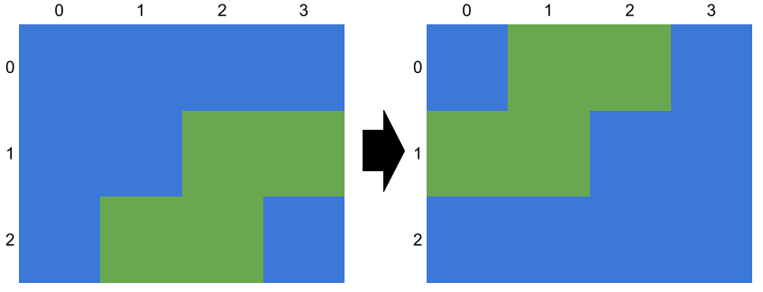
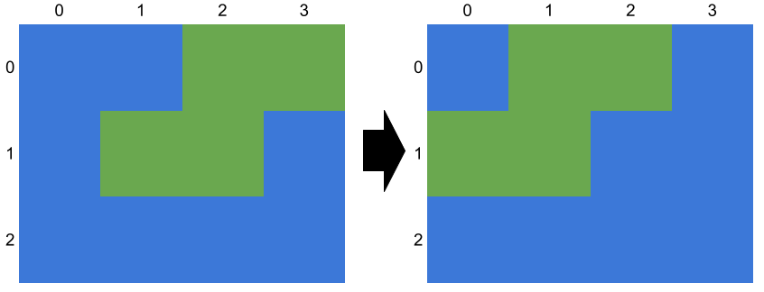
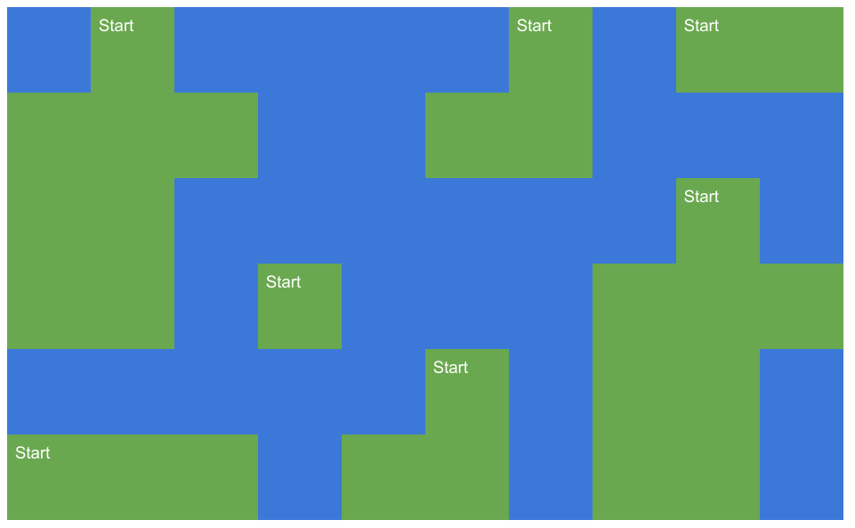
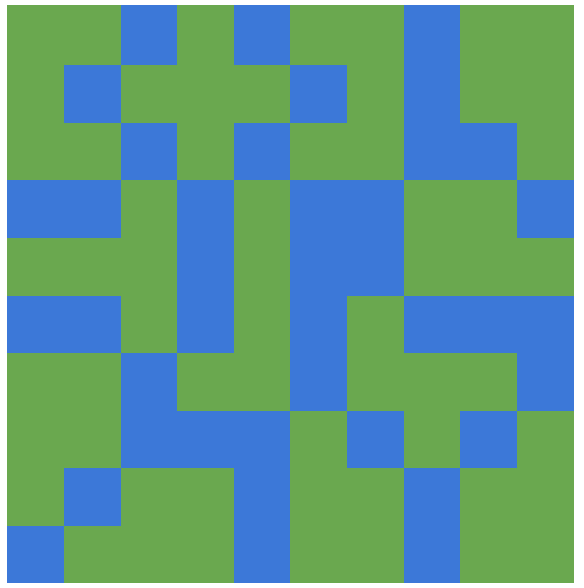
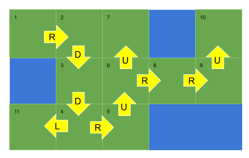
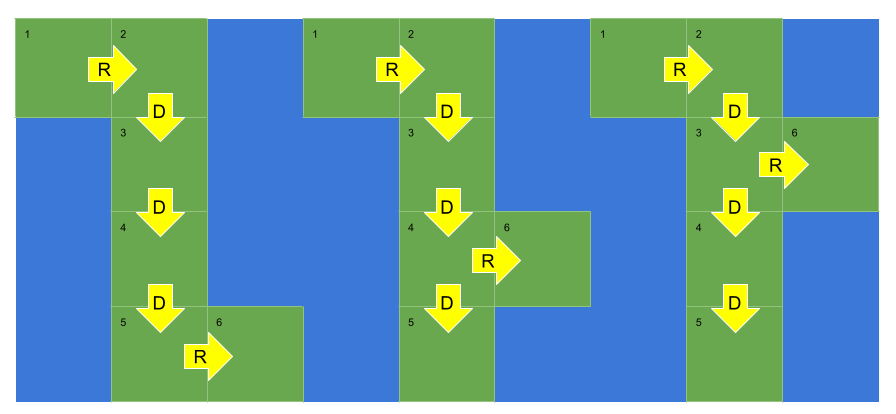
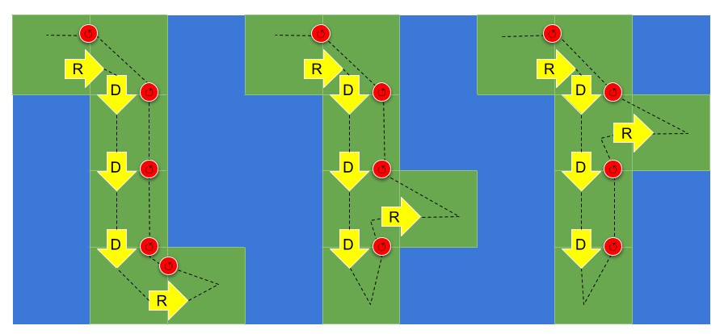

# 694. Number of Distinct Islands

## Overview

This problem has two main parts:

1. **Finding every island**
2. **Determining whether two islands have the same shape**

The first part is straightforward: we can use **Depth-First Search (DFS)** to traverse the grid and collect the cells belonging to each island.

The second part is the real challenge:

> How do we decide whether two islands are the same, given that translation is allowed, but rotation and reflection are not?

This document explains three approaches in detail:

1. **Brute Force**
2. **Hash by Local Coordinates**
3. **Hash by Path Signature**

---

# Problem Restatement

You are given an `m x n` binary grid.

- `1` represents land
- `0` represents water

An island is formed by connecting adjacent land cells **4-directionally**:

- up
- down
- left
- right

Two islands are considered the same if one can be obtained by **translating** the other.

Important:

- Translation is allowed
- Rotation is **not** allowed
- Reflection is **not** allowed

We need to return the number of **distinct island shapes**.

---

# Core Observation

If two islands differ only by location, then their **relative structure** is the same.

So the entire problem becomes:

> How do we encode an island in a location-independent way?

That is exactly what the three approaches try to do.

---

# Approach 1: Brute Force

## Intuition



Assume we already used DFS to extract every island as a list of coordinates.

Now we need to determine how many of these islands have unique shapes.

Because translation is allowed, absolute positions do not matter.

For example, these two islands should be considered identical:

```text
[(2, 1), (3, 1), (1, 2), (2, 2)]
[(2, 0), (3, 0), (1, 1), (2, 1)]
```

Even though their coordinates differ, they have the same structure after shifting.

So the main idea is:

- normalize every island
- compare normalized islands against each other



---

## How Normalization Works

We translate the island so that it is pushed as far toward the **top-left corner** as possible.

For example:

```text
[(2, 1), (3, 1), (1, 2), (2, 2)]
```

can be translated into:

```text
[(1, 0), (2, 0), (0, 1), (1, 1)]
```

Similarly:

```text
[(2, 0), (3, 0), (1, 1), (2, 1)]
```

also becomes:

```text
[(1, 0), (2, 0), (0, 1), (1, 1)]
```

Now the two islands have identical normalized coordinates, so we know they represent the same shape.

---

## Why Order Can Be Ignored Safely

Normally, coordinate lists like these could appear in different orders:

```text
[(0, 1), (0, 2)]
[(0, 2), (0, 1)]
```

These should still be treated as the same island.

To avoid having to sort every island explicitly, we rely on a careful traversal strategy:

- scan the grid **top to bottom**
- and within each row, **left to right**

That guarantees each island is first discovered from the same relative starting cell:

> the leftmost cell in the topmost row of that island

Then, because DFS always explores directions in the same fixed order, islands with the same shape will be discovered in the same relative order.

So consistent traversal gives us consistent coordinate ordering.

---

## Another Clever Simplification

Instead of explicitly shifting each island to the global top-left corner, we can shift it relative to the **first discovered cell**.

If the first discovered cell is `(r0, c0)`, then every coordinate `(r, c)` becomes:

```text
(r - r0, c - c0)
```

For example:

```text
[(2, 3), (2, 4), (2, 5), (3, 5)]
```

becomes:

```text
[(0, 0), (0, 1), (0, 2), (1, 2)]
```

This is enough to remove the effect of translation.

---

## Algorithm

1. Use DFS to find each island.
2. Store the coordinates of all cells in the current island.
3. Normalize the island by translating its coordinates.
4. Compare it against every previously discovered unique island.
5. If no match exists, add it to the list of unique islands.
6. Return the number of unique islands.



---

## Java Code

```java
class Solution {

    private List<List<int[]>> uniqueIslands = new ArrayList<>(); // All known unique islands.
    private List<int[]> currentIsland = new ArrayList<>(); // Current Island
    private int[][] grid; // Input grid
    private boolean[][] seen; // Cells that have been explored.

    public int numDistinctIslands(int[][] grid) {
        this.grid = grid;
        this.seen = new boolean[grid.length][grid[0].length];
        for (int row = 0; row < grid.length; row++) {
            for (int col = 0; col < grid[0].length; col++) {
                dfs(row, col);
                if (currentIsland.isEmpty()) {
                    continue;
                }
                // Translate the island we just found to the top left.
                int minCol = grid[0].length - 1;
                for (int i = 0; i < currentIsland.size(); i++) {
                    minCol = Math.min(minCol, currentIsland.get(i)[1]);
                }
                for (int[] cell : currentIsland) {
                    cell[0] -= row;
                    cell[1] -= minCol;
                }
                // If this island is unique, add it to the list.
                if (currentIslandUnique()) {
                    uniqueIslands.add(currentIsland);
                }
                currentIsland = new ArrayList<>();
            }
        }
        return uniqueIslands.size();
    }

    private void dfs(int row, int col) {
        if (row < 0 || col < 0 || row >= grid.length || col >= grid[0].length) return;
        if (seen[row][col] || grid[row][col] == 0) return;
        seen[row][col] = true;
        currentIsland.add(new int[]{row, col});
        dfs(row + 1, col);
        dfs(row - 1, col);
        dfs(row, col + 1);
        dfs(row, col - 1);
    }

    private boolean currentIslandUnique() {
        for (List<int[]> otherIsland : uniqueIslands) {
            if (currentIsland.size() != otherIsland.size()) {
                continue;
            }
            if (equalIslands(currentIsland, otherIsland)) {
                return false;
            }
        }
        return true;
    }

    private boolean equalIslands(List<int[]> island1, List<int[]> island2) {
        for (int i = 0; i < island1.size(); i++) {
            if (island1.get(i)[0] != island2.get(i)[0] || island1.get(i)[1] != island2.get(i)[1]) {
                return false;
            }
        }
        return true;
    }
}
```

---

## Detailed Walkthrough of the Code

### 1. Global Fields

```java
private List<List<int[]>> uniqueIslands = new ArrayList<>();
private List<int[]> currentIsland = new ArrayList<>();
private int[][] grid;
private boolean[][] seen;
```

- `uniqueIslands` stores all distinct normalized islands found so far
- `currentIsland` stores the cells of the island currently being explored
- `grid` is the input matrix
- `seen` tracks visited cells

---

### 2. Main Traversal

```java
for (int row = 0; row < grid.length; row++) {
    for (int col = 0; col < grid[0].length; col++) {
        dfs(row, col);
        ...
    }
}
```

We scan the grid from top-left to bottom-right.

This scan order is important because it ensures identical islands are discovered from corresponding relative starting cells.

---

### 3. DFS for Island Collection

```java
private void dfs(int row, int col) {
    if (row < 0 || col < 0 || row >= grid.length || col >= grid[0].length) return;
    if (seen[row][col] || grid[row][col] == 0) return;
    seen[row][col] = true;
    currentIsland.add(new int[]{row, col});
    dfs(row + 1, col);
    dfs(row - 1, col);
    dfs(row, col + 1);
    dfs(row, col - 1);
}
```

This standard DFS:

- stops if out of bounds
- stops if already visited
- stops if cell is water
- otherwise marks the cell visited and adds it to the current island

Then it explores in 4 directions.

---

### 4. Normalization Step

```java
int minCol = grid[0].length - 1;
for (int i = 0; i < currentIsland.size(); i++) {
    minCol = Math.min(minCol, currentIsland.get(i)[1]);
}
for (int[] cell : currentIsland) {
    cell[0] -= row;
    cell[1] -= minCol;
}
```

This shifts the island coordinates.

Notice the logic:

- `row` corresponds to the row where DFS began
- `minCol` is the leftmost column in the island

So each cell gets translated relative to that anchored position.

---

### 5. Uniqueness Check

```java
private boolean currentIslandUnique() {
    for (List<int[]> otherIsland : uniqueIslands) {
        if (currentIsland.size() != otherIsland.size()) {
            continue;
        }
        if (equalIslands(currentIsland, otherIsland)) {
            return false;
        }
    }
    return true;
}
```

We compare the current island against each known unique island.

If any one matches exactly, then the current island is not unique.

---

### 6. Cell-by-Cell Comparison

```java
private boolean equalIslands(List<int[]> island1, List<int[]> island2) {
    for (int i = 0; i < island1.size(); i++) {
        if (island1.get(i)[0] != island2.get(i)[0] || island1.get(i)[1] != island2.get(i)[1]) {
            return false;
        }
    }
    return true;
}
```

Since both islands are normalized and traversed consistently, identical shapes will have matching coordinate sequences.

---

## Complexity Analysis

### Time Complexity

```text
O(M^2 * N^2)
```

This is the expensive part.

Why?

- DFS visits each cell once, which is `O(M * N)`
- but after extracting each island, we may compare it against all previously found unique islands
- and each comparison may require examining all cells in the island

In the worst case:

- there are many islands
- many of them are unique
- and they have similar sizes

Then repeated comparisons become costly.



---

## Why the Worst Case Gets Bad

Imagine a large grid packed with many unique islands of the same size.

Then for each newly discovered island:

- we compare it against many previous islands
- and each comparison walks across all cells of the island

That repeated work causes the brute-force method to scale poorly.

The article connects this to **polyominoes**, which are connected shapes made from square cells.

The number of such shapes grows very quickly as the size increases, which is why many unique islands can exist even in relatively compact spaces.

---

### Space Complexity

```text
O(M * N)
```

Why?

- `seen` uses `O(M * N)`
- all land cells stored across island representations together also take `O(M * N)`

---

## Brute Force Summary

### Good

- conceptually straightforward
- easy to reason about
- good starting point

### Bad

- comparing islands one-by-one is expensive
- poor worst-case time complexity

This motivates a better idea:

> instead of comparing full islands repeatedly, compute a hash-like representation and store it in a set

---

# Approach 2: Hash By Local Coordinates

## Intuition

The brute-force approach is slow because checking whether an island is unique requires comparing it against every other discovered island.

A better idea is:

- represent each island in a canonical form
- store that form in a hash set

If two islands have the same canonical form, they are the same shape.

So instead of repeated pairwise comparisons, we let the hash set handle duplicate detection.

---

## Key Idea

For each island, record each cell relative to the island’s origin.

Suppose DFS starts from `(currRowOrigin, currColOrigin)`.

Then for every visited cell `(row, col)` in that island, store:

```text
(row - currRowOrigin, col - currColOrigin)
```

This removes absolute position and preserves only shape.

For example, if one island is:

```text
[(5, 7), (5, 8), (6, 8)]
```

and DFS starts from `(5, 7)`, then the local coordinates are:

```text
[(0, 0), (0, 1), (1, 1)]
```

Another identical island starting somewhere else would produce the same local coordinates.

---

## Why Hashing Helps

If each island is stored as a set of local-coordinate pairs, then identical island shapes produce identical sets.

So we can do:

- one hash set for the cells inside each island
- another outer hash set for all islands

Then:

- duplicate islands collapse automatically
- the final size of the outer set is the number of distinct islands

---

## Language-Specific Note

This is one of those cases where implementation details depend on the language.

### In Java

We can store an island as:

```java
Set<Pair<Integer, Integer>>
```

Then store all islands in:

```java
Set<Set<Pair<Integer, Integer>>>
```

### In Python

A normal set cannot be inserted into another set, because sets are mutable.

So Python would need:

```python
frozenset
```

instead.

---

## Java Code

```java
class Solution {

    private int[][] grid;
    private boolean[][] seen;
    private Set<Pair<Integer, Integer>> currentIsland;
    private int currRowOrigin;
    private int currColOrigin;

    private void dfs(int row, int col) {
        if (row < 0 || row >= grid.length || col < 0 || col >= grid[0].length) {
            return;
        }
        if (grid[row][col] == 0 || seen[row][col]) {
            return;
        }
        seen[row][col] = true;
        currentIsland.add(new Pair<>(row - currRowOrigin, col - currColOrigin));
        dfs(row + 1, col);
        dfs(row - 1, col);
        dfs(row, col + 1);
        dfs(row, col - 1);
    }

    public int numDistinctIslands(int[][] grid) {
        this.grid = grid;
        this.seen = new boolean[grid.length][grid[0].length];
        Set<Set<Pair<Integer, Integer>>> islands = new HashSet<>();
        for (int row = 0; row < grid.length; row++) {
            for (int col = 0; col < grid[0].length; col++) {
                this.currentIsland = new HashSet<>();
                this.currRowOrigin = row;
                this.currColOrigin = col;
                dfs(row, col);
                if (!currentIsland.isEmpty()) {
                    islands.add(currentIsland);
                }
            }
        }
        return islands.size();
    }
}
```

---

## Detailed Walkthrough

### 1. State Variables

```java
private int[][] grid;
private boolean[][] seen;
private Set<Pair<Integer, Integer>> currentIsland;
private int currRowOrigin;
private int currColOrigin;
```

- `currentIsland` stores the local-coordinate representation of the island
- `currRowOrigin` and `currColOrigin` store the DFS start position for the current island

---

### 2. DFS with Local Coordinates

```java
currentIsland.add(new Pair<>(row - currRowOrigin, col - currColOrigin));
```

This is the heart of the approach.

Instead of storing the absolute coordinate `(row, col)`, we store the coordinate relative to the island’s origin.

That is what makes the representation translation-invariant.

---

### 3. Outer Set of Islands

```java
Set<Set<Pair<Integer, Integer>>> islands = new HashSet<>();
```

This stores all unique island shapes.

If two islands have identical local-coordinate sets, they hash the same and only one remains in the set.

---

### 4. Grid Traversal

```java
for (int row = 0; row < grid.length; row++) {
    for (int col = 0; col < grid[0].length; col++) {
        this.currentIsland = new HashSet<>();
        this.currRowOrigin = row;
        this.currColOrigin = col;
        dfs(row, col);
        if (!currentIsland.isEmpty()) {
            islands.add(currentIsland);
        }
    }
}
```

For each cell:

- start a fresh island representation
- set the local origin
- run DFS
- if something was found, add that island to the set

---

## Complexity Analysis

Let:

- `M` = number of rows
- `N` = number of columns

### Time Complexity

```text
O(M * N)
```

Why?

There are two major phases conceptually:

### Phase 1: insert each land cell into its island set

Each cell is visited once, and insertion into a hash set is expected `O(1)`.

So total for this phase is:

```text
O(M * N)
```

### Phase 2: insert each island-set into the final hash set

To insert a set into another hash set, the set itself has to be hashed.

Hashing that set takes time proportional to the number of cells in the island.

But across all islands, each land cell contributes only once to this total hashing work.

So this phase is also:

```text
O(M * N)
```

Therefore total time is:

```text
O(M * N)
```

---

## Important Caveat

This analysis assumes a good hash function.

If the hash function is poor and causes many collisions, performance can degrade substantially.

In practice, the built-in hash functions in Java and Python are usually good enough.

Still, it is worth remembering:

> hashing-based complexity is only as good as the quality of the hash behavior

---

### Space Complexity

```text
O(M * N)
```

Why?

- `seen` requires `O(M * N)`
- all local coordinate pairs across all islands also total `O(M * N)`

---

## Hash by Local Coordinates Summary

### Good

- much faster than brute force
- very clean conceptual model
- directly encodes island shape

### Bad

- depends on language features
- depends on reasonable hashing behavior
- the nested-set idea may feel a bit advanced if you have not used hashing much

---

# Approach 3: Hash By Path Signature

## Intuition

This approach is elegant.

Instead of storing island coordinates, we store the **DFS traversal pattern itself**.

Why might that work?

If DFS always:

- starts from the same relative place in identical islands
- and explores directions in the same fixed order

then islands with the same shape will produce the same DFS path.

So the path itself becomes the island’s signature.

---

## Basic Path Encoding

Suppose during DFS we append the direction used to enter each cell.

For example:

- `D` for moving down
- `U` for moving up
- `R` for moving right
- `L` for moving left

If DFS explores some island and the traversal sequence is:

```text
R D D R U U R R U L
```

then we can encode it as:

```text
"RDDRUURRUL"
```

This already captures structure to some extent.

But there is a serious issue.



---

## Why Direction Sequence Alone Is Not Enough

Different island shapes can produce the same movement sequence if we only record forward moves.

That means collisions can happen.

For example, three different islands may all produce the same forward signature:

```text
RDDDR
```

even though their shapes are not the same.

So forward moves alone are insufficient.

---

## The Fix: Record Backtracking Too

We also need to record when DFS finishes exploring a cell and returns.

This is similar to encoding the structure of a tree traversal.

So after exploring all four directions from a cell, we append a special marker, such as:

```text
'0'
```

That means:

- enter a cell with a direction marker
- recursively explore neighbors
- append `'0'` when backtracking

This makes the traversal signature structurally complete.

Then those previously ambiguous islands become:

```text
RDDDR
RDDD0R
RDDD00R
```

Now they are distinguishable.

---

## Why This Works

The full DFS signature, including both:

- entry direction
- exit marker

acts like a structural fingerprint of the island shape.

Because traversal order is fixed, equal island shapes generate the same signature.

Different shapes generate different signatures.

This is a compact and elegant form of hashing.





---

## Java Code

```java
class Solution {
    private int[][] grid;
    private boolean[][] visited;
    private StringBuffer currentIsland;

    public int numDistinctIslands(int[][] grid) {
        this.grid = grid;
        this.visited = new boolean[grid.length][grid[0].length];
        Set<String> islands = new HashSet<>();
        for (int row = 0; row < grid.length; row++) {
            for (int col = 0; col < grid[0].length; col++) {
                currentIsland = new StringBuffer();
                dfs(row, col, '0');
                if (currentIsland.length() == 0) {
                    continue;
                }
                islands.add(currentIsland.toString());
            }
        }
        return islands.size();
    }

    private void dfs(int row, int col, char dir) {
        if (row < 0 || col < 0 || row >= grid.length || col >= grid[0].length) {
            return;
        }
        if (visited[row][col] || grid[row][col] == 0) {
            return;
        }
        visited[row][col] = true;
        currentIsland.append(dir);
        dfs(row + 1, col, 'D');
        dfs(row - 1, col, 'U');
        dfs(row, col + 1, 'R');
        dfs(row, col - 1, 'L');
        currentIsland.append('0');
    }
}
```

---

## Detailed Walkthrough

### 1. Signature Storage

```java
private StringBuffer currentIsland;
```

This string builder stores the traversal signature of the island currently being explored.

---

### 2. Start DFS with a Dummy Direction

```java
dfs(row, col, '0');
```

The first cell of an island is not entered from any real direction, so we use a dummy symbol such as `'0'`.

---

### 3. Append Entry Direction

```java
currentIsland.append(dir);
```

Whenever DFS successfully visits a land cell, it appends the direction used to enter that cell.

---

### 4. Explore in Fixed Order

```java
dfs(row + 1, col, 'D');
dfs(row - 1, col, 'U');
dfs(row, col + 1, 'R');
dfs(row, col - 1, 'L');
```

The order must remain fixed.

This consistency is essential. If the order changes, equal islands may produce different signatures.

---

### 5. Append Backtrack Marker

```java
currentIsland.append('0');
```

Once all recursive calls return, we append `'0'` to mark the end of this DFS branch.

This resolves ambiguity between different shapes.

---

### 6. Add Signature to Set

```java
islands.add(currentIsland.toString());
```

Now identical island shapes collapse into the same signature string.

The number of unique signatures equals the number of distinct islands.

---

## Complexity Analysis

Let:

- `M` = number of rows
- `N` = number of columns

### Time Complexity

```text
O(M * N)
```

Each cell is visited at most once.

For each land cell, we append a constant number of characters to the string and do constant work besides recursive calls.

So total time is linear in the size of the grid.

This matches Approach 2.

---

### Space Complexity

```text
O(M * N)
```

Why?

- `visited` requires `O(M * N)`
- recursion stack can grow in the worst case
- signature strings across all islands together can also total `O(M * N)`

So the overall auxiliary space remains linear.

---

## Hash by Path Signature Summary

### Good

- elegant and compact
- avoids storing all coordinates explicitly
- linear time
- often considered the cleanest interview solution once understood

### Bad

- less obvious initially
- easy to get wrong if you forget the backtracking marker
- relies on fixed traversal order

---

# Comparing the Three Approaches

## Approach 1: Brute Force

### Idea

- normalize each island
- compare it against all previously found islands

### Time

```text
O(M^2 * N^2)
```

### Space

```text
O(M * N)
```

### Best For

- building initial intuition

### Main Weakness

- repeated full-island comparisons are expensive

---

## Approach 2: Hash by Local Coordinates

### Idea

- represent each island as a set of coordinates relative to its origin
- store island representations in a hash set

### Time

```text
O(M * N)
```

### Space

```text
O(M * N)
```

### Best For

- direct, shape-based canonical representation

### Main Weakness

- depends on hashing and language support for nested hashable sets

---

## Approach 3: Hash by Path Signature

### Idea

- encode the DFS traversal path of each island
- include backtracking markers
- use the resulting string as the signature

### Time

```text
O(M * N)
```

### Space

```text
O(M * N)
```

### Best For

- elegant and compact solutions
- interview settings where DFS encoding is appreciated

### Main Weakness

- subtle correctness detail: must record backtracking

---

# Which Approach Should You Prefer?

## For Learning

Start with **Approach 1**.

It makes the core issue visible:

> location does not matter, only shape does

That is the conceptual foundation of the problem.

---

## For Practical Efficiency

Prefer **Approach 2** or **Approach 3**.

Both achieve linear time:

```text
O(M * N)
```

---

## If You Want the Most Direct Canonical Representation

Choose **Approach 2**.

It explicitly stores the island’s relative shape.

---

## If You Want the Most Elegant DFS-Based Encoding

Choose **Approach 3**.

It turns the traversal itself into the signature.

This is often the most satisfying solution once the backtracking detail clicks.

---

# Final Takeaways

This problem is really about finding a **translation-invariant representation** of an island.

Three progressively better ideas appear:

1. **Normalize coordinates and compare manually**
2. **Normalize coordinates and hash them**
3. **Encode DFS traversal shape directly**

The biggest lesson is not just about islands.

It is about a common algorithmic pattern:

> when direct comparison is expensive, design a canonical representation and compare those instead

That idea appears everywhere in algorithm design.

---

# Summary

- DFS is used in all approaches to discover islands.
- The hard part is deciding whether two islands have the same shape.
- **Approach 1** normalizes islands and compares them manually.
- **Approach 2** hashes local coordinates to avoid repeated comparisons.
- **Approach 3** hashes the DFS traversal path, including backtracking markers.
- Approach 1 is slower:
  ```text
  O(M^2 * N^2)
  ```
- Approaches 2 and 3 are both linear:
  ```text
  O(M * N)
  ```
- Approach 3 is especially elegant, but only correct if backtracking is recorded.
