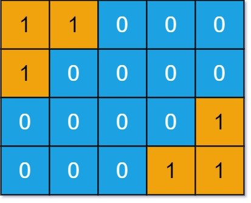
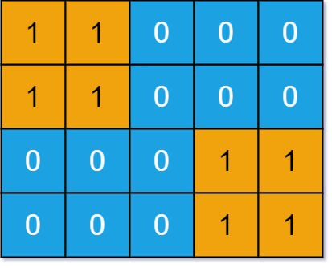

# 711. Number of Distinct Islands II

You are given an **m x n binary matrix** `grid`.

An **island** is a group of `1`s (representing land) connected **4-directionally** (horizontal or vertical).

You may assume all four edges of the grid are surrounded by water.

Two islands are considered the **same** if they have the same shape, or if one can be transformed into the other through:

- **Rotation** (90°, 180°, or 270°)
- **Reflection** (left-right or up-down)

Return the **number of distinct islands**.

---

# Examples

## Example 1



**Input**

```
grid = [
  [1,1,0,0,0],
  [1,0,0,0,0],
  [0,0,0,0,1],
  [0,0,0,1,1]
]
```

**Output**

```
1
```

**Explanation**

The two islands are considered the same because if we rotate the first island by **180 degrees clockwise**, the two islands will have identical shapes.

---

## Example 2



**Input**

```
grid = [
  [1,1,0,0,0],
  [1,1,0,0,0],
  [0,0,0,1,1],
  [0,0,0,1,1]
]
```

**Output**

```
1
```

---

# Constraints

```
m == grid.length
n == grid[i].length
1 <= m, n <= 50
grid[i][j] is either 0 or 1
```
