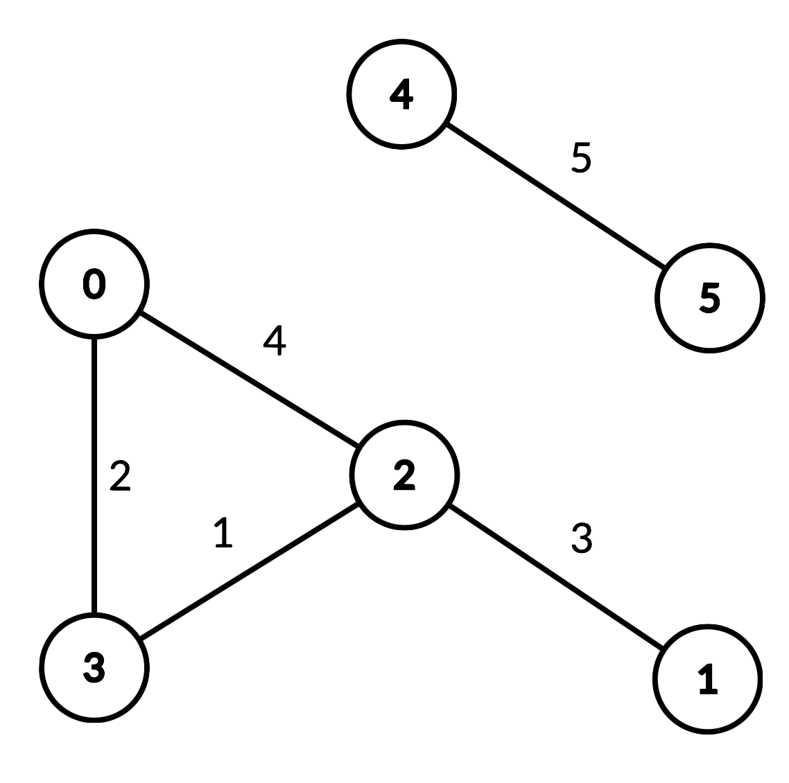

# 1724. Checking Existence of Edge Length Limited Paths II

An undirected graph of **n nodes** is defined by **edgeList**, where:

```
edgeList[i] = [ui, vi, disi]
```

- `ui` and `vi` represent an undirected edge between nodes `ui` and `vi`
- `disi` represents the **distance (edge weight)**

Notes:

- There may be **multiple edges** between the same nodes.
- The graph **may not be connected**.

---

# Class to Implement

Implement the class:

```
DistanceLimitedPathsExist
```

### Constructor

```
DistanceLimitedPathsExist(int n, int[][] edgeList)
```

Initializes the structure with the given graph.

---

### Query Function

```
boolean query(int p, int q, int limit)
```

Returns:

```
true
```

if there exists a path from **p → q** such that:

```
every edge weight < limit
```

Otherwise return:

```
false
```

---

# Example



## Input

```
["DistanceLimitedPathsExist", "query", "query", "query", "query"]

[[6,
 [[0,2,4],[0,3,2],[1,2,3],[2,3,1],[4,5,5]]],
 [2,3,2],
 [1,3,3],
 [2,0,3],
 [0,5,6]]
```

## Output

```
[null, true, false, true, false]
```

---

# Explanation

```
DistanceLimitedPathsExist obj =
    new DistanceLimitedPathsExist(
        6,
        [[0,2,4],[0,3,2],[1,2,3],[2,3,1],[4,5,5]]
    );
```

### Query 1

```
query(2,3,2)
```

Edge `2 → 3` has distance `1 < 2`

Result:

```
true
```

---

### Query 2

```
query(1,3,3)
```

No path from `1 → 3` with edges `< 3`

Result:

```
false
```

---

### Query 3

```
query(2,0,3)
```

Valid path:

```
2 → 3 → 0
```

Edge weights:

```
1, 2
```

Both `< 3`

Result:

```
true
```

---

### Query 4

```
query(0,5,6)
```

Node `5` is in another component.

No valid path.

Result:

```
false
```

---

# Constraints

```
2 <= n <= 10^4
0 <= edgeList.length <= 10^4
edgeList[i].length == 3

0 <= ui, vi, p, q <= n-1
ui != vi
p != q

1 <= disi, limit <= 10^9

At most 10^4 queries will be made.
```
