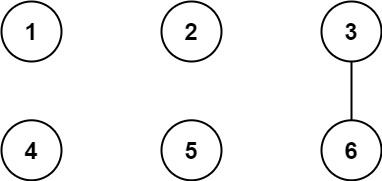
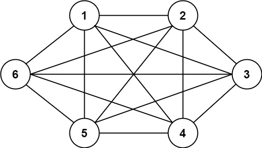
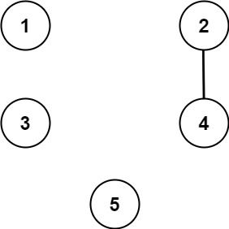

# 1627. Graph Connectivity With Threshold

## Problem

We have **n cities labeled from 1 to n**.

Two different cities with labels **x** and **y** are directly connected by a **bidirectional road** if and only if:

There exists an integer **z** such that:

- `x % z == 0`
- `y % z == 0`
- `z > threshold`

In other words, the two cities share a **common divisor strictly greater than the threshold**.

---

## Task

Given:

- An integer **n**
- An integer **threshold**
- An array **queries** where `queries[i] = [ai, bi]`

Determine for each query whether cities **ai** and **bi** are:

- **Directly connected**, or
- **Indirectly connected** through other cities (i.e., there exists some path between them).

Return an array **answer** such that:

```
answer[i] = true  → if a path exists between ai and bi
answer[i] = false → otherwise
```

---

## Example 1



### Input

```
n = 6
threshold = 2
queries = [[1,4],[2,5],[3,6]]
```

### Output

```
[false, false, true]
```

### Explanation

Divisors of each number:

```
1 → 1
2 → 1, 2
3 → 1, 3
4 → 1, 2, 4
5 → 1, 5
6 → 1, 2, 3, 6
```

Considering only divisors **greater than threshold (2)**:

- 3 and 6 share divisor **3**
- Therefore **3 ↔ 6 are connected**

Query results:

```
[1,4] → false
[2,5] → false
[3,6] → true
```

---

## Example 2



### Input

```
n = 6
threshold = 0
queries = [[4,5],[3,4],[3,2],[2,6],[1,3]]
```

### Output

```
[true,true,true,true,true]
```

### Explanation

Since **threshold = 0**, divisor **1** is allowed.

All numbers share divisor **1**, therefore **all cities are connected**.

---

## Example 3



### Input

```
n = 5
threshold = 1
queries = [[4,5],[4,5],[3,2],[2,3],[3,4]]
```

### Output

```
[false,false,false,false,false]
```

### Explanation

The only valid divisor greater than 1 connecting cities is:

```
2 ↔ 4 (divisor = 2)
```

No other pairs are connected.

Thus all queries return **false**.

---

## Constraints

```
2 ≤ n ≤ 10^4
0 ≤ threshold ≤ n
1 ≤ queries.length ≤ 10^5
queries[i].length = 2
1 ≤ ai, bi ≤ n
ai ≠ bi
```

---

## Notes

- Roads are **bidirectional**.
- Connectivity may be **direct or indirect**.
- Queries may contain **duplicate pairs**.
- `[x, y]` is equivalent to `[y, x]`.
