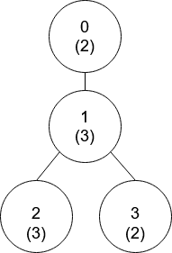
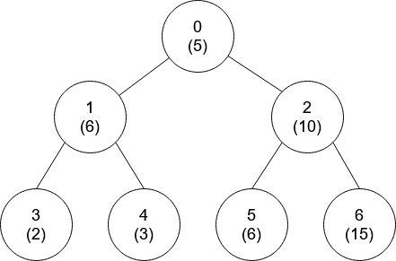

# 1766. Tree of Coprimes

## Problem

There is a **tree** (a connected, undirected graph with no cycles) consisting of `n` nodes numbered from `0` to `n - 1` and exactly `n - 1` edges. The root of the tree is **node 0**.

You are given:

- An integer array **nums**
- A 2D array **edges**

Where:

- `nums[i]` represents the value of node `i`
- `edges[j] = [u_j, v_j]` represents an undirected edge between nodes `u_j` and `v_j`

---

## Coprime Definition

Two values `x` and `y` are **coprime** if:

```
gcd(x, y) == 1
```

where `gcd` is the **greatest common divisor**.

---

## Ancestor Definition

An **ancestor** of node `i` is any node on the path from node `i` to the root (`0`).

A node is **not** considered an ancestor of itself.

---

## Task

Return an array **ans** of size `n` where:

```
ans[i] = closest ancestor of node i
         whose value is coprime with nums[i]
```

If no such ancestor exists:

```
ans[i] = -1
```

---

# Example 1



## Input

```
nums = [2,3,3,2]
edges = [[0,1],[1,2],[1,3]]
```

## Output

```
[-1,0,0,1]
```

## Explanation

Each node's value is shown in parentheses in the tree.

- **Node 0**
  - Has no ancestors → `-1`

- **Node 1**
  - Ancestor: node `0`
  - `gcd(2,3) = 1`
  - Coprime → answer `0`

- **Node 2**
  - Ancestors: `1`, `0`
  - `gcd(3,3) = 3` → not coprime
  - `gcd(2,3) = 1` → coprime
  - Closest valid ancestor → `0`

- **Node 3**
  - Ancestors: `1`, `0`
  - `gcd(3,2) = 1`
  - Closest valid ancestor → `1`

---

# Example 2



## Input

```
nums = [5,6,10,2,3,6,15]
edges = [[0,1],[0,2],[1,3],[1,4],[2,5],[2,6]]
```

## Output

```
[-1,0,-1,0,0,0,-1]
```

---

# Constraints

```
nums.length == n
1 <= nums[i] <= 50
1 <= n <= 10^5

edges.length == n - 1
edges[j].length == 2

0 <= u_j, v_j < n
u_j != v_j
```

---

# Observations

Important constraints:

```
nums[i] ≤ 50
```

This is extremely helpful because:

- Only **50 possible values**
- Coprime relationships can be **precomputed**

This allows efficient DFS solutions.

---

# Summary

We must find for every node:

- The **closest ancestor**
- Whose value is **coprime** with the current node value.

Key properties:

- The structure is a **tree**
- Use **DFS traversal**
- Track ancestors during traversal
- Precompute **coprime pairs** for numbers `1..50`
