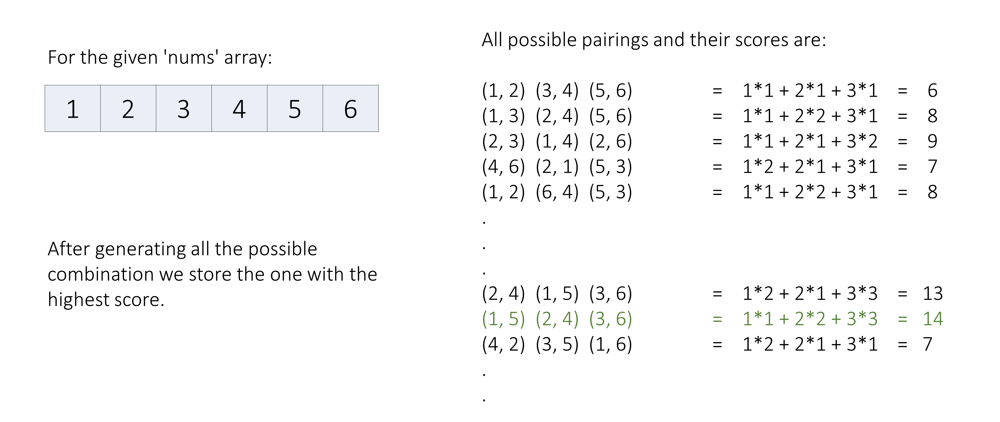
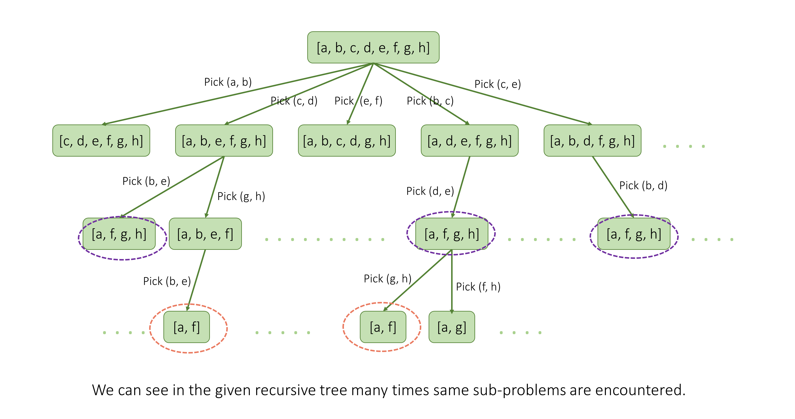

# 1799. Maximize Score After N Operations — Detailed Summary

## Overview

We are given an array `nums` of size `2 * n`.

We must perform exactly `n` operations.
In the `i-th` operation (1-indexed):

1. Choose two elements `x` and `y`
2. Gain score:

```text
i * gcd(x, y)
```

3. Remove those two elements

Our goal is to maximize the total score after all operations.

---

# Core Difficulty

The problem is not just about choosing good pairs.

It is also about **when** to choose them.

A pair with a large gcd is usually more valuable if used later, because later operations have larger multipliers.

So the problem is fundamentally:

- choose pairings
- choose ordering of pairings
- maximize total score

---

# Why Bitmask DP Fits Perfectly

The array size is at most:

```text
2 * n <= 14
```

That is small enough for subset DP.

A bitmask can represent which elements are already used:

- bit = `1` → element already chosen
- bit = `0` → element still available

Total number of masks:

```text
2^(2n) <= 2^14 = 16384
```

This is small enough to explore all states with memoization or iterative DP.

---

# Important Optimization: Precompute GCD

We may evaluate the same pair many times across DP states.

So we should precompute:

```text
gcd(nums[i], nums[j])
```

for all pairs once.

This avoids repeating gcd computations in every transition.

---

# Approach 1: DP with Bitmasking (Recursive)

## Intuition



A brute-force idea is to try all possible pairs, recursively solve the remaining subproblem, and take the maximum.

That naturally suggests backtracking.

However, the same remaining subset of numbers can appear from different pairing orders, so we memoize based on the current mask.

The mask uniquely identifies the current subproblem.

---

## State Definition

Let:

```text
mask = bitmask of already chosen elements
pairsPicked = number of pairs already formed
```

Then the next operation number is:

```text
pairsPicked + 1
```

---

## Transition

For every pair of unused indices `(firstIndex, secondIndex)`:

1. mark both as used in `newMask`
2. compute current score:

```text
(pairsPicked + 1) * gcd(nums[firstIndex], nums[secondIndex])
```

3. recursively solve remaining numbers
4. maximize total score



---

## Recursive Java Code

```java
import java.util.Arrays;

class Solution {
    public int backtrack(int[] nums, int mask, int pairsPicked, int[] memo) {
        // If all numbers are picked, no more score can be obtained.
        if (2 * pairsPicked == nums.length) {
            return 0;
        }

        // Return cached result if this state was solved before.
        if (memo[mask] != -1) {
            return memo[mask];
        }

        int maxScore = 0;

        // Try all possible pairs of unused elements.
        for (int firstIndex = 0; firstIndex < nums.length; ++firstIndex) {
            for (int secondIndex = firstIndex + 1; secondIndex < nums.length; ++secondIndex) {

                // Skip already picked elements.
                if (((mask >> firstIndex) & 1) == 1 || ((mask >> secondIndex) & 1) == 1) {
                    continue;
                }

                // Mark these two as picked.
                int newMask = mask | (1 << firstIndex) | (1 << secondIndex);

                int currScore = (pairsPicked + 1) * gcd(nums[firstIndex], nums[secondIndex]);
                int remainingScore = backtrack(nums, newMask, pairsPicked + 1, memo);

                maxScore = Math.max(maxScore, currScore + remainingScore);
            }
        }

        memo[mask] = maxScore;
        return maxScore;
    }

    public int maxScore(int[] nums) {
        int memoSize = 1 << nums.length;
        int[] memo = new int[memoSize];
        Arrays.fill(memo, -1);

        return backtrack(nums, 0, 0, memo);
    }

    public int gcd(int a, int b) {
        if (b == 0) {
            return a;
        }
        return gcd(b, a % b);
    }
}
```

---

## Complexity Analysis

Let:

```text
m = 2 * n
A = maximum value in nums
```

### Time Complexity

There are at most:

```text
2^m
```

unique masks.

For each state, we iterate over all pairs:

```text
O(m^2)
```

Each gcd calculation costs:

```text
O(log A)
```

So total time is:

```text
O(2^m * m^2 * log A)
```

Since `m = 2n`, this is often written as:

```text
O(2^(2n) * (2n)^2 * log A)
= O(4^n * n^2 * log A)
```

---

### Space Complexity

- recursion stack: `O(n)`
- memo array: `O(2^m)`

So:

```text
O(n + 2^m)
```

or equivalently:

```text
O(n + 2^(2n))
= O(4^n)
```

---

# Approach 2: DP with Bitmasking (Iterative)

## Intuition

The recursive memoized solution can also be implemented bottom-up.

Let:

```text
dp[state]
```

represent the maximum score obtainable from the configuration represented by `state`.

If a state already has some picked elements, then:

- number of picked numbers = `Integer.bitCount(state)`
- number of completed pairs = `numbersTaken / 2`

So the next operation number is:

```text
pairsFormed + 1
```

We transition from smaller states to larger states by choosing one more pair.

---

## Why reverse iteration works

When we choose a pair from `state`, the next state is:

```text
stateAfterPickingCurrPair = state | (1 << i) | (1 << j)
```

This new state always has more bits set than the current state.

So if we iterate masks in decreasing order, bigger states are already computed when needed.

---

## Iterative Java Code

```java
class Solution {
    public int maxScore(int[] nums) {
        int maxStates = 1 << nums.length;
        int finalMask = maxStates - 1;

        // dp[i] stores maximum score for state i.
        int[] dp = new int[maxStates];

        for (int state = finalMask; state >= 0; state--) {
            if (state == finalMask) {
                dp[state] = 0;
                continue;
            }

            int numbersTaken = Integer.bitCount(state);
            int pairsFormed = numbersTaken / 2;

            // Only states with even number of picked elements are valid.
            if (numbersTaken % 2 != 0) {
                continue;
            }

            for (int firstIndex = 0; firstIndex < nums.length; firstIndex++) {
                for (int secondIndex = firstIndex + 1; secondIndex < nums.length; secondIndex++) {
                    if (((state >> firstIndex) & 1) == 1 || ((state >> secondIndex) & 1) == 1) {
                        continue;
                    }

                    int currentScore = (pairsFormed + 1) * gcd(nums[firstIndex], nums[secondIndex]);
                    int stateAfterPickingCurrPair = state | (1 << firstIndex) | (1 << secondIndex);
                    int remainingScore = dp[stateAfterPickingCurrPair];

                    dp[state] = Math.max(dp[state], currentScore + remainingScore);
                }
            }
        }

        return dp[0];
    }

    private int gcd(int a, int b) {
        if (b == 0) {
            return a;
        }
        return gcd(b, a % b);
    }
}
```

---

## Complexity Analysis

Let:

```text
m = 2 * n
```

### Time Complexity

We iterate over all:

```text
2^m
```

states.

For each state:

- `Integer.bitCount(state)` takes `O(m)` in worst case
- nested loops over pairs take `O(m^2)`
- gcd takes `O(log A)`

Thus total:

```text
O(2^m * m^2 * log A)
```

or:

```text
O(2^(2n) * (2n)^2 * log A)
= O(4^n * n^2 * log A)
```

---

### Space Complexity

Only the DP array is stored:

```text
O(2^m)
= O(2^(2n))
= O(4^n)
```

---

# Practical Improvement: Precompute GCDs

Both approaches above compute gcd repeatedly inside DP transitions.

That can be improved by precomputing all pairwise gcd values once.

Then each transition becomes `O(1)` instead of `O(log A)` for gcd work.

---

# Improved Recursive Version with GCD Precompute

```java
import java.util.Arrays;

class Solution {
    int[][] gcd;
    int[] memo;

    public int maxScore(int[] nums) {
        int m = nums.length;
        gcd = new int[m][m];
        memo = new int[1 << m];
        Arrays.fill(memo, -1);

        for (int i = 0; i < m; i++) {
            for (int j = i + 1; j < m; j++) {
                gcd[i][j] = getGcd(nums[i], nums[j]);
                gcd[j][i] = gcd[i][j];
            }
        }

        return dfs(0, m);
    }

    private int dfs(int mask, int m) {
        if (mask == (1 << m) - 1) return 0;
        if (memo[mask] != -1) return memo[mask];

        int op = Integer.bitCount(mask) / 2 + 1;
        int best = 0;

        for (int i = 0; i < m; i++) {
            if ((mask & (1 << i)) != 0) continue;

            for (int j = i + 1; j < m; j++) {
                if ((mask & (1 << j)) != 0) continue;

                int nextMask = mask | (1 << i) | (1 << j);
                int cur = op * gcd[i][j] + dfs(nextMask, m);
                best = Math.max(best, cur);
            }
        }

        return memo[mask] = best;
    }

    private int getGcd(int a, int b) {
        while (b != 0) {
            int t = a % b;
            a = b;
            b = t;
        }
        return a;
    }
}
```

---

# Example Walkthrough

## Example 2

```text
nums = [3,4,6,8]
```

Pairwise gcd values:

```text
gcd(3,4) = 1
gcd(3,6) = 3
gcd(3,8) = 1
gcd(4,6) = 2
gcd(4,8) = 4
gcd(6,8) = 2
```

Possible good pairing:

- operation 1: pair `(3,6)` → score = `1 * 3 = 3`
- operation 2: pair `(4,8)` → score = `2 * 4 = 8`

Total:

```text
3 + 8 = 11
```

If we reverse those:

- operation 1: `(4,8)` → `1 * 4 = 4`
- operation 2: `(3,6)` → `2 * 3 = 6`

Total:

```text
10
```

So order clearly matters.

That is why greedy approaches are dangerous.

---

# Why Greedy Does Not Work Reliably

A tempting idea is:

> always choose the pair with maximum gcd first

This fails because larger gcd values are usually worth more if saved for later operations with larger multipliers.

The DP explores all orderings and automatically finds the best arrangement.

---

# Common Pitfalls

## 1. Forgetting that operation number depends on used bits

If `mask` has `k` used elements, then:

```text
pairsPicked = k / 2
next operation = k / 2 + 1
```

This must be computed correctly.

---

## 2. Using states with odd number of set bits

Those are invalid because each operation picks exactly 2 elements.

---

## 3. Recomputing the same subproblem many times

Without memoization, brute force becomes far too slow.

---

## 4. Recomputing gcd repeatedly

Precompute pairwise gcds once for better efficiency.

---

# Best Approach

## Recommended

Use **bitmask DP with memoization**.

It is the cleanest and most natural approach for these constraints.

### Why it is best

- subset size is tiny (`<= 14`)
- state naturally fits a bitmask
- memoization avoids repeated work
- order of operations is handled automatically
- simple to implement once the state is clear

---

# Final Recommended Java Solution

```java
import java.util.Arrays;

class Solution {
    int[][] gcd;
    int[] memo;

    public int maxScore(int[] nums) {
        int m = nums.length;
        gcd = new int[m][m];
        memo = new int[1 << m];
        Arrays.fill(memo, -1);

        for (int i = 0; i < m; i++) {
            for (int j = i + 1; j < m; j++) {
                gcd[i][j] = getGcd(nums[i], nums[j]);
                gcd[j][i] = gcd[i][j];
            }
        }

        return dfs(0, m);
    }

    private int dfs(int mask, int m) {
        if (mask == (1 << m) - 1) {
            return 0;
        }

        if (memo[mask] != -1) {
            return memo[mask];
        }

        int op = Integer.bitCount(mask) / 2 + 1;
        int best = 0;

        for (int i = 0; i < m; i++) {
            if ((mask & (1 << i)) != 0) continue;

            for (int j = i + 1; j < m; j++) {
                if ((mask & (1 << j)) != 0) continue;

                int nextMask = mask | (1 << i) | (1 << j);
                int current = op * gcd[i][j] + dfs(nextMask, m);
                best = Math.max(best, current);
            }
        }

        return memo[mask] = best;
    }

    private int getGcd(int a, int b) {
        while (b != 0) {
            int t = a % b;
            a = b;
            b = t;
        }
        return a;
    }
}
```

---

# Final Complexity Summary

Let:

```text
m = nums.length <= 14
```

Then:

- number of DP states = `2^m`
- transitions per state = `O(m^2)`

So the final complexity is:

```text
Time:  O(2^m * m^2)
Space: O(2^m + m^2)
```

Since `m <= 14`, this is easily fast enough.

---

# Final Takeaway

This is a classic **subset DP / bitmask DP** problem.

The essential structure is:

1. represent used elements with a mask
2. choose two unused elements
3. compute score using current operation number
4. recurse or transition to the next mask
5. take maximum

Among all possible approaches, **memoized bitmask DP** is the standard optimal one.
