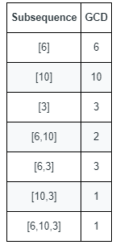

# 1819. Number of Different Subsequences GCDs

You are given an array `nums` that consists of positive integers.

The **GCD (Greatest Common Divisor)** of a sequence of numbers is defined as the greatest integer that divides all the numbers in the sequence evenly.

For example:

```
GCD([4,6,16]) = 2
```

A **subsequence** of an array is a sequence that can be formed by removing some elements (possibly none) of the array without changing the order of the remaining elements.

For example:

```
[2,5,10] is a subsequence of [1,2,1,2,4,1,5,10]
```

Your task is to return the **number of different GCD values** that appear among **all non‑empty subsequences** of `nums`.

---

## Example 1



**Input**

```
nums = [6,10,3]
```

**Output**

```
5
```

**Explanation**

All non-empty subsequences and their GCD values produce the following distinct GCDs:

```
6, 10, 3, 2, 1
```

So the answer is **5**.

---

## Example 2

**Input**

```
nums = [5,15,40,5,6]
```

**Output**

```
7
```

---

## Constraints

```
1 <= nums.length <= 10^5
1 <= nums[i] <= 2 * 10^5
```
