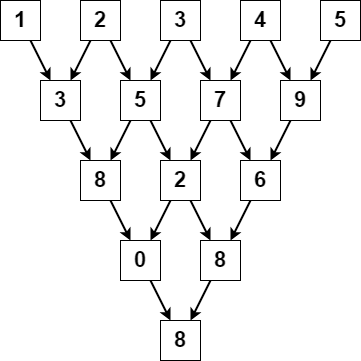

# 2221. Find Triangular Sum of an Array

You are given a **0-indexed integer array `nums`**, where:

```
nums[i] is a digit between 0 and 9 (inclusive)
```

The **triangular sum** of `nums` is defined as the value of the **single element remaining** after repeatedly applying the following process.

---

# Process Definition

Let `nums` contain `n` elements.

1. If:

```
n == 1
```

Stop the process.

2. Otherwise, create a new array:

```
newNums
```

with length:

```
n - 1
```

3. For every index `i`:

```
0 <= i < n - 1
```

compute:

```
newNums[i] = (nums[i] + nums[i + 1]) % 10
```

4. Replace:

```
nums = newNums
```

5. Repeat the process until only one element remains.

The final remaining element is the **triangular sum**.

---

# Example 1



## Input

```
nums = [1,2,3,4,5]
```

## Output

```
8
```

## Explanation

Process steps:

```
[1,2,3,4,5]
 → [3,5,7,9]
 → [8,2,6]
 → [0,8]
 → [8]
```

Final value:

```
8
```

---

# Example 2

## Input

```
nums = [5]
```

## Output

```
5
```

## Explanation

Since there is only one element in the array, the triangular sum is simply:

```
5
```

---

# Constraints

```
1 <= nums.length <= 1000
0 <= nums[i] <= 9
```
