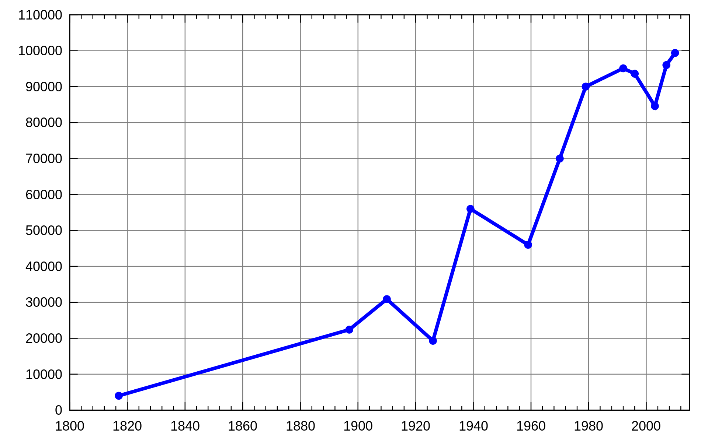
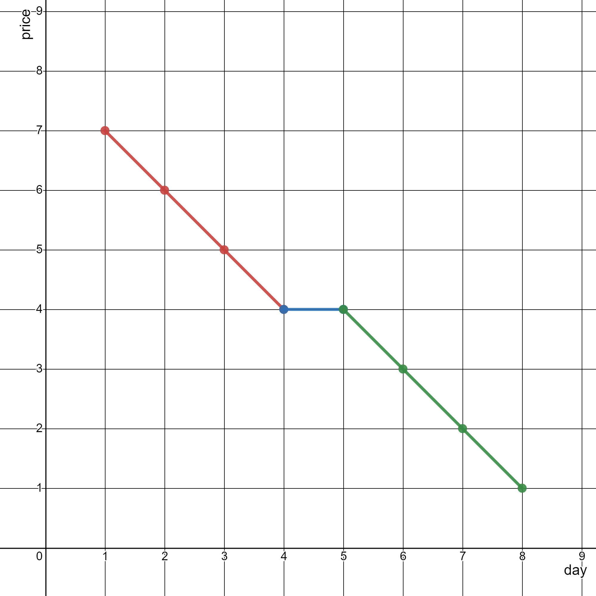
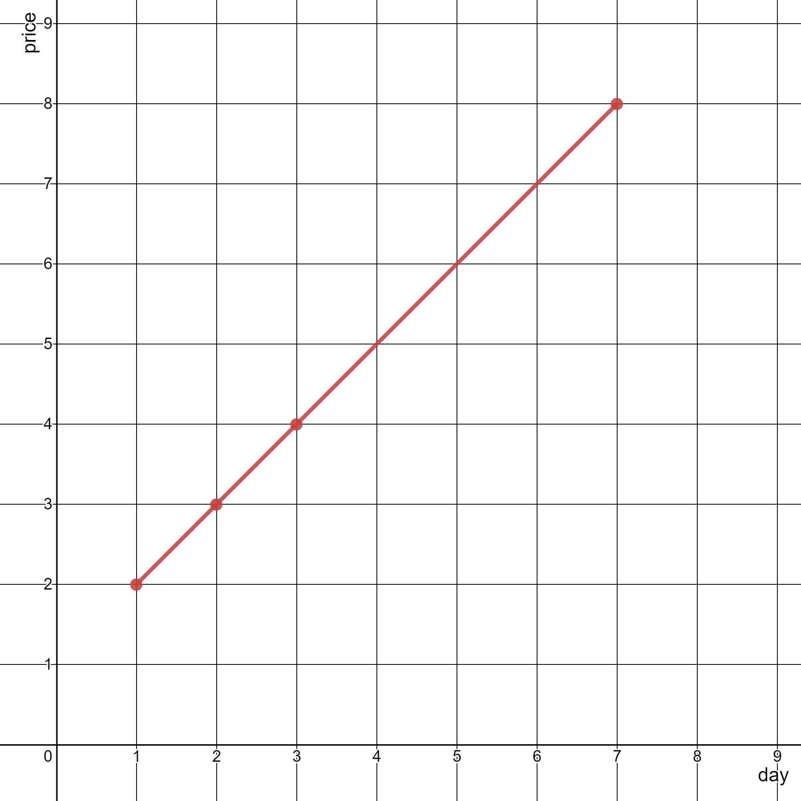

# 2280. Minimum Lines to Represent a Line Chart

You are given a **2D integer array `stockPrices`** where:

```
stockPrices[i] = [day_i, price_i]
```



This means the **price of the stock on day `day_i` is `price_i`**.

A **line chart** is created by:

1. Plotting the points `(day_i, price_i)` on a 2D plane.
2. Connecting **adjacent points** in order of day with straight line segments.

Your task is to determine the **minimum number of straight lines needed** to represent the entire chart.

---

# Key Idea

If **three consecutive points lie on the same straight line**, they can be represented using a **single line segment**.

Two segments are part of the **same line** if their slopes are equal.

Thus the problem reduces to:

1. **Sort the points by day**
2. Compare **slopes of consecutive segments**
3. Count how many times the slope changes

Each slope change requires a **new line segment**.

---

# Example 1



## Input

```
stockPrices = [[1,7],[2,6],[3,5],[4,4],[5,4],[6,3],[7,2],[8,1]]
```

## Output

```
3
```

## Explanation

The points form three straight segments:

```
Line 1: (1,7) → (4,4)
Line 2: (4,4) → (5,4)
Line 3: (5,4) → (8,1)
```

Therefore the minimum number of lines required is:

```
3
```

---

# Example 2



## Input

```
stockPrices = [[3,4],[1,2],[7,8],[2,3]]
```

## Output

```
1
```

## Explanation

After sorting by day:

```
(1,2), (2,3), (3,4), (7,8)
```

All points lie on the **same straight line**, so only **one line segment** is needed.

---

# Constraints

```
1 <= stockPrices.length <= 10^5
stockPrices[i].length == 2
1 <= day_i, price_i <= 10^9
All day_i are distinct
```

---

# Problem Goal

Determine the **minimum number of straight line segments** required to represent the chart created by connecting points in **increasing order of day**.
