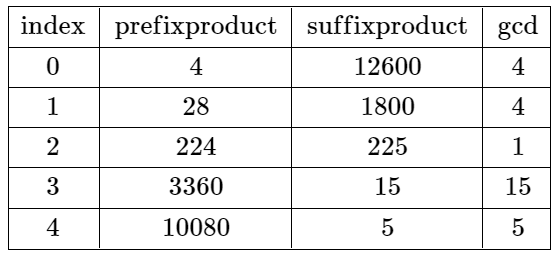
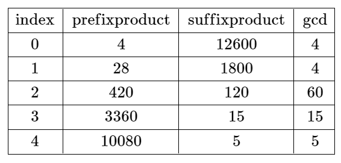

# 2584. Split the Array to Make Coprime Products

You are given a **0-indexed integer array** `nums` of length `n`.

A **split** at an index `i` where:

```
0 ≤ i ≤ n - 2
```

is called **valid** if:

- The **product of the first `i + 1` elements**
- The **product of the remaining elements**

are **coprime**.

Two values `val1` and `val2` are **coprime** if:

```
gcd(val1, val2) == 1
```

where `gcd` denotes the **greatest common divisor**.

---

# Problem Goal

Return the **smallest index `i`** where the array can be split validly.

If **no such split exists**, return:

```
-1
```

---

# Example 1



## Input

```
nums = [4,7,8,15,3,5]
```

## Output

```
2
```

## Explanation

We examine splits:

| i   | Left Product | Right Product | gcd |
| --- | ------------ | ------------- | --- |
| 0   | 4            | 7×8×15×3×5    | 1   |
| 1   | 4×7          | 8×15×3×5      | 1   |
| 2   | 4×7×8        | 15×3×5        | 1   |

The **smallest valid split index is 2**.

---

# Example 2



## Input

```
nums = [4,7,15,8,3,5]
```

## Output

```
-1
```

## Explanation

For every possible split:

| i   | Left Product | Right Product | gcd |
| --- | ------------ | ------------- | --- |
| 0   | 4            | 7×15×8×3×5    | >1  |
| 1   | 4×7          | 15×8×3×5      | >1  |
| 2   | 4×7×15       | 8×3×5         | >1  |
| 3   | 4×7×15×8     | 3×5           | >1  |
| 4   | 4×7×15×8×3   | 5             | >1  |

No valid split exists.

---

# Constraints

```
n == nums.length
1 ≤ n ≤ 10^4
1 ≤ nums[i] ≤ 10^6
```
