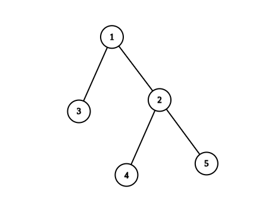

# 2867. Count Valid Paths in a Tree

There is an **undirected tree** with `n` nodes labeled from `1` to `n`.

You are given:

- an integer `n`
- a 2D integer array `edges` of length `n - 1`

where:

```
edges[i] = [u_i, v_i]
```

indicates that there is an **edge between nodes `u_i` and `v_i`**.

The graph is guaranteed to form a **valid tree**.

---

# Goal

Return the **number of valid paths** in the tree.

A path `(a, b)` is **valid** if there exists **exactly one prime number** among the node labels along the path from `a` to `b`.

---

# Path Definition

A path `(a, b)` is defined as:

- a sequence of **distinct nodes**
- starting with node `a`
- ending with node `b`
- where every adjacent pair of nodes shares an edge.

Additionally:

```
(a, b) and (b, a) represent the same path
```

and are counted **only once**.

---

# Example 1



## Input

```
n = 5
edges = [[1,2],[1,3],[2,4],[2,5]]
```

## Output

```
4
```

## Explanation

The pairs with **exactly one prime number** on the path are:

- `(1, 2)` → path contains prime `2`
- `(1, 3)` → path contains prime `3`
- `(1, 4)` → path contains prime `2`
- `(2, 4)` → path contains prime `2`

Thus, the total number of valid paths is:

```
4
```

---

# Example 2


## Input

```
n = 6
edges = [[1,2],[1,3],[2,4],[3,5],[3,6]]
```

## Output

```
6
```

## Explanation

The pairs with **exactly one prime number** on the path are:

- `(1, 2)` → path contains prime `2`
- `(1, 3)` → path contains prime `3`
- `(1, 4)` → path contains prime `2`
- `(1, 6)` → path contains prime `3`
- `(2, 4)` → path contains prime `2`
- `(3, 6)` → path contains prime `3`

Total valid paths:

```
6
```

---

# Constraints

```
1 ≤ n ≤ 10^5
edges.length == n - 1
edges[i].length == 2
1 ≤ u_i, v_i ≤ n
```

The input is guaranteed to represent a **valid tree**.
