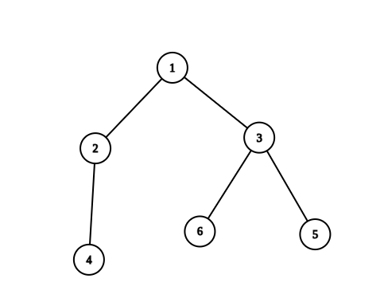

# 2949. Count Beautiful Substrings II

You are given a string `s` and a positive integer `k`.

Let:

- `vowels` = number of vowel characters in a substring
- `consonants` = number of consonant characters in a substring

A substring is considered **beautiful** if:

1. `vowels == consonants`
2. `(vowels * consonants) % k == 0`

Return the **number of non-empty beautiful substrings** in the given string `s`.

A **substring** is a contiguous sequence of characters in a string.

---

# Definitions

**Vowels** in English:

```
a, e, i, o, u
```

**Consonants**:

```
all English lowercase letters except vowels
```

---

# Example 1


## Input

```
s = "baeyh"
k = 2
```

## Output

```
2
```

## Explanation

There are **2 beautiful substrings**.

### Substring 1

```
"aeyh"
```

- vowels = 2 → `a, e`
- consonants = 2 → `y, h`

```
vowels == consonants
2 * 2 % 2 == 0
```

Valid.

### Substring 2

```
"baey"
```

- vowels = 2 → `a, e`
- consonants = 2 → `b, y`

```
vowels == consonants
2 * 2 % 2 == 0
```

Valid.

---

# Example 2



## Input

```
s = "abba"
k = 1
```

## Output

```
3
```

## Explanation

The beautiful substrings are:

### Substring 1

```
"ab"
```

- vowels = 1
- consonants = 1

### Substring 2

```
"ba"
```

- vowels = 1
- consonants = 1

### Substring 3

```
"abba"
```

- vowels = 2
- consonants = 2

All satisfy:

```
vowels == consonants
(vowels * consonants) % 1 == 0
```

---

# Example 3

## Input

```
s = "bcdf"
k = 1
```

## Output

```
0
```

## Explanation

The string contains **no vowels**, therefore no substring can satisfy:

```
vowels == consonants
```

---

# Constraints

```
1 <= s.length <= 5 * 10^4
1 <= k <= 1000
s consists only of lowercase English letters
```
