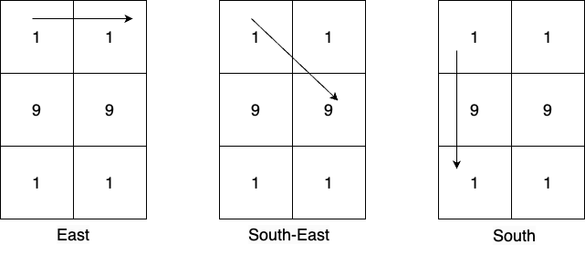

# 3044. Most Frequent Prime

You are given a **m x n 0-indexed 2D matrix `mat`**. From every cell, you can create numbers in the following way:

There could be at most **8 possible directions** from any cell:

- East
- South-East
- South
- South-West
- West
- North-West
- North
- North-East

From a starting cell, you pick one direction and keep moving in that direction while **appending digits** to build a number.

At every step along the path, a number is generated.

Example:

If digits along the path are:

```
1 → 9 → 1
```

Then the generated numbers are:

```
1
19
191
```

---

## Goal

Return the **most frequent prime number greater than 10** among all generated numbers.

If multiple primes have the **same highest frequency**, return the **largest** of them.

If **no such prime exists**, return:

```
-1
```

---

# Example 1



## Input

```
mat = [[1,1],[9,9],[1,1]]
```

## Output

```
19
```

## Explanation

From cell `(0,0)` possible numbers greater than 10:

```
East: [11]
South-East: [19]
South: [19,191]
```

From cell `(0,1)`:

```
[19,191,19,11]
```

From cell `(1,0)`:

```
[99,91,91,91,91]
```

From cell `(1,1)`:

```
[91,91,99,91,91]
```

From cell `(2,0)`:

```
[11,19,191,19]
```

From cell `(2,1)`:

```
[11,19,19,191]
```

The most frequent **prime number greater than 10** is:

```
19
```

---

# Example 2

## Input

```
mat = [[7]]
```

## Output

```
-1
```

## Explanation

Only number generated:

```
7
```

Although `7` is prime, it is **not greater than 10**, so the result is:

```
-1
```

---

# Example 3

## Input

```
mat = [[9,7,8],[4,6,5],[2,8,6]]
```

## Output

```
97
```

## Explanation

Numbers generated from `(0,0)`:

```
[97,978,96,966,94,942]
```

From `(0,1)`:

```
[78,75,76,768,74,79]
```

From `(0,2)`:

```
[85,856,86,862,87,879]
```

From `(1,0)`:

```
[46,465,48,42,49,47]
```

From `(1,1)`:

```
[65,66,68,62,64,69,67,68]
```

From `(1,2)`:

```
[56,58,56,564,57,58]
```

From `(2,0)`:

```
[28,286,24,249,26,268]
```

From `(2,1)`:

```
[86,82,84,86,867,85]
```

From `(2,2)`:

```
[68,682,66,669,65,658]
```

The most frequent prime number among all generated numbers is:

```
97
```

---

# Constraints

```
m == mat.length
n == mat[i].length
1 <= m, n <= 6
1 <= mat[i][j] <= 9
```

---
