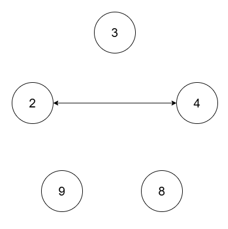
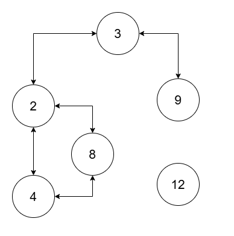

# 3378. Count Connected Components in LCM Graph

You are given an array of integers `nums` of size `n` and a positive integer `threshold`.

There is a graph consisting of `n` nodes where the **i-th node has value `nums[i]`**.

Two nodes `i` and `j` are connected with an **undirected edge** if:

```
lcm(nums[i], nums[j]) <= threshold
```

Return the **number of connected components** in this graph.

---

# Definitions

### Connected Component

A **connected component** is a subgraph where:

- every pair of vertices is connected through some path
- no vertex in the subgraph connects to a vertex outside the subgraph

### Least Common Multiple

The **least common multiple** of two numbers `a` and `b` is:

```
lcm(a, b) = (a * b) / gcd(a, b)
```

Where:

```
gcd(a, b)
```

is the **greatest common divisor**.

---

# Example 1



## Input

```
nums = [2,4,8,3,9]
threshold = 5
```

## Output

```
4
```

## Explanation

Edges exist only when:

```
lcm(nums[i], nums[j]) <= 5
```

Valid connection:

```
lcm(2,4) = 4
```

So nodes `(2,4)` are connected.

Other values exceed the threshold when paired.

Connected components:

```
(2,4), (3), (8), (9)
```

Total:

```
4
```

---

# Example 2



## Input

```
nums = [2,4,8,3,9,12]
threshold = 10
```

## Output

```
2
```

## Explanation

Nodes connect when their LCM is ≤ 10.

Connections chain together forming:

```
(2,3,4,8,9)
```

while:

```
(12)
```

remains isolated.

Total components:

```
2
```

---

# Constraints

```
1 <= nums.length <= 10^5
1 <= nums[i] <= 10^9
All nums[i] are unique
1 <= threshold <= 2 * 10^5
```

---

# Problem Goal

Construct a graph where nodes are indices of `nums` and edges exist if:

```
lcm(nums[i], nums[j]) <= threshold
```

Then determine the **number of connected components** in this graph.
