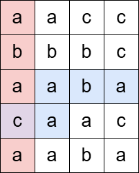
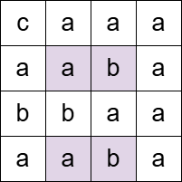

# 3529. Count Cells in Overlapping Horizontal and Vertical Substrings

You are given an **m × n matrix `grid`** consisting of characters and a string **`pattern`**.

A **horizontal substring** is a contiguous sequence of characters read **from left to right**.
If the end of a row is reached before the substring is complete, it **wraps to the first column of the next row** and continues as needed.
You **do not wrap from the bottom row back to the top**.

A **vertical substring** is a contiguous sequence of characters read **from top to bottom**.
If the bottom of a column is reached before the substring is complete, it **wraps to the first row of the next column** and continues as needed.
You **do not wrap from the last column back to the first**.

---

# Goal

Count the number of cells in the matrix that satisfy the following condition:

- The cell must be part of **at least one horizontal substring**
- The cell must also be part of **at least one vertical substring**
- Both substrings must be **equal to the given pattern**

Return the count of such cells.

---

# Example 1

Input:

grid =
[
["a","a","c","c"],
["b","b","b","c"],
["a","a","b","a"],
["c","a","a","c"],
["a","a","b","a"]
]

pattern = "abaca"

Output:

1

Explanation:

The pattern `"abaca"` appears once as a **horizontal substring** and once as a **vertical substring**.
They intersect at exactly **one cell**.

---

# Example 2

Input:

grid =
[
["c","a","a","a"],
["a","a","b","a"],
["b","b","a","a"],
["a","a","b","a"]
]

pattern = "aba"

Output:

4

Explanation:

The highlighted cells belong to **both** a horizontal and a vertical substring matching `"aba"`.

---

# Example 3

Input:

grid = [["a"]]

pattern = "a"

Output:

1

---

# Constraints

- `m == grid.length`
- `n == grid[i].length`
- `1 ≤ m, n ≤ 1000`
- `1 ≤ m * n ≤ 10^5`
- `1 ≤ pattern.length ≤ m * n`
- `grid` and `pattern` consist of lowercase English letters
