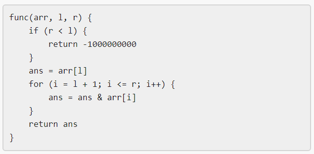

# 1521. Find a Value of a Mysterious Function Closest to Target



## Problem Description

Winston was given a mysterious function `func`.
He also has:

- an integer array `arr`
- an integer `target`

He wants to find indices **l** and **r** such that:

```
|func(arr, l, r) - target|
```

is **minimum possible**.

Return the **minimum possible value** of this expression.

The function `func` must be called with:

```
0 <= l, r < arr.length
```

---

## Example 1

### Input

```
arr = [9,12,3,7,15]
target = 5
```

### Output

```
2
```

### Explanation

Calling `func` with all pairs `[l, r]`:

```
[0,0] [1,1] [2,2] [3,3] [4,4]
[0,1] [1,2] [2,3] [3,4]
[0,2] [1,3] [2,4]
[0,3] [1,4]
[0,4]
```

Results obtained:

```
[9,12,3,7,15,8,0,3,7,0,0,3,0,0,0]
```

The values closest to `target = 5` are:

```
7 and 3
```

Minimum difference:

```
|7 - 5| = 2
|3 - 5| = 2
```

So the answer is:

```
2
```

---

## Example 2

### Input

```
arr = [1000000,1000000,1000000]
target = 1
```

### Output

```
999999
```

### Explanation

The function always returns:

```
1000000
```

Difference from target:

```
|1000000 - 1| = 999999
```

---

## Example 3

### Input

```
arr = [1,2,4,8,16]
target = 0
```

### Output

```
0
```

---

## Constraints

```
1 <= arr.length <= 10^5
1 <= arr[i] <= 10^6
0 <= target <= 10^7
```
