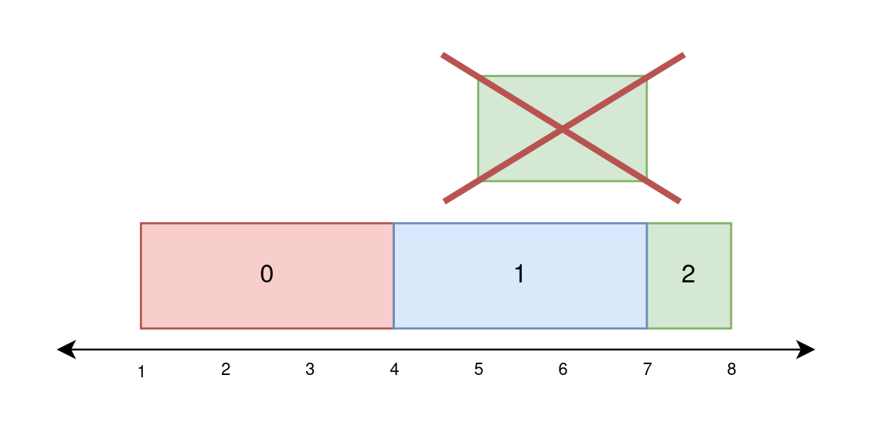
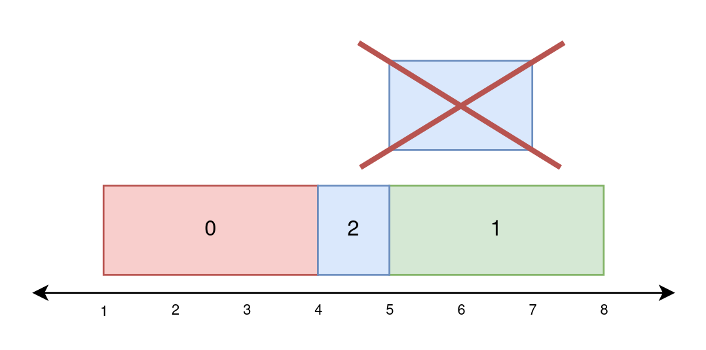
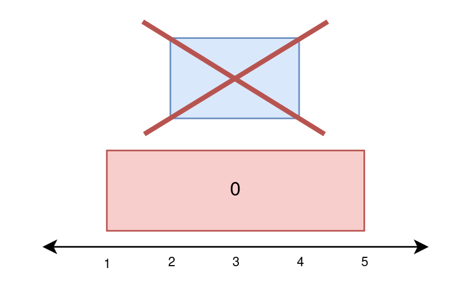

# 2158. Amount of New Area Painted Each Day

## Problem Description

There is a long painting that can be represented as a **number line**.

You are given a **0-indexed 2D array**:

```
paint[i] = [start_i, end_i]
```

This means that on **day i** you must paint the area between:

```
[start_i, end_i)
```

However, painting the same area more than once creates an **uneven painting**, so each unit of area should be painted **at most once**.

Your task is to compute how much **new area** is painted each day.

---

# Objective

Return an integer array:

```
worklog
```

Where:

```
worklog[i] = amount of new area painted on day i
```

---

# Example 1



## Input

```
paint = [[1,4],[4,7],[5,8]]
```

## Output

```
[3,3,1]
```

## Explanation

### Day 0

Paint interval:

```
[1,4)
```

New area:

```
4 - 1 = 3
```

### Day 1

Paint interval:

```
[4,7)
```

New area:

```
7 - 4 = 3
```

### Day 2

Paint interval:

```
[5,8)
```

But:

```
[5,7) was already painted on day 1
```

New area:

```
[7,8) → 1
```

Final result:

```
[3,3,1]
```

---

# Example 2



## Input

```
paint = [[1,4],[5,8],[4,7]]
```

## Output

```
[3,3,1]
```

## Explanation

### Day 0

Paint:

```
[1,4)
```

New area:

```
3
```

### Day 1

Paint:

```
[5,8)
```

New area:

```
3
```

### Day 2

Paint:

```
[4,7)
```

But:

```
[5,7) already painted
```

New area:

```
[4,5) → 1
```

---

# Example 3



## Input

```
paint = [[1,5],[2,4]]
```

## Output

```
[4,0]
```

## Explanation

### Day 0

Paint:

```
[1,5)
```

New area:

```
4
```

### Day 1

Paint:

```
[2,4)
```

But everything was already painted.

New area:

```
0
```

---

# Constraints

```
1 <= paint.length <= 10^5
paint[i].length == 2
0 <= start_i < end_i <= 5 * 10^4
```
