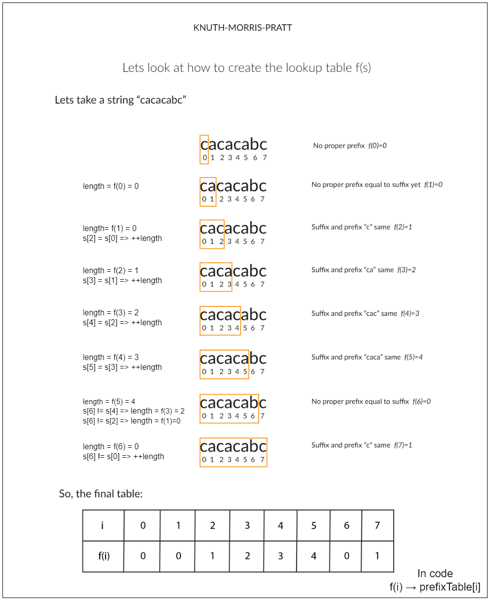

# 214. Shortest Palindrome

## Overview

We are given a string `s`. Our task is to build the **smallest palindrome** by adding characters to the **beginning** of `s`.

The core idea is to find the **longest palindromic prefix** of the string.
Once this prefix is known, we reverse the remaining suffix and prepend it to the string.

### Example

For:

```
s = "aacecaaa"
```

The longest palindromic prefix is:

```
"aacecaa"
```

Remaining suffix:

```
"a"
```

Reverse it and prepend:

```
"aaacecaaa"
```

---

# Approach 1: Brute Force

## Intuition

A palindrome reads the same forward and backward.

We check prefixes of `s` and compare them with suffixes of `reverse(s)`.

If:

```
s[0 : n-i] == reversed[i : ]
```

Then we found the longest palindromic prefix.

We prepend:

```
reverse(s)[0:i]
```

to the original string.

---

## Algorithm

1. Reverse the string `s`
2. For `i` from `0 → n-1`
3. Compare

```
s.substring(0, n-i)
```

with

```
reversed.substring(i)
```

4. If equal:

```
return reversed.substring(0,i) + s
```

---

## Implementation

```java
class Solution {

    public String shortestPalindrome(String s) {
        int length = s.length();
        String reversedString = new StringBuilder(s).reverse().toString();

        for (int i = 0; i < length; i++) {
            if (s.substring(0, length - i).equals(reversedString.substring(i))) {
                return new StringBuilder(reversedString.substring(0, i))
                        .append(s)
                        .toString();
            }
        }
        return "";
    }
}
```

### Complexity

Time:

```
O(n^2)
```

Space:

```
O(n)
```

---

# Approach 2: Two Pointer

## Intuition

Use two pointers to detect the longest palindromic prefix.

Move:

```
right → from end to start
left → from start
```

Whenever characters match, increase `left`.

Finally:

```
[0,left)
```

contains the longest palindromic prefix.

---

## Implementation

```java
class Solution {

    public String shortestPalindrome(String s) {
        int length = s.length();
        if (length == 0) return s;

        int left = 0;

        for (int right = length - 1; right >= 0; right--) {
            if (s.charAt(right) == s.charAt(left)) {
                left++;
            }
        }

        if (left == length) return s;

        String suffix = s.substring(left);
        StringBuilder reversed = new StringBuilder(suffix).reverse();

        return reversed
                .append(shortestPalindrome(s.substring(0, left)))
                .append(suffix)
                .toString();
    }
}
```

### Complexity

Time:

```
O(n^2)
```

Space:

```
O(n)
```

---

# Approach 3: KMP Algorithm



## Intuition

Use the **KMP prefix table** to compute the longest palindromic prefix efficiently.

Create:

```
combined = s + "#" + reverse(s)
```

The last value of the prefix table gives the length of the longest prefix of `s`
that matches a suffix of `reverse(s)`.

---

## Implementation

```java
class Solution {

    public String shortestPalindrome(String s) {
        String reversed = new StringBuilder(s).reverse().toString();
        String combined = s + "#" + reversed;

        int[] prefix = buildPrefixTable(combined);

        int palindromeLength = prefix[combined.length() - 1];

        StringBuilder suffix = new StringBuilder(
                s.substring(palindromeLength)
        ).reverse();

        return suffix.append(s).toString();
    }

    private int[] buildPrefixTable(String s) {

        int[] table = new int[s.length()];
        int length = 0;

        for (int i = 1; i < s.length(); i++) {

            while (length > 0 && s.charAt(i) != s.charAt(length)) {
                length = table[length - 1];
            }

            if (s.charAt(i) == s.charAt(length)) {
                length++;
            }

            table[i] = length;
        }

        return table;
    }
}
```

### Complexity

Time:

```
O(n)
```

Space:

```
O(n)
```

---

# Approach 4: Rolling Hash

## Intuition

Use rolling hashes to detect the longest palindromic prefix.

Maintain:

```
forwardHash
reverseHash
```

When both match, a palindromic prefix is found.

---

## Implementation

```java
class Solution {

    public String shortestPalindrome(String s) {

        long base = 29;
        long mod = (long)1e9 + 7;

        long forwardHash = 0;
        long reverseHash = 0;
        long power = 1;

        int palindromeEnd = -1;

        for (int i = 0; i < s.length(); i++) {

            int value = s.charAt(i) - 'a' + 1;

            forwardHash = (forwardHash * base + value) % mod;

            reverseHash = (reverseHash + value * power) % mod;

            power = (power * base) % mod;

            if (forwardHash == reverseHash) {
                palindromeEnd = i;
            }
        }

        String suffix = s.substring(palindromeEnd + 1);

        StringBuilder reversed = new StringBuilder(suffix).reverse();

        return reversed.append(s).toString();
    }
}
```

### Complexity

Time:

```
O(n)
```

Space:

```
O(n)
```

---

# Approach 5: Manacher's Algorithm

## Intuition

Manacher's algorithm finds **all palindromic substrings in O(n)**.

Transform the string:

```
^#a#a#c#e#c#a#a#a#$
```

Maintain:

```
P[i] = palindrome radius
```

Then detect the palindrome touching the start.

---

## Implementation

```java
class Solution {

    public String shortestPalindrome(String s) {

        if (s == null || s.length() == 0) return s;

        String modified = preprocess(s);

        int[] P = new int[modified.length()];

        int center = 0;
        int right = 0;

        int maxLen = 0;

        for (int i = 1; i < modified.length() - 1; i++) {

            int mirror = 2 * center - i;

            if (right > i) {
                P[i] = Math.min(right - i, P[mirror]);
            }

            while (
                modified.charAt(i + 1 + P[i]) ==
                modified.charAt(i - 1 - P[i])
            ) {
                P[i]++;
            }

            if (i + P[i] > right) {
                center = i;
                right = i + P[i];
            }

            if (i - P[i] == 1) {
                maxLen = Math.max(maxLen, P[i]);
            }
        }

        StringBuilder suffix = new StringBuilder(
                s.substring(maxLen)
        ).reverse();

        return suffix.append(s).toString();
    }

    private String preprocess(String s) {

        StringBuilder sb = new StringBuilder("^");

        for (char c : s.toCharArray()) {
            sb.append("#").append(c);
        }

        return sb.append("#$").toString();
    }
}
```

### Complexity

Time:

```
O(n)
```

Space:

```
O(n)
```

---

# Summary

| Approach     | Time  | Space | Notes                          |
| ------------ | ----- | ----- | ------------------------------ |
| Brute Force  | O(n²) | O(n)  | Simple but slow                |
| Two Pointer  | O(n²) | O(n)  | Recursive strategy             |
| KMP          | O(n)  | O(n)  | Most common interview solution |
| Rolling Hash | O(n)  | O(n)  | Probabilistic                  |
| Manacher     | O(n)  | O(n)  | Advanced algorithm             |
